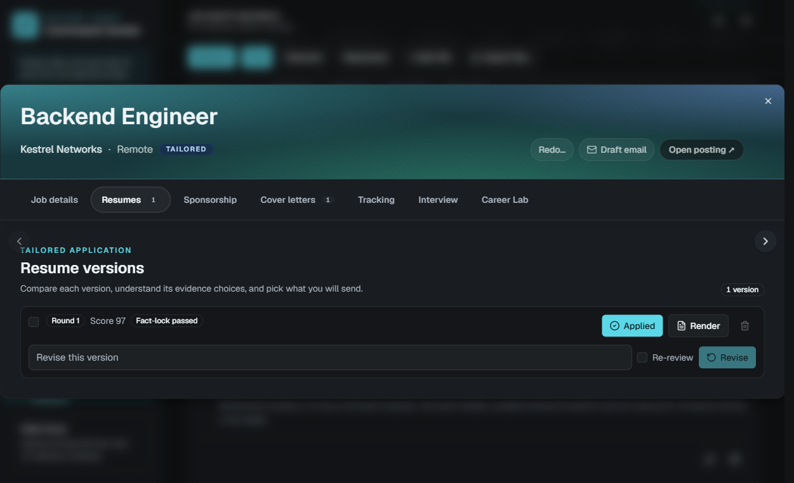
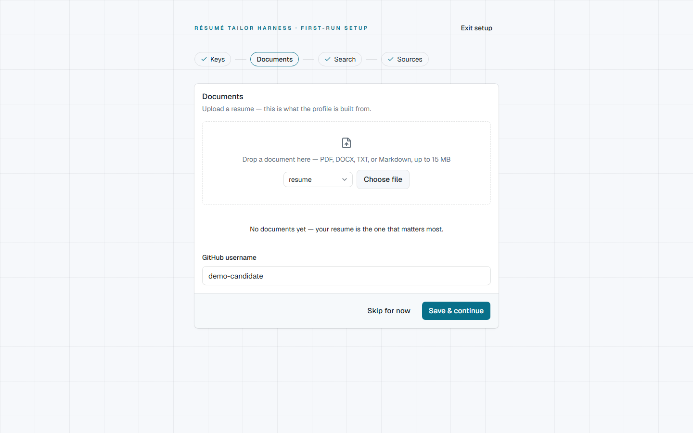

# Resume Agent

[](https://github.com/awbjcj/resume-agent/actions/workflows/ci-main.yml)
[](LICENSE)
[](https://www.python.org/)

A local-first, command-line and web job-hunt pipeline. Point it at your own
resume and API keys, and it pulls job posts from multiple sources (job-board
connectors, LinkedIn, or hand-pasted), scores them against a **fact-locked**
profile of your real experience, helps you tailor a resume through a panel of
reviewer agents, drafts a matching cover letter, renders both to PDF, and tracks
every application — auto-syncing statuses from your Gmail — all on your own
machine, in one SQLite database.

The guiding rule is **fact-lock**: every bullet on a tailored resume must trace
back to a fact you actually provided. The agents rewrite and reframe; they never
invent.

_Screenshots below are from a throwaway demo workspace with invented companies
and jobs — not a real job search._

---

## How it works

Jobs flow through a funnel. Each stage has one command that advances it, and two
points where _you_ (not the agent) make the call.

```
              ┌─ pull ───┐
  connectors  │          │
  LinkedIn    │  scrape  │
  paste       └─ addjob ─┘
                   │
                   ▼
   raw ─▶ extracted ─▶ filtered ─▶ shortlisted ──▶ approved ─▶ tailored ─▶ rendered
                          │            ▲   │            ▲           │
                       rejected     discover         👤 you      cover-letter
                                  (extract + score)  approve     (fact-locked)

   then track the application:  ready ─▶ submitted ─▶ interview ─▶ offer / rejected / closed
                                              ▲
                                         sync-status (Gmail proposes the moves)
```

| Stage            | Command                      | What happens                                                                                                                                              |
| ---------------- | ---------------------------- | --------------------------------------------------------------------------------------------------------------------------------------------------------- |
| **Ingest**       | `pull` / `scrape` / `addjob` | Raw jobs land in the DB (deduped by URL or JD text). `pull` runs every enabled job-board connector; `scrape` drives LinkedIn; `addjob` takes one by hand. |
| **Discover**     | `discover`                   | Agents extract structured criteria, apply your hard filters, and score fit → `shortlisted`.                                                               |
| **👤 Approve**   | web app or `approve`         | The cost gate: you approve only the jobs worth paying to tailor.                                                                                          |
| **Tailor**       | `tailor`                     | A writer agent drafts a fact-locked resume; a reviewer panel critiques and a reviser loops until it passes.                                               |
| **Cover letter** | `cover-letter`               | Drafts a fact-locked cover letter per job, gated by a deterministic provenance check, and renders it to PDF.                                              |
| **Render**       | `render`                     | A chosen resume version becomes a PDF in `output/`.                                                                                                       |
| **👤 Track**     | web app / `sync-status`      | Log submission status and notes by hand, or let `sync-status` read Gmail and **propose** status moves for you to apply.                                   |

### What it looks like

Every job in the board opens into one detail view — fit score, requested skills,
and one tab per stage below:


**Ingest.** `pull` runs the connectors you've enabled; `+ Add URL` and
`Import file…` (top bar) take one job by hand. Manage boards at
**Settings → Sources** (`/settings/sources`):


**Discover.** Extraction and filtering land on the **Triage** page
(`/triage`) — clear the raw/rejected backlog before anything reaches the
shortlist:


**👤 Approve.** The **Shortlist** page (`/shortlist`) is the cost gate —
review scored jobs and approve only what's worth paying to tailor:


**Tailor.** Open a job → **Resumes** tab to see each round's score,
fact-check status, and PDF render/revise actions:



**Cover letter.** Open a job → **Cover letters** tab for the fact-locked
draft, its provenance check, and a **Generate another** option:


**Render.** Rendered PDFs show up on the **Pipeline** board (`/pipeline`)
under their own stage, alongside every other stage in flight:


**👤 Track.** Open a job → **Tracking** tab to set the application status
by hand, or let `sync-status` propose moves from Gmail:


---

## Prerequisites

Choose either setup path:

- **Container:** Docker Engine with the Compose plugin (Docker Desktop includes both).
- **Native development:** **[uv](https://docs.astral.sh/uv/)** and **Node.js 22+** with npm. `uv` manages Python 3.13 for the project.

- An **LLM provider key** is needed for AI-powered operations. The discover,
  tailor, and cover-letter steps default to **Claude**, so an Anthropic key
  works out of the box; OpenAI, Google Gemini, and DeepSeek are also supported.
  The app starts without a key, so you can configure one from the web UI. See
  [LLM providers](#env--secrets-and-models).
- _Optional:_ a **GitHub token** (enriches your profile from your repos)
- _Optional:_ a **burner LinkedIn account** (only needed for `scrape`)
- _Optional:_ **job-board connector keys** for `pull` — e.g. [Adzuna API](https://developer.adzuna.com/) credentials (Greenhouse and RemoteOK need no key)
- _Optional:_ **Gmail OAuth credentials** (only needed for `sync-status`, scheduled sync, reminders, and email drafts — see [Gmail setup](#gmail-setup-for-sync-status-sync-reminders-and-email-drafts))

---

## Start with Docker

This builds the frontend and backend into one image, stores application data in
a named volume, and exposes the app only on the host's loopback interface:

```bash
docker compose up --build
```

Open <http://localhost:8000>. Stop it with `Ctrl+C` and later restart with
`docker compose up`. `docker compose down` removes the container and network
but retains your named data volume.

To build and run the image without Compose:

```bash
docker build -t resume-agent .
docker run --name resume-agent --init --restart unless-stopped \
  -e APP_MODE=local \
  -p 127.0.0.1:8000:8000 \
  -v resume-agent-data:/app/data \
  resume-agent
```

PowerShell accepts the same command with backticks instead of backslashes, or
as one line. Add `--env-file .env` after creating `.env` if you want to inject
provider keys at container startup; keys can also be saved from the web UI.

The image defaults to auth-free local mode. For an internet-facing multi-user
deployment, set `APP_MODE=hosted` and follow [Hosted multi-user server](#hosted-multi-user-server); hosted mode requires credentials and a canonical HTTPS URL.

## Native setup (Windows, macOS, and Linux)

One idempotent bootstrap command installs locked Python and frontend
dependencies and creates missing local config files without overwriting edits:

```bash
uv run --no-project scripts/bootstrap.py
uv run resume-agent setup                 # optional guided configuration
uv run python scripts/dev.py              # API + frontend; Ctrl+C stops both
```

Open <http://localhost:5173>. The same commands work in PowerShell, Command
Prompt, and POSIX shells. If you use `make`, `make setup` and `make dev` are
short aliases. Pass `--browser` to the bootstrap command only when you need
browser-backed job sources such as LinkedIn.

`resume-agent setup` walks through secrets, search criteria, and connectors and
writes `.env` plus `config/*.yaml`. You can instead edit the files created from
the checked-in examples.

Everything else (the SQLite database, the `output/` and `data/` folders) is
created automatically on first run.

### Career coaching: Profile coach, Mock interviews, and Career Lab

Three coaching surfaces sit alongside the tailoring pipeline in the sidebar,
each scoped to a different moment in the job hunt.

**Profile coach** (`/coach`) reviews your current fact-lock profile, asks one
focused question at a time about outcomes, scope, or project evidence you may
have left out, and drafts only claims grounded in what you actually answered:


**Mock interviews** (`/interview`) runs a focused rehearsal against a
specific tailored role, then turns the conversation into a scored debrief you
can act on:


**Career Lab** (`/career-lab`) is a draft-only workspace also available
through the `career-lab` CLI command and the `/api/career-lab` REST
resources. It routes each turn to one verified local career skill, keeps one
active session per workspace, streams recoverable runs, and supports end,
archive, unarchive, and delete lifecycle actions. Its outputs are drafts: it
cannot apply, upload, send, or update a profile.


```bash
uv run resume-agent career-lab "Prepare negotiation points" \
  --skill salary-negotiation-prep --offer-application-id 7
```

H-1B enrichment is an optional historical signal for jobs whose search config
requires sponsorship research and whose posting signal is silent. Set
`H1B_MCP_ENABLED=true` and configure either the local `stdio` command or a
credential-free Streamable HTTP URL in `.env.example`; never configure both.
Only these read-only MCP tools are exposed: `h1b_get_company_stats`,
`h1b_search_h1b_jobs`, and `h1b_get_available_data`. Historical filings are
never treated as confirmation of current sponsorship or current employer
policy, never flip the posting signal, and never hard-reject a job. Check it
per job from the **Sponsorship** tab in the job detail view:


For local development, `make dev` starts only the API and Vite frontend, so a
fresh clone has no sibling-repository dependency. `make full-stack` additionally
starts the optional sibling `h1b-job-search-mcp` server. That launcher uses
`http://127.0.0.1:8001/mcp` for the API's Streamable HTTP connection, so no
manual MCP command or URL is needed. Run `make stack-health` after startup to
check both HTTP health endpoints and the MCP handshake/tool allowlist.

### Hosted multi-user server

`resume-agent serve` is an auth-free local application by default: it binds to
loopback, reuses the existing administrator workspace (or creates a `local`
workspace on first boot), and does not require account credentials. To expose a
server or enable multiple users, opt into hosted mode and seed the first
administrator before its first boot:

```bash
uv run resume-agent serve --mode hosted --host 0.0.0.0
```

```env
AUTH_USERNAME=owner
AUTH_PASSWORD_HASH=<output of `uv run resume-agent hash-password`>
SESSION_SECRET=<long random value>
```

After signing in, create a single-use invite on the **Admin** page or with
`resume-agent admin invite`. Members register at `/register`; each receives a
separate database, profile corpus, configuration, secrets, output, and run
history. Administrators manage recurring USD-cost allowances, durable credits,
effective-dated LLM rates, active-job caps, and concurrent-run caps. Token usage
remains available as shared/BYOK analytics but does not control quotas after the
[cost quota rollout](docs/cost-quotas.md) reaches enforcement. Members manage
their own keys, tokens, password, and
workspace export in the web UI. The remote member workflow is web-first; the
local domain CLI can select an existing workspace with `--user USERNAME`.

`REGISTRATION_MODE` (`invite` by default, or `closed`/`open`) controls whether
an invite is required at all. Every administrator, free member, and subscriber
can use the platform's shared LLM keys. Configure those keys as Railway
environment variables; they are selected before a workspace key. Once the
applicable account or platform allowance is exhausted, calls automatically use
that user's key for the provider when one is configured.
`GLOBAL_DAILY_SIGNUP_LIMIT` and `GLOBAL_WEEKLY_TOKEN_BUDGET` cap total
verification emails and total shared-key spend platform-wide, regardless of
how many accounts exist — see [Deploying to Railway](docs/deploy-railway.md)
for the full variable list and recommended production posture.

### Gmail setup (for `sync-status`, sync, reminders, and email drafts)

Gmail powers the CLI's `sync-status`, plus (in the API/web app) scheduled
background inbox sync, stale-application follow-up reminders, and the
email-draft writer. It only ever **reads** mail (readonly scope) and
**creates drafts** (compose scope) — it never sends anything. There's no
password in `.env`; it authenticates via a Google OAuth client, and which
_type_ of client you create depends on how you run the app:

**CLI, single machine** — an OAuth **Desktop app** client, stored as a file:

1. In the [Google Cloud console](https://console.cloud.google.com/), create (or
   reuse) a project, enable the **Gmail API**, and create an **OAuth client ID**
   of type _Desktop app_.
2. Download the client-secret JSON and save it as `config/gmail_credentials.json`.
3. The first `sync-status` run opens a browser consent screen once; the granted
   token is cached to `data/gmail_token.json` (git-ignored) and reused after that.

**Web app / API server** (this is what a Railway deployment needs) — an OAuth
**Web application** client, configured via env vars instead of a file:

1. Create an OAuth client ID of type _Web application_ (the same Cloud console
   project as above is fine). Add an **authorized redirect URI** of
   `<your-domain>/api/gmail/callback` — e.g. `http://localhost:8000/api/gmail/callback`
   for local `resume-agent serve`, or your Railway domain for a cloud deploy
   (see [Deploying to Railway](docs/deploy-railway.md#gmail-oauth-optional)).
2. Set `GOOGLE_OAUTH_CLIENT_ID` and `GOOGLE_OAUTH_CLIENT_SECRET` in `.env` (or
   as platform environment variables on Railway). This is the **platform
   client** every workspace connects through by default; any signed-in user
   can instead paste their own client id/secret under Settings → Keys, which
   overrides the platform client for their workspace only.
3. Sign in to the web app, open **Settings → Keys**, and click **Connect
   Gmail** on the Gmail card to run the consent flow. The granted token is
   stored per-workspace (never shared across users).

Either way, while your OAuth consent screen is in **Testing** publishing
status (the default), add every Gmail address that will connect as a **test
user** in the Cloud console — Google caps testing apps at 100 users and
rejects sign-in for anyone not on that list.

Skip this entirely if you'd rather track statuses by hand in the web app —
everything else works without it.

All commands below are shown as `uv run resume-agent …`. If you'd rather not
prefix every call, activate the venv first (`source .venv/bin/activate`, or
`.venv\Scripts\Activate.ps1` on Windows) and drop the `uv run`.

---

## Quickstart — the happy path

```bash
# 1. Build your fact-lock profile from your resume (+ optional GitHub)
uv run resume-agent profile build

# 2. Get some jobs into the pipeline (pick one)
uv run resume-agent pull --limit 10            # job-board connectors, or…
uv run resume-agent scrape --limit 10          # LinkedIn, or…
uv run resume-agent addjob --company "Acme" --title "Backend Engineer" --jd-file jd.txt

# 3. Score them against your profile and your search criteria
uv run resume-agent discover
uv run resume-agent match-gap                 # optional: see missing high-demand skills

# 4. Review the shortlist and approve the keepers in the web app
make dev                                # http://localhost:5173

# 5. Tailor every approved job, and draft matching cover letters
uv run resume-agent tailor --approved
uv run resume-agent cover-letter --approved

# 6. Render a specific resume version to PDF (id shown in the web app)
uv run resume-agent render 12

# 7. Track submissions back in the web app
make dev                                # http://localhost:5173

# 8. Later, let Gmail propose status updates (review first, then apply)
uv run resume-agent sync-status               # lists proposals only
uv run resume-agent sync-status --apply        # applies them
```

---

## Command reference

Run `uv run resume-agent --help` for the full list, or `… <command> --help` for
any single command. Every command accepts `--db-url` to point at a different
database (handy for testing).

### `profile build` — create your fact-lock profile

Reads your resume (and GitHub, if configured) into `data/profile/facts.json`.
This file is the **ground truth** every later step is allowed to draw from.

```bash
uv run resume-agent profile build [--sources config/profile_sources.yaml] [--out data/profile/facts.json] [--refresh]
```

`--refresh` rebuilds the file and **discards any manual edits** — otherwise the
command refuses to overwrite an existing `facts.json`.

### `addjob` — add one job by hand

The job description is read from `--jd-file`, or from stdin if you omit it.

```bash
uv run resume-agent addjob --company "Acme" --title "Backend Engineer" --url "https://…" --jd-file jd.txt
```

Duplicates (same URL or identical JD text) are detected and skipped.

### `scrape` — pull jobs from LinkedIn

Searches LinkedIn using your `search.yaml`, then ingests matching posts as raw
jobs. **First run:** a real browser window opens — log in to your burner account
by hand _once_. The session is saved to `.linkedin_profile/` and reused after
that.

```bash
uv run resume-agent scrape [--search config/search.yaml] [--limit 25]
```

`--limit` caps how many postings are processed this run (be a polite scraper).

### `pull` — pull jobs from job-board connectors

Runs every connector enabled in `connectors.yaml`, dedupes results into `raw`
jobs, and prints a per-source count. When a higher-priority (canonical) source
re-finds a job already in the DB from an aggregator, it **upgrades** the stored
URL and JD text in place rather than dropping the duplicate — the pull summary
shows `+N added, N upgraded`. Secrets (e.g. Adzuna keys) come from `.env`;
which boards/sources to hit come from `connectors.yaml`.

| Connector    | What it needs                                                                                     |
| ------------ | ------------------------------------------------------------------------------------------------- |
| `greenhouse` | Board tokens in `connectors.yaml`                                                                 |
| `lever`      | Board slugs in `connectors.yaml`                                                                  |
| `adzuna`     | `ADZUNA_APP_ID` + `ADZUNA_APP_KEY` in `.env`                                                      |
| `remoteok`   | Nothing — open API                                                                                |
| `linkedin`   | Burner credentials in `.env` (same as `scrape`)                                                   |
| `companies`  | Careers URLs in `connectors.yaml` — auto-detects Greenhouse, Lever, Ashby, Workday, Tesla, Google |

```bash
uv run resume-agent pull [--connectors config/connectors.yaml] [--search config/search.yaml] [--limit 25]
```

`--limit` caps postings **per connector** this run. If `config/connectors.yaml`
is missing, the command tells you to copy it from the example first.

### `sources` — connector run history

Shows each connector's last run: when it ran, how many jobs it added, and the
last error (if any). A quick health check after `pull`.

```bash
uv run resume-agent sources
```

### `discover` — extract, filter, and score

Runs the funnel over every `raw` job already in the DB: extracts structured
criteria, drops anything failing your hard filters, and assigns each survivor a
0–100 fit score with a rationale → `shortlisted`.

```bash
uv run resume-agent discover [--search config/search.yaml] [--facts data/profile/facts.json]
```

### `match-gap` — target-job skills your profile does not show

Compares the `must_have_skills` of every job that survived discovery
(`shortlisted` / `approved` / `tailored` / `rendered`) against your profile's
skill names and aliases. Gaps are ranked by how many target jobs demand them.
This is read-only: it never edits `facts.json`. The same view is at
**Match-gap** (`/match-gap`) in the web app:


```bash
uv run resume-agent match-gap                 # aggregate, most-demanded first
uv run resume-agent match-gap --job-id 7      # gaps for one target job
uv run resume-agent match-gap --llm           # optional synonym pass, e.g. k8s/Kubernetes
```

### `approve` — the cost gate (CLI alternative to the web app)

Marks a shortlisted job `approved` so it's eligible for tailoring.

```bash
uv run resume-agent approve 7
```

### `tailor` — draft + review loop

Tailors one job (`--job-id`) or every approved job (`--approved`). Each round is
saved as a `ResumeVersion`; the reviewer panel runs until a draft passes or
`max_rounds` is hit. The **fact-check** reviewer is a hard gate. Optional
`config/style_guide.md` prose is appended beneath the fixed fact-lock rules for
the writer, reviser, and reviewers.

```bash
uv run resume-agent tailor --approved
uv run resume-agent tailor --job-id 7
```

### `cover-letter` — draft a fact-locked cover letter

Writes a cover letter for one job (`--job-id`) or every approved job
(`--approved`), then renders it to a PDF in `output/`. A writer agent drafts only
from your `facts.json`; a **deterministic provenance gate** checks that every
paragraph cites real fact ids and loops a reviser until the draft is clean (or
`fact_check_passed=False` is recorded so you know not to send it). Lower-stakes
than `tailor`, so there's no reviewer panel — just the gate.

```bash
uv run resume-agent cover-letter --approved
uv run resume-agent cover-letter --job-id 7
```

### `render` — version → PDF

Renders a stored resume version (by id) through the Typst template into
`output/`. Filenames are unique per version, so re-rendering never clobbers an
earlier PDF.

```bash
uv run resume-agent render 12 [--config config/render.yaml]
```

### Web app — visual boards

Runs the FastAPI backend and React frontend with Shortlist, Pipeline, Triage,
Analytics, and Match-gap views. Use it to approve shortlisted jobs, inspect
rendered artifacts, edit application status/notes, and prune stale jobs. It
opens on the **Dashboard** (`/`) — daily counts by stage and quick links into
whatever needs attention next:


**Analytics** (`/analytics`) shows which sources and fit-score bands actually
convert to interviews and offers:



```bash
make dev                                # http://localhost:5173
```

### `sync-status` — let Gmail propose status updates

Scans recent inbox mail (read-only), matches each message to a tracked
application by company, classifies it (rejection / interview / assessment /
offer) with deterministic rules plus an optional cheap-LLM fallback, and
**proposes** forward-only status moves. Nothing changes until you re-run with
`--apply` — statuses are never flipped silently. Requires
[Gmail setup](#gmail-setup-for-sync-status-sync-reminders-and-email-drafts) (the
CLI, Desktop-app path).

```bash
uv run resume-agent sync-status                 # list proposals only
uv run resume-agent sync-status --apply         # apply them
uv run resume-agent sync-status --max-results 100
```

---

## API server

The same pipeline is exposed over HTTP for the React frontend (and any API
client):

```bash
uv run resume-agent serve                       # http://127.0.0.1:8000
uv run resume-agent serve --mode hosted --host 0.0.0.0 --port 8080
```

The default local mode skips account authentication and always activates the
one default workspace. It refuses non-loopback binds. Hosted mode is the
deployment boundary: it enables login, bearer/PAT checks, tenant selection,
registration, and isolated user workspaces. The container defaults to local
mode and switches to hosted mode when `APP_MODE=hosted` is set (or when
hosted-only settings such as `APP_BASE_URL` are present).

- Interactive docs at `/docs`; the OpenAPI schema at `/openapi.json`.
- The committed contract the frontend consumes lives in `contracts/`
  (`openapi.json` + generated `ts/api.ts`); regenerate with
  `bash scripts/gen_ts_client.sh` after any schema change.
- Long operations (`POST /api/discover|pull|tailor|cover-letters|jobs/from-url`)
  return a **run** you watch via `GET /api/runs/{id}/events` (Server-Sent Events)
  or poll at `GET /api/runs/{id}`.
- In hosted mode, configure account credentials/PATs for API access and set
  `CORS_ORIGINS` (comma-separated) for a separate frontend dev server. Local
  mode intentionally ignores account and API authentication settings.

Gmail sync (`POST /api/gmail/sync`), connect/status/disconnect
(`/api/gmail/connect|status|token`), and email drafts are exposed over HTTP.
Deferred (not yet exposed over HTTP): `profile build` and LinkedIn `scrape`.

---

## Configuration

### `.env` — secrets and models

Copy `.env.example` to `.env`; it is loaded automatically. The example contains
every environment-backed application setting with safe local defaults. See the
[complete environment configuration reference](docs/configuration.md) for
accepted values, bounds, hosted/Docker overrides, and integration-specific
requirements.

#### Choosing an LLM provider

Every LLM call resolves through one of three model tiers — `CHEAP_MODEL`,
`MID_MODEL`, `PREMIUM_MODEL` — which default to Claude Haiku / Sonnet / Opus. A
model id is **provider-prefixed**: a bare id stays on Anthropic, while an
`openai:`, `gemini:`, or `deepseek:` prefix routes that tier to another provider.
Each tier uses its own provider's key, so you can mix providers freely:

```bash
CHEAP_MODEL=gemini:gemini-3.5-flash-lite # cheap extract/fit/relevance on Gemini
MID_MODEL=deepseek:deepseek-v4-flash    # reviewers / cover-letter reviser on DeepSeek
PREMIUM_MODEL=claude-opus-5             # bare id → Anthropic for the tailor writer
```

Set only the keys for the providers you actually use; a provider's SDK is loaded
lazily, so a Claude-only run never touches the OpenAI or Gemini libraries.

> **Gmail** authenticates via `config/gmail_credentials.json` for the CLI only;
> the API/web app instead uses the `GOOGLE_OAUTH_CLIENT_ID`/`_SECRET` env vars
> above — see [Gmail setup](#gmail-setup-for-sync-status-sync-reminders-and-email-drafts).

### `config/*.yaml`

| File                   | Controls                                                                                                                                                                                                                                                                   |
| ---------------------- | -------------------------------------------------------------------------------------------------------------------------------------------------------------------------------------------------------------------------------------------------------------------------- |
| `profile_sources.yaml` | Path to your resume and your GitHub username.                                                                                                                                                                                                                              |
| `search.yaml`          | Keywords, titles, locations, and **hard filters** (salary, years of experience, remote policy, sponsorship).                                                                                                                                                               |
| `connectors.yaml`      | Which job-board connectors `pull` runs and their parameters (Greenhouse board tokens, Lever slugs, Adzuna country, RemoteOK, LinkedIn on/off, and `companies.urls` for direct ATS/portal URLs — Greenhouse, Lever, Ashby, Workday, Tesla, Google). Secrets stay in `.env`. |
| `review.yaml`          | The reviewer roster, their weights/model tiers, `max_rounds`, `score_threshold`, optional `length_budget` one-page guidance, and optional `style_guide_path`.                                                                                                              |
| `render.yaml`          | Typst `template_path` and the PDF `output_dir`.                                                                                                                                                                                                                            |
| `style_guide.md`       | Optional house-style prose appended to the resume tailor loop. Governs how resumes are written, never what is claimed. Missing or empty means no change.                                                                                                                   |

Each `*.yaml.example` is annotated — copy it, then edit.

The cover-letter and resume templates live in `templates/` (`cover_letter.typ`,
`resume.typ`) and can be edited directly. `config/gmail_credentials.json`
(CLI-only `sync-status`) is the one config file with no example — it's the
Desktop-app OAuth client secret you download from Google Cloud (see
[Gmail setup](#gmail-setup-for-sync-status-sync-reminders-and-email-drafts)).
The API/web app uses `GOOGLE_OAUTH_CLIENT_ID`/`_SECRET` in `.env` instead.

### Source priority

When the same job is seen by multiple connectors, a **canonical** source always
wins over an **aggregator** copy:

| Tier                            | Sources                                                                                        |
| ------------------------------- | ---------------------------------------------------------------------------------------------- |
| **Canonical** (higher priority) | `greenhouse`, `lever`, `ashby`, `workday`, `tesla`, `google`, `companies`, `url` (hand-pasted) |
| **Fallback** (lower priority)   | `adzuna`, `remoteok`, `linkedin`                                                               |

**First-seen-wins** among equal-tier sources — no churn from same-tier re-pulls.

**Upgrade, not drop.** If a canonical source re-finds a job previously ingested
from a fallback source, the stored posting fields (`url`, `jd_text`, `source`,
`title`, `location`) are upgraded in place, keeping the same `Job` id. Your
tailored resumes, cover letters, and application status are never touched.

Once a job's status has advanced past `raw`, only the canonical apply `url` is
updated (the JD text is frozen so a resume already tailored to it is not
silently re-based).

---

## Where things live

| Path                                                  | Contents                                                                                                                                                        |
| ----------------------------------------------------- | --------------------------------------------------------------------------------------------------------------------------------------------------------------- |
| `data/resume_agent.db`                                | All jobs, resume versions, cover letters, and applications (SQLite).                                                                                            |
| `data/profile/facts.json`                             | Your fact-lock profile.                                                                                                                                         |
| `data/connector_runs.json`                            | Per-connector run history that `sources` reads.                                                                                                                 |
| `data/gmail_token.json`                               | Cached Gmail OAuth token for CLI/local-mode `sync-status` (git-ignored). The API/web app stores each user's token inside their own workspace instead.           |
| `output/`                                             | Rendered resume **and** cover-letter PDFs (cover letters are suffixed `cl<id>`).                                                                                |
| `.linkedin_profile/`                                  | Cached LinkedIn browser session (git-ignored).                                                                                                                  |
| `config/gmail_credentials.json`                       | Your Gmail OAuth **Desktop app** client secret for CLI-only use (git-ignored; you provide it). The API/web app uses `GOOGLE_OAUTH_CLIENT_ID`/`_SECRET` instead. |
| `templates/resume.typ` / `templates/cover_letter.typ` | The Typst templates the renderers use.                                                                                                                          |

`data/`, `output/`, `.env`, `.linkedin_profile/`, and `config/gmail_credentials.json`
are all git-ignored.

---

## A note on scraping responsibly

`scrape` is built for **personal, low-volume** use against a **burner** account:
it drives a real logged-in browser, paces its requests deliberately, and caps
how much it pulls per run. Keep `--limit` modest and don't point it at an account
you care about. Manual `addjob` is always available if you'd rather skip scraping.

The `companies` connector's Workday backend issues one detail request per
surviving job listing — keep the relevance filters in `search.yaml` tight so the
title-gate prunes the list before detail fetches begin.

---

## Development

```bash
uv run pytest              # run the full test suite
uv run pytest -k scraper   # run a subset
ruff check                 # lint
```

Tests are pure and offline — agents and the browser are faked, so the suite needs
no API key and no network. Connector backends are tested against fixture JSON
payloads captured from real responses.

v1.5 keeps the tailor loop synchronous. Parallel reviewer panels and job-level
concurrency are deferred while this pass reduces cost through leaner prompts.

## Contributing

Contributions are welcome. See [CONTRIBUTING](.github/CONTRIBUTING.md) for local
setup and the checks your change must pass (`make verify`). Please branch from
`main` and open a PR.

## Security

Found a vulnerability? Please report it privately — see the
[security policy](.github/SECURITY.md). Do not open a public issue for security
reports.

The repository root also carries a self-audit of the public multi-user
deployment: `resume-agent-threat-model.md` (trust boundaries, attacker model,
prioritized threat table) and `security_best_practices_report.md` (findings
with severity, evidence, and fixes). See [ADR-0008](docs/adr/0008-egress-gateway-tenant-storage-canonical-origin.md)
for the architectural response already shipped (SSRF-safe outbound gateway,
tenant-confined artifact downloads, configuration-only OAuth/cookie origin)
and the P0/P1 items still open.

## License

[MIT](LICENSE) © awbjcj
