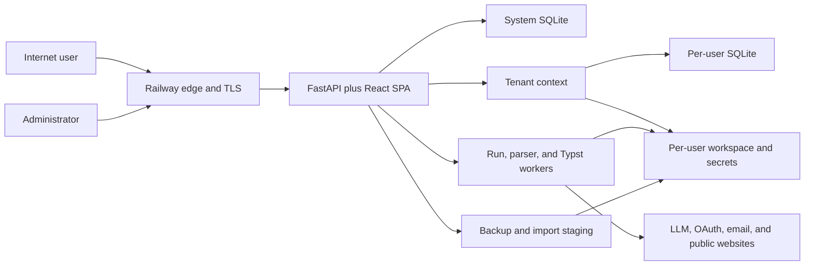

# Resume Agent threat model

## Executive summary

The source audit originally found that Resume Agent was not ready for unrestricted public registration. The P0 code blockers are now remediated on `codex/security-blockers`; deployment still requires the canonical Railway origin, working mail delivery, explicit budgets, and a live smoke test before opening the domain.

The release blockers are: (1) imported tenant database path fields can later reach file-download sinks without workspace confinement; (2) job/source URL ingestion does not consistently use the hardened SSRF-safe fetch path; (3) Railway proxy trust is not explicit even though cookie security and IP rate limits depend on the normalized request scheme/client; and (4) open signup would allow attackers to multiply per-user shared-key quotas by creating accounts. Workspace archive expansion and untrusted document/template processing also need resource isolation before anonymous public use.

Recommended deployment posture: keep invite-only registration until the P0 controls in this model are implemented and tested. Then introduce open signup in a limited tier with global budgets, per-network signup controls, no shared platform LLM key by default, and an operational kill switch.

Remediation update: tenant artifact downloads and imported database paths are confined; legacy render paths are disabled/forced to tenant roots in multi-user mode; user-influenced HTTP fetches share a DNS-pinned and redirect-revalidating gateway; production cookies/callbacks/hosts use a configured canonical origin; open accounts begin BYOK-only with low limits plus global signup/spend circuit breakers; and archive member/expanded-size/compression limits are checked before extraction. Remaining P1/P2 defense-in-depth items are still tracked below.

## Scope and assumptions

- Scope: the FastAPI API, React SPA, authentication and registration, multi-tenant workspace/storage model, background runs, LLM/provider integrations, URL ingestion, uploads/imports, custom Typst templates, Gmail/Google OAuth, Docker image, and Railway deployment boundary.
- Deployment: one publicly reachable Railway service, with TLS terminated at Railway's edge and persistent application data on a Railway volume.
- Registration target: any Internet user may eventually create an account after email verification.
- Provider model: the platform may pay for shared LLM keys, while users may also store their own provider keys.
- Data sensitivity: resumes, job-search records, email/OAuth data, prompts, API keys, generated documents, and account credentials are confidential.
- This is a source-based defensive model. Railway project settings, domain/DNS controls, production environment variables, volume permissions, backup destinations, email-provider controls, and live edge behavior were not inspected.

## System model

### Primary components

- Railway edge and public domain: TLS termination, routing, request headers, and basic network protection.
- FastAPI application: sessions, registration, authorization dependencies, API routes, SPA serving, download endpoints, and administration.
- React SPA: browser UI using same-origin cookie authentication, with legacy bearer/query-token support still present.
- System database: users, invites, verification/reset codes, rate-limit attempts, system settings, and usage accounting.
- Tenant workspace: per-user SQLite database, configuration, generated output, uploads, run artifacts, and `secrets.env`.
- Run manager and rendering/parsing code: background LLM workflows, document parsers, transcription, and Typst compilation.
- External services: LLM providers, Google OAuth/Gmail, SMTP/email, job/source websites, and optional search/connector providers.
- Backup/import path: account workspace export/import and administrator root backup/restore.

### Data flows and trust boundaries

1. An unauthenticated browser crosses the Internet/Railway edge boundary to registration, login, verification, password reset, OAuth callbacks, health, and SPA endpoints.
2. A valid session crosses the authentication boundary into guarded routes. `get_user_context` selects a tenant engine and workspace.
3. User inputs cross a high-risk processing boundary when they become URLs, documents, archives, templates, prompts, or provider requests.
4. Tenant metadata crosses the database/filesystem boundary when stored paths are resolved and files are read, written, rendered, archived, or returned.
5. The application crosses an egress boundary when it contacts OAuth/email services, LLM providers, or user-selected websites.
6. Administrator actions cross a privilege boundary into user management, invitations, backups, and system settings.

#### Diagram

## Assets and security objectives

| Asset                                                         | Confidentiality objective                                                     | Integrity objective                                                | Availability objective                               |
| ------------------------------------------------------------- | ----------------------------------------------------------------------------- | ------------------------------------------------------------------ | ---------------------------------------------------- |
| Password hashes and sessions                                  | Never exposed; session tokens stay out of URLs/logs                           | Revocable and bound to the intended account                        | Login and reset remain usable under abuse            |
| Resumes, profile facts, jobs, cover letters, and email drafts | One tenant cannot read another tenant or host data                            | Only the owning tenant can change records/artifacts                | Tenant workloads cannot exhaust the service          |
| Platform and user LLM/API keys                                | Never returned, logged, archived without encryption, or readable cross-tenant | Changes are authenticated and auditable                            | Compromise or budget spikes can be contained quickly |
| LLM budget and provider accounts                              | Usage visible only as needed                                                  | Charges attributed correctly; quotas cannot be multiplied cheaply  | Global circuit breakers preserve service and spend   |
| System database and admin operations                          | Non-admin users cannot inspect system state                                   | Role and user lifecycle changes require admin authority            | Backup/restore cannot block the service indefinitely |
| Railway volume and backups                                    | Encrypted and access-controlled                                               | Restore artifacts are authenticated and validated                  | Quotas and reserves prevent disk exhaustion          |
| OAuth identities/tokens                                       | State and tokens are not leaked or swapped                                    | Callback is bound to the initiating browser and fixed redirect URI | OAuth failure does not affect password login         |
| Application image and dependency graph                        | No secrets embedded                                                           | Builds are reproducible and provenance is known                    | Vulnerable components can be upgraded promptly       |

## Attacker model

### Capabilities

- Create and control many email accounts and, after open registration, many Resume Agent accounts.
- Send concurrent HTTP requests, large or highly compressed uploads, crafted archives/documents/templates, and arbitrary supported URLs.
- Control an external website, redirects, DNS answers, response size/timing, and content returned to the application.
- Modify all data legitimately importable into the attacker's own tenant workspace, including an imported SQLite database.
- Observe browser history and links on their own device and potentially cause cross-site browser requests.
- Consume shared provider budget and trigger expensive parsers, renders, transcription, or LLM workflows.
- Use errors and timing to infer application behavior.

### Non-capabilities

- No initial Railway project, host, volume, database, admin, source repository, or provider-account access.
- Cannot break modern cryptography or directly decrypt correctly protected secrets.
- Cannot bypass authentication merely by knowing another tenant's numeric resource identifiers when tenant engine selection works as designed.
- No assumed compromise of Railway, the email provider, Google, or an LLM provider.

## Entry points and attack surfaces

| Surface                                  | Trust boundary                       | Primary defensive concern                                                   |
| ---------------------------------------- | ------------------------------------ | --------------------------------------------------------------------------- |
| Registration, verification, login, reset | Unauthenticated to authenticated     | Account farming, enumeration, brute force, session fixation, provider spend |
| Google identity OAuth and Gmail OAuth    | Browser/app to third party           | Redirect-host trust, one-time state binding, callback confusion             |
| Guarded CRUD and run APIs                | User to tenant context               | Complete mediation, IDOR, quota enforcement, CSRF                           |
| Resume and cover-letter downloads        | Database to filesystem/response      | Tenant path confinement and capability lifetime                             |
| Workspace/settings backup import         | Archive to persistent tenant state   | Path trust, archive expansion, schema/content validation, atomicity         |
| Job/source/profile URL ingestion         | User URL to application egress       | SSRF, DNS rebinding, redirects, response size, content type                 |
| Document/audio uploads                   | Untrusted bytes to parser/provider   | Memory/disk exhaustion, parser vulnerabilities, spoofed MIME                |
| Custom Typst templates                   | Untrusted program to compiler        | CPU/memory exhaustion and filesystem capability scope                       |
| LLM calls and shared provider keys       | Tenant input to paid external API    | Sybil abuse, prompt/data leakage, budget attribution                        |
| Admin APIs and root backup               | Admin to all tenants                 | Strong authorization, re-authentication, auditability, blast radius         |
| SPA and public API metadata              | Browser to app                       | XSS defense-in-depth, security headers, docs/schema exposure                |
| Railway container and volume             | Edge/runtime to persistent host data | Proxy normalization, non-root runtime, shared-process blast radius          |

## Top abuse paths

1. A tenant imports a syntactically valid workspace whose artifact metadata points outside its workspace; a normal artifact download later reads that path. The boundary failure is trusting imported database paths at a filesystem sink.
2. A user submits a job/source URL through a code path that performs a plain redirect-following HTTP request, allowing access attempts to destinations that the hardened profile intake correctly rejects.
3. An attacker creates many verified accounts and uses the shared platform key. Per-user weekly budgets reset at the account boundary, so total spend is limited only by account-creation friction rather than a platform-wide budget.
4. A compressed workspace archive expands to excessive files or bytes. The compressed upload cap does not bound uncompressed disk, member count, or extraction work.
5. Forwarded scheme/client headers are not normalized through an explicit Railway trust policy. Session cookies may lose the `Secure` attribute and IP budgets may key on the wrong address.
6. Google sign-in state and its PKCE verifier are bound to a short-lived opaque HttpOnly callback cookie and a durable one-time server-side flow record. A mismatched, expired, replayed, or unavailable flow fails closed before token exchange.
7. A tenant repeatedly submits costly documents, audio, custom Typst templates, or LLM jobs. Some work runs in the API process and lacks a common CPU, memory, wall-time, queue, and disk budget.
8. A short-lived download capability in a URL leaks into access logs, browser history, monitoring, or copied links. Legacy local-storage bearer support increases impact if an XSS defect is later introduced.

## Threat model table

| ID     | Threat                                                                      | Affected assets                                                  | Existing controls                                                                      | Gap                                                                                                                                  | Recommended control                                                                                                                                                                                                                                   | Priority              |
| ------ | --------------------------------------------------------------------------- | ---------------------------------------------------------------- | -------------------------------------------------------------------------------------- | ------------------------------------------------------------------------------------------------------------------------------------ | ----------------------------------------------------------------------------------------------------------------------------------------------------------------------------------------------------------------------------------------------------- | --------------------- |
| TM-001 | Imported artifact paths escape the tenant workspace                         | All tenant/host files readable by the app UID                    | Auth guard, per-user database, archive path validation                                 | Imported row content is not normalized; download sinks use stored paths directly                                                     | Disable public workspace import until every imported file reference is validated; replace stored paths with opaque artifact IDs/tenant-relative names; resolve through a fail-closed `TenantStorage`; add cross-tenant/absolute-path regression tests | P0                    |
| TM-002 | SSRF through inconsistent URL fetchers                                      | Cloud metadata, internal services, egress identity, availability | Strong public-IP/DNS/redirect/size checks in profile intake and scrape URL validation  | Job URL fetch uses a separate plain client; source inspection can fetch before validation                                            | Create one outbound HTTP gateway that enforces scheme, DNS/IP policy, DNS pinning, redirect revalidation, byte/time/content limits, audit metadata, and optional host allowlists; enforce network egress deny rules                                   | P0                    |
| TM-003 | Account farming multiplies shared LLM spend                                 | Platform keys, provider budget, availability                     | Email verification, IP/email attempt budgets, per-user weekly token/concurrency limits | No platform-wide/provider-wide budget or Sybil-resistant eligibility boundary                                                        | Open signup in a restricted tier; require abuse challenge; add global daily/monthly/provider circuit breakers, queue fairness, network/device risk signals, and manual/paid promotion before shared-key access                                        | P0 before open signup |
| TM-004 | Incorrect proxy normalization weakens cookie/IP controls                    | Sessions, rate limits, OAuth callbacks                           | HttpOnly, SameSite=Lax cookie; Railway TLS edge                                        | `Secure` depends on request scheme; Uvicorn proxy trust is implicit; client IP behavior is deployment-dependent                      | Configure explicit trusted proxy policy, force secure cookies in production, canonical public base URL, allowed hosts, and tested client-IP extraction                                                                                                | P0                    |
| TM-005 | OAuth login/session swapping or redirect confusion                          | Account identities and sessions                                  | HMAC-signed state, configured callback URI, opaque HttpOnly callback cookie, one-time server-side PKCE record | OAuth flow rows rely on system-database availability, but mismatched, expired, and replayed records fail closed before token exchange | Retain atomic consume and expiry cleanup tests; keep callback URI configuration independent of forwarded headers                                                                                                                                        | Resolved              |
| TM-006 | Archive expansion exhausts disk/memory/CPU                                  | Volume and service availability                                  | Compressed upload cap, path/type/duplicate checks, staging and atomic swap             | No total expanded size, file-count, compression-ratio, per-file, or free-space bounds                                                | Apply streaming limits used by settings bundles to all imports; add workspace disk quota and reserved free space; reject before extraction exceeds budget                                                                                             | P0/P1                 |
| TM-007 | Legacy path-bearing settings escape tenant roots                            | Tenant isolation and filesystem integrity                        | Some historical paths are rebased                                                      | Absolute paths pass through; extensible render config retains `template_path`/`output_dir`                                           | Forbid absolute/escaping paths in multi-user mode; use template IDs and fixed output roots; reject legacy path fields in public import schemas                                                                                                        | P0/P1                 |
| TM-008 | Untrusted parser/compiler workload affects all tenants                      | Availability, filesystem, provider spend                         | Per-file limits on many endpoints; custom template size cap; per-user run concurrency  | Typst and document parsing share the API process; no uniform CPU/memory/wall-time isolation; audio reads fully before enforcing size | Move risky processing to constrained workers; use bounded streaming, magic-byte validation, page/file limits, timeouts, and per-user/global queues                                                                                                    | P1                    |
| TM-009 | Cross-site state change                                                     | Account settings, secrets, jobs, OAuth links                     | SameSite=Lax cookie, JSON APIs, no credentialed cross-origin CORS                      | No explicit CSRF token or central Origin/Fetch-Metadata validation                                                                   | Add synchronizer/double-submit CSRF protection for unsafe methods and validate `Origin`; retain SameSite and same-origin defaults                                                                                                                     | P1                    |
| TM-010 | Capability or bearer token leakage through URLs/browser storage             | Sessions and downloadable artifacts                              | Download capability is purpose-bound and short-lived                                   | Query strings appear in logs/history; legacy PAT stays in localStorage; server accepts query tokens broadly                          | Use cookie-authenticated fetch-to-blob or single-use, resource-bound tokens; redact queries at edge/app; remove public-mode localStorage/query bearer support                                                                                         | P1                    |
| TM-011 | Cross-tenant impact from shared process/UID and plaintext key files         | User keys, platform keys, tenant data                            | Separate workspace directories and write-only API response                             | One process/UID can read all workspaces; secrets are plaintext files; container runs as root                                         | Envelope-encrypt user keys, keep platform keys outside tenant volume, set files to `0600`, run non-root, and isolate high-risk workers/filesystem mounts                                                                                              | P1                    |
| TM-012 | Missing browser/API hardening exposes metadata or increases impact          | UI sessions and API surface                                      | React escaping; Markdown does not enable raw HTML; explicit CORS origins               | Public docs/schema, no CSP/host/security-header middleware, wildcard CORS methods/headers                                            | Disable docs in production or protect them; add CSP, `frame-ancestors`, nosniff, referrer/permissions policy, HSTS at edge, allowed hosts, and narrower CORS                                                                                          | P2                    |
| TM-013 | Security events are not detectable or attributable                          | All assets and incident response                                 | Ordinary application/provider logs                                                     | No dedicated security audit trail or alert thresholds were found                                                                     | Record auth, reset, admin, secret-change, import, quota, and blocked-egress events with correlation IDs; never log secrets/tokens/codes; alert on spikes                                                                                              | P1/P2                 |
| TM-014 | Vulnerable or unnecessary build dependencies increase supply-chain exposure | Build integrity and developer workstations                       | Locked Python/Node dependency graphs; multi-stage image excludes Node runtime          | Current Node audit reports advisories; CLI/build packages are declared as runtime dependencies                                       | Upgrade advisories, move `shadcn` and build-only packages to dev dependencies, add lockfile audits/SBOM/signing to CI; assess reachability before emergency response                                                                                  | P2                    |

## Criticality calibration

- **Critical/P0:** a normal authenticated tenant can cross tenant/host file boundaries, or an unauthenticated/open-signup workflow can create unbounded shared-provider spend. Public rollout should stop until these controls are in place.
- **High/P0-P1:** SSRF, proxy/cookie correctness, path-bearing configuration, archive expansion, and shared-process resource exhaustion can compromise sensitive infrastructure or make the public service unavailable.
- **Medium/P1-P2:** CSRF defense-in-depth, URL capability leakage, runtime privilege reduction, security headers, and audit logging materially reduce exploitability and blast radius but do not replace the P0 boundaries.
- **Low/informational:** dependency advisories that are not present in the final runtime or are unreachable in the SPA's operating mode still require normal upgrade hygiene, not emergency treatment.

## Focus paths for security review

1. **Tenant storage boundary:** `api/routers/account.py`, `api/routers/resumes.py`, `api/routers/cover_letters.py`, `tenancy/paths.py`, render configuration, artifact exporters, and every `FileResponse`/`Path` sink.
2. **Outbound request boundary:** `profile/intake.py`, `discovery/url_ingest/fetch.py`, `services/sources.py`, redirects, DNS resolution/pinning, provider webhooks, and any future HTTP client.
3. **Identity and Railway edge boundary:** session cookie issuance, proxy allowlist, canonical base URL, Google/Gmail callbacks, OAuth state storage, CSRF, allowed hosts, and real client-IP derivation.
4. **Open-registration economics:** account creation, email verification, global/provider budgets, platform-key eligibility, queue fairness, abuse signals, and emergency disable switches.
5. **Untrusted processing boundary:** archive extraction, document parsers, audio, Typst, browser/search connectors, temporary directories, worker process limits, and volume quotas.
6. **Secrets and operational boundary:** per-user key storage, platform keys, backups, logging/redaction, administrator actions, container UID/capabilities, and incident response.

Quality check: trust boundaries, attacker capabilities, runtime/admin/upload/import surfaces, and non-runtime build dependencies were included. Each major threat maps to a concrete code or deployment control, and runtime-reachable issues were ranked above theoretical dependency findings.
