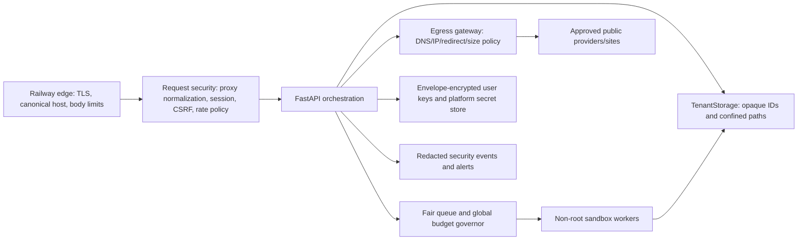

# Security best-practices report

## Overall assessment

**The P0 source-code blockers are remediated on `codex/security-blockers`.** Public deployment should proceed only after setting the required Railway origin/mail/budget variables and completing a live smoke test. The codebase also has meaningful existing controls: guarded routers consistently select a user context, tenant databases/workspaces are separated, passwords use PBKDF2-SHA256 with 600,000 iterations, sessions are HttpOnly and SameSite=Lax, registration/login attempts are budgeted, email verification is required, per-user LLM/concurrency limits exist, common uploads are capped, and secret read APIs return status/hints rather than values.

The main weakness is architectural consistency. Several trusted helpers exist, but sensitive paths can bypass them. Public multi-tenancy needs a small number of mandatory chokepoints: `TenantStorage` for every filesystem operation, one egress client for every user-influenced URL, one production request-security layer for proxy/host/origin/cookie policy, and one workload governor for all expensive work.

## Release gate

Implementation status: the five P0 items below are complete in code and covered by focused regression tests. Operational requirements remain: configure an HTTPS `APP_BASE_URL`, mail delivery, shared-key/global budgets, and Railway domain; keep shared-key access off for new accounts; and validate the deployed cookie/callback/host behavior.

### P0 — required before public registration

1. Disable tenant workspace import until imported database/file metadata is validated and all download/render paths are tenant-confined.
2. Route every user-influenced outbound request through the existing SSRF-safe design and add infrastructure egress denial for private/link-local/metadata ranges.
3. Configure and test Railway proxy trust; force production Secure cookies; use a canonical public base URL and allowed-host policy.
4. Add platform-wide and provider-wide spend/concurrency circuit breakers. New public accounts must not receive unrestricted shared-key access.
5. Bound archive expansion and per-tenant disk consumption, including temporary/staging data.

### P1 — required for a robust public beta

1. Bind OAuth state to the initiating browser and consume it once; add CSRF/Origin enforcement for unsafe cookie-authenticated requests.
2. Remove legacy path fields from public settings/import schemas and adopt opaque artifact/template IDs.
3. Isolate Typst/document/audio processing in resource-constrained workers.
4. Remove long-lived bearer tokens from localStorage/query strings; make download capabilities single-use and resource-bound, or use authenticated blob downloads.
5. Encrypt user provider keys at the application layer and separate platform keys from tenant-readable storage.
6. Add dedicated security audit events, alerts, and redaction tests.

### P2 — defense in depth and operations

1. Run the final image as a non-root user, minimize writable mounts, and use a read-only root filesystem where supported.
2. Add CSP and standard response headers, allowed hosts, narrower CORS, and disable/protect API docs in production.
3. Clean up Node dependency roles/advisories and automate Python/Node auditing, SBOM generation, and image scanning.
4. Document backup encryption, retention, restore testing, incident response, secret rotation, and emergency signup/provider kill switches.

## Findings

### RA-SEC-001 — Imported artifact paths are not tenant-confined

- **Severity:** Critical
- **Location:** `src/resume_tailor_harness/api/routers/account.py:72-91,413-445`; `src/resume_tailor_harness/api/routers/resumes.py:28-45`; `src/resume_tailor_harness/api/routers/cover_letters.py:33-53`; `src/resume_tailor_harness/tenancy/paths.py:20-43`
- **Evidence:** Workspace validation checks SQLite integrity and the presence of `jobs`, but not path-bearing rows. Download handlers check `Path(version.pdf_path).exists()` and pass the stored value directly to `FileResponse`. The common resolver explicitly returns absolute paths unchanged.
- **Impact:** A tenant-controlled imported database can cause a later authenticated download to read a file available to the application UID outside that tenant workspace. In a shared Railway process/volume, this breaks tenant isolation and may expose system configuration, backups, or another tenant's files.
- **Fix:** Immediately disable workspace import for non-admin public users. Replace persisted absolute paths with opaque artifact IDs or normalized tenant-relative paths. Introduce a `TenantStorage` API whose read/write methods resolve the final path and require it to remain under the exact allowed root. Validate and migrate every path-bearing imported row before the atomic swap. Apply the same boundary to render inputs/outputs and all `FileResponse` sites.
- **Mitigation:** Until the migration is complete, use separate runtime identities/containers or object-storage namespaces per tenant and keep platform secrets off the tenant volume.
- **False-positive notes:** Authentication and a per-user database do not mitigate this issue because the attacker controls their own imported database and the sink trusts its contents.

### RA-SEC-002 — User-controlled outbound URLs bypass the hardened fetch policy

- **Severity:** High
- **Location:** `src/resume_tailor_harness/discovery/url_ingest/fetch.py:27-31`; `src/resume_tailor_harness/api/routers/runs.py:417-438`; `src/resume_tailor_harness/services/sources.py:162-177`; compare `src/resume_tailor_harness/profile/intake.py:40-78,103-151`
- **Evidence:** `fetch_static` performs `httpx.get(url, follow_redirects=True)` with no destination-IP, redirect-hop, content-type, or response-byte policy. The profile intake already implements public-IP validation, DNS pinning, per-hop redirect checks, content restrictions, and a 1 MB streaming cap, demonstrating the intended safe pattern.
- **Impact:** A registered user can make the Railway workload attempt connections to non-public/internal destinations or return arbitrarily large/slow content, risking credential exposure, internal service access, memory pressure, and service degradation.
- **Fix:** Build one mandatory egress gateway and delete direct user-URL HTTP calls. It should allow only HTTP(S), reject credentials and non-global addresses, pin the validated address while preserving TLS SNI/Host, revalidate every redirect, stream with hard byte/time limits, restrict content type, and emit a redacted security event. Add tests for IPv4/IPv6, alternate address forms, DNS changes, redirects, and size/time boundaries.
- **Mitigation:** Add Railway/network egress controls that deny loopback, RFC1918, link-local, metadata, and other internal ranges. Prefer provider/ATS allowlists where product behavior permits.
- **False-positive notes:** `BROWSER_ENABLED=false` removes one browser-based path but does not protect the direct `httpx` call.

### RA-SEC-003 — Open signup would make shared-provider quotas Sybil-bypassable

- **Severity:** High (release blocker for open registration)
- **Location:** `src/resume_tailor_harness/api/routers/auth_register.py:83-104`; `src/resume_tailor_harness/api/attempts.py:18-27`; `src/resume_tailor_harness/tenancy/limits.py:12-15`
- **Evidence:** Registration currently requires an invite. Existing attempt budgets are per email/IP and usage is primarily per user (10 million weighted tokens per week, 2,000 active jobs, and 2 concurrent runs by default). There is no platform-wide or provider-wide spend ceiling in the reviewed path.
- **Impact:** Removing the invite requirement without a new eligibility boundary lets an attacker create multiple accounts to multiply shared platform-key budget, queue slots, storage, and parser work.
- **Fix:** Make registration and shared-key eligibility separate decisions. Allow verified users into a low-cost/BYOK-only tier; require risk review, payment, or manual promotion for platform-funded models. Add global daily/monthly spend caps, provider circuit breakers, queue fairness, per-network signup velocity, abuse challenges, and an instant signup/shared-key kill switch.
- **Mitigation:** Keep invite-only registration while P0 controls are implemented. Lower free-tier storage, concurrency, and token budgets.
- **False-positive notes:** Email verification and per-IP limits slow simple abuse but do not establish a durable person/account boundary.

### RA-SEC-004 — Railway proxy trust is implicit while security decisions depend on it

- **Severity:** High
- **Location:** `src/resume_tailor_harness/api/auth.py:155-164`; `src/resume_tailor_harness/api/attempts.py`; `src/resume_tailor_harness/api/routers/auth_google.py:51-54`; `src/resume_tailor_harness/api/routers/gmail.py:60-61`; `src/resume_tailor_harness/cli.py:1243`; `docker/entrypoint.sh:4`
- **Evidence:** The session cookie's `Secure` flag depends on `request.url.scheme`. OAuth callback construction reads forwarded proto/host directly. Rate limits use the request client address. The Uvicorn startup does not declare a trusted forwarded-header policy or an application-level canonical host policy.
- **Impact:** Under TLS termination, a mis-normalized request can produce non-Secure cookies, incorrect callback URIs, attacker-influenced hosts, or ineffective/global IP throttles.
- **Fix:** Add a production setting that unconditionally forces Secure cookies. Configure Uvicorn's trusted proxy sources according to Railway's verified header contract; do not trust arbitrary forwarded headers. Derive client IP once after normalization. Configure `APP_BASE_URL`/fixed OAuth callbacks and `TrustedHostMiddleware` (or equivalent). Add a deployment test through the real Railway domain that asserts scheme, host, client IP behavior, cookie flags, and redirects.
- **Mitigation:** Use a Railway/private proxy layer that strips and replaces forwarded headers and enforces the canonical domain.
- **False-positive notes:** Railway terminates TLS, so the application must explicitly model the proxy boundary; local HTTPS behavior is not sufficient evidence.

### RA-SEC-005 — OAuth state is not browser-bound or single-use

- **Severity:** High
- **Location:** `src/resume_tailor_harness/api/auth.py:211-245`; `src/resume_tailor_harness/api/routers/auth_google.py:51-54,88-108,161-180`
- **Evidence:** State contains a random nonce, expiry, mode, and HMAC, but verification is stateless. The nonce is not tied to an initiating browser/session and is not stored and atomically consumed. The redirect URI is constructed from forwarded request headers.
- **Impact:** The login/registration flow is more susceptible to replay or session/account confusion than a one-time browser-bound OAuth transaction, and host confusion can redirect the flow incorrectly.
- **Fix:** Store only a hash of a high-entropy state nonce with mode, initiating browser binding, intended return path, and expiry. Consume it atomically at callback. Set a short-lived HttpOnly/Secure/SameSite transaction cookie. Use only provider-registered, configured callback URIs.
- **Mitigation:** Keep a short TTL, reject unexpected callback hosts, and alert on state re-use while the durable store is introduced.
- **False-positive notes:** The HMAC prevents state forgery but does not provide browser binding or replay prevention.

### RA-SEC-006 — Archive extraction lacks expanded-resource limits

- **Severity:** High
- **Location:** `src/resume_tailor_harness/services/backup.py:82-111`; `src/resume_tailor_harness/api/routers/account.py:435-445`; compare `src/resume_tailor_harness/services/settings_bundle.py:44-48,184-200`
- **Evidence:** Member paths/types/duplicates are validated, but extraction calls `getmembers()` and `extractall()` without total uncompressed bytes, file count, per-file size, compression ratio, or free-space thresholds. The account route caps only the compressed upload at 256 MB. Settings bundles already implement tighter member/expanded-size limits that can be generalized.
- **Impact:** A registered user can exhaust memory, CPU, temporary storage, or the persistent volume and affect all tenants.
- **Fix:** Inspect members with strict count/per-file/total-expanded/compression-ratio budgets, reserve disk headroom, and abort as soon as a streamed extraction exceeds quota. Apply the same limits to account and admin imports. Track temporary and final bytes against a per-workspace quota.
- **Mitigation:** Lower the compressed cap, disable import for public/free accounts, and use a dedicated scratch volume with a hard size limit.
- **False-positive notes:** Archive path traversal is handled; this finding concerns resource exhaustion rather than path traversal.

### RA-SEC-007 — Legacy render paths weaken tenant storage isolation

- **Severity:** High
- **Location:** `src/resume_tailor_harness/render/render_config.py:7-15`; `src/resume_tailor_harness/render/templates.py:94-100`; `src/resume_tailor_harness/render/service.py:35-56`; `src/resume_tailor_harness/tenancy/paths.py:20-43`; `src/resume_tailor_harness/services/settings_bundle.py:142-155`
- **Evidence:** Render configuration remains extensible and accepts `template_path` and `output_dir`. Legacy template paths become a raw `Path`; absolute paths pass through the tenant resolver unchanged.
- **Impact:** Imported or persisted configuration can select files or output locations outside the tenant workspace, causing cross-tenant integrity/confidentiality problems or overwriting application-visible files.
- **Fix:** Define a strict multi-user schema with `extra="forbid"`; reject legacy path fields in public APIs/imports. Persist template IDs and artifact IDs only. Force outputs to a server-selected tenant root and validate the final resolved path at the write sink.
- **Mitigation:** Strip these fields during import and ignore them in multi-user mode until migration is complete.
- **False-positive notes:** Local single-user CLI compatibility can retain explicit external paths behind a separate trusted code path; it should not share the public tenant schema.

### RA-SEC-008 — Expensive untrusted processing shares the API process

- **Severity:** High
- **Location:** `src/resume_tailor_harness/services/render_templates.py:22-40,54-73`; `src/resume_tailor_harness/render/renderer.py:52-67`; document parsing and transcription routes
- **Evidence:** A 200 KB custom Typst template is synchronously compiled using `typst.compile` in process, without a wall-time/CPU/memory boundary. Uploaded office/PDF documents are parsed by native/complex libraries in the workload, and similar jobs share service resources.
- **Impact:** Malicious or pathological inputs can monopolize CPU/memory, trigger parser vulnerabilities, or degrade all tenants.
- **Fix:** Move compilation and document parsing to separate non-root worker processes/containers with read-only inputs, dedicated scratch space, no secrets, no network by default, and hard CPU/memory/wall-time/output quotas. Queue work per tenant and globally. Gate custom templates for higher-trust tiers.
- **Mitigation:** Disable custom templates for public/free accounts and apply low concurrency/timeouts until worker isolation exists.
- **False-positive notes:** Input byte limits help but do not bound computational complexity.

### RA-SEC-009 — Cookie-authenticated mutations lack explicit CSRF enforcement

- **Severity:** Medium
- **Location:** central FastAPI middleware/dependencies; `src/resume_tailor_harness/api/auth.py:155-164`; `src/resume_tailor_harness/api/app.py:241-252`
- **Evidence:** Session cookies use SameSite=Lax and CORS credentials are disabled, but no synchronizer/double-submit token, unsafe-method Origin check, or Fetch Metadata policy was found.
- **Impact:** SameSite and JSON request behavior reduce common CSRF, but explicit enforcement is needed for robust defense against browser behavior changes, same-site subdomain compromise, and endpoints accepting simple requests.
- **Fix:** Centrally require a CSRF token and validate `Origin` for unsafe methods. Optionally enforce Fetch Metadata (`Sec-Fetch-Site`) while allowing documented OAuth callbacks. Keep SameSite and same-origin CORS as additional layers.
- **Mitigation:** Avoid GET mutations, require JSON/custom headers, and keep all application subdomains controlled.
- **False-positive notes:** This is defense-in-depth, not a claim that every current endpoint is directly exploitable cross-site.

### RA-SEC-010 — Query and localStorage bearer-token compatibility is unsuitable for public mode

- **Severity:** Medium
- **Location:** `web/src/lib/api/client.ts:5-29,84-90`; `src/resume_tailor_harness/api/deps.py:202-214`
- **Evidence:** The frontend can retain a bearer in localStorage and append it to URLs. Downloads mint a purpose token and navigate with `?token=...`. The server comment explicitly describes query tokens as acceptable for a localhost tool.
- **Impact:** URLs can be retained by browser history, copied, or logged at the edge/application. localStorage increases credential exposure if XSS is introduced later.
- **Fix:** Remove legacy bearer/localStorage behavior from multi-user builds. Download with the session cookie via `fetch`, then create a local blob URL; or use a one-time, resource/method-bound capability with seconds-long TTL and atomic consumption. Ensure access logs redact query strings.
- **Mitigation:** Keep purpose/TTL restrictions and add `Referrer-Policy: no-referrer` while migrating.
- **False-positive notes:** The minted download token is safer than a long-lived PAT, but it is still a bearer capability in a URL.

### RA-SEC-011 — User secrets are plaintext in a shared-UID workspace

- **Severity:** Medium
- **Location:** `src/resume_tailor_harness/api/routers/secrets.py:46-68`; `src/resume_tailor_harness/services/env_config.py:27-39`; `Dockerfile:8-38`
- **Evidence:** Secret responses expose only status/last-four hints, but values are written to tenant `secrets.env` without application-layer encryption or an explicit restrictive mode. The final container does not declare a non-root `USER`, and all tenant workspaces are readable by the same process UID.
- **Impact:** Any filesystem boundary bug or process compromise can expose every user key and platform-adjacent data. Backups may also carry plaintext secrets.
- **Fix:** Envelope-encrypt per-user credentials with a key held outside the tenant volume; decrypt only for the specific worker call. Store platform keys only in Railway secret variables/KMS, never tenant files. Set secret files to `0600`, run as an unprivileged UID, separate risky workers, and encrypt/access-control backups.
- **Mitigation:** Encourage BYOK rotation, minimize provider scopes, and never log secret values.
- **False-positive notes:** Railway may encrypt storage at rest, but that does not contain an application-path or same-UID compromise.

### RA-SEC-012 — Request and upload limits are not enforced at one outer boundary

- **Severity:** Medium
- **Location:** `src/resume_tailor_harness/api/routers/transcribe.py:38-59`; `src/resume_tailor_harness/api/uploads.py`; server/Railway request configuration
- **Evidence:** Most helpers enforce 15 MB, but transcription reads the complete upload before comparing its length. No central request-body/field-count/header/time limit was found at the application boundary, and MIME validation relies mainly on the client-provided content type.
- **Impact:** Oversized or slow requests consume memory/connections before route-level checks and can bypass consistency assumptions.
- **Fix:** Enforce maximum body/header/multipart counts at the edge and ASGI layer; use bounded streaming helpers everywhere; sniff magic bytes and bound parser-specific pages/entries/dimensions/duration. Reject early and drain/close safely.
- **Mitigation:** Configure conservative Railway/proxy timeouts and body limits and isolate parsing workers.
- **False-positive notes:** A post-read size check limits downstream provider use but not the memory used to receive the body.

### RA-SEC-013 — Browser and API hardening headers/policies are incomplete

- **Severity:** Medium
- **Location:** `src/resume_tailor_harness/api/app.py:166,241-252`; `web/index.html`; deployment configuration
- **Evidence:** FastAPI defaults leave OpenAPI/Swagger/ReDoc public. No allowed-host middleware, CSP, frame-ancestor policy, nosniff, referrer policy, or permissions policy was found. CORS uses configured origins but wildcard methods and headers. The page loads external font resources.
- **Impact:** Public schema exposure simplifies reconnaissance, missing headers increase the impact of future injection/content-type defects, and host/header ambiguity affects generated URLs.
- **Fix:** Disable/protect docs in production; add canonical allowed hosts; deploy a nonce/hash-based CSP (or self-host fonts), `frame-ancestors 'none'`, `X-Content-Type-Options: nosniff`, strict referrer/permissions policies, and HSTS at the TLS edge. Narrow CORS to actual methods/headers and keep credentials disabled unless intentionally redesigned.
- **Mitigation:** Apply headers at Railway/reverse proxy while adding application tests.
- **False-positive notes:** React's escaping and the absence of raw Markdown HTML are positive controls; CSP remains defense-in-depth.

### RA-SEC-014 — Security auditability and global abuse response need a dedicated design

- **Severity:** Medium
- **Location:** authentication, registration, admin, secret, import, egress, and quota paths
- **Evidence:** No dedicated tamper-resistant security event stream or alert policy was found for login/reset/registration spikes, secret changes, admin actions, repeated import failures, blocked egress, or platform budget thresholds.
- **Impact:** Account abuse, spend spikes, and cross-tenant probes may be detected late, while ordinary logs risk including query capabilities or sensitive exception details.
- **Fix:** Emit structured, redacted security events with request/user correlation IDs and normalized client/network metadata. Alert on account velocity, failed auth/reset, OAuth-state reuse, quota/circuit-breaker activity, blocked private egress, storage pressure, and admin/secret changes. Define retention and incident runbooks.
- **Mitigation:** Redact query strings and known secret/token/code fields in both application and Railway logs immediately.
- **False-positive notes:** General logs may contain fragments of this data; the gap is a deliberate security signal and response contract.

### RA-SEC-015 — Current Node advisories are mostly build/development reachability but need cleanup

- **Severity:** Low to Medium
- **Location:** `web/package.json:15-39`; `web/package-lock.json`
- **Evidence:** `npm audit --omit=dev` reports high advisories for `react-router`/`react-router-dom` (RSC-mode action handling) and `js-yaml`, plus moderate `@hono/node-server`/MCP SDK issues. This project is a Vite client SPA without React Server Components, and the final Docker image copies only built assets. `js-yaml`, Hono, and MCP SDK are transitive to the `shadcn` CLI, which is incorrectly declared as a runtime dependency.
- **Impact:** The React Router advisory appears unreachable in the deployed SPA mode; the CLI chain primarily affects builds/developer environments. Keeping unnecessary runtime declarations still expands supply-chain and audit noise.
- **Fix:** Upgrade to patched versions when available, move `shadcn`, Tailwind/Vite tooling, and other build-only packages to `devDependencies`, regenerate the lock, and verify the production bundle. Fail CI on reachable high/critical advisories while documenting justified reachability exceptions.
- **Mitigation:** Keep the multi-stage build and do not copy `node_modules` into the final image.
- **False-positive notes:** Do not classify the RSC advisory as a deployed critical issue unless server actions/RSC are introduced. Python lock auditing found no known vulnerabilities at review time.

## Defensive target architecture

Key invariants to encode in APIs and tests:

- A tenant-facing file operation cannot accept an absolute path and cannot return a `Path` outside its explicit workspace capability.
- User-controlled URLs cannot be fetched except through the egress gateway, including redirects and provider inspection helpers.
- A user quota is never the only limit on a platform-funded or globally scarce resource.
- No untrusted parser/compiler runs in the web process or with platform secrets/network/filesystem access it does not need.
- Production cookie, host, callback, and client-IP decisions do not depend on unverified request headers.
- Import validation covers semantic row/config content, expanded resources, and final filesystem destinations—not just archive syntax.

## Verification performed

- Focused security/tenancy test set: **133 passed** (`auth`, multi-user auth, Google OAuth, email/account security, OAuth state, account reset, downloads, run quotas, transcription, backup, profile intake, source services, and tenancy tests).
- Locked Python production dependency audit: **no known vulnerabilities found**.
- Node production-dependency audit: advisories found as described in RA-SEC-015; runtime reachability was assessed against the Vite SPA and multi-stage Docker image.
- Tracked-secret pattern scan: no likely live credential/private-key pattern found; only `.env.example` matched the sensitive-filename inventory.
- Git worktree was clean before these two report files were added.

Passing tests confirm current behavior, not the absence of the architectural gaps above. New negative tests should be added alongside each P0/P1 boundary change.
