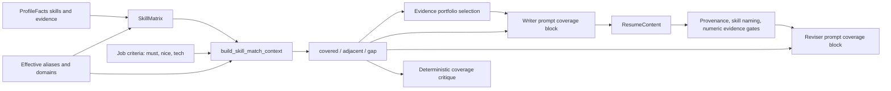

# Skill taxonomy: current architecture, tailoring effects, and research handoff

**Status:** Current-state technical reference and research brief

**Audience:** Engineers and a GPT Pro research session evaluating the next taxonomy design

**Code snapshot reviewed:** 2026-08-18

## 1. Purpose

This document explains how candidate and job skill classification is currently represented, how the classification agents create and maintain it, and how the result affects resume tailoring. It also separates the candidate-skill taxonomy from the repository's unrelated agent `SKILL.md` capability system. The final section is a self-contained handoff prompt for GPT Pro to research improvements.

The central conclusion is:

> Tailoring does not consume a category label and ask an agent to “write for that category.” It uses the taxonomy's canonical aliases and learned domains to construct deterministic `covered`, `adjacent`, or `gap` matches between job requirements and the candidate's evidence-backed skill matrix. That match context then guides evidence selection, drafting, revision, and coverage review. Candidate truth still comes exclusively from `ProfileFacts` and provenance gates.

## 2. Terms that must not be conflated

The codebase currently uses “skill,” “category,” and “group” for several different contracts.

| Concept | Shape | Direct effect | Authoritative source |
|---|---|---|---|
| Profile skill fact | `Skill(name, aliases, inferred, evidence_fact_ids, category)` | Candidate truth and render eligibility | [`models/profile.py`](../src/resume_agent/models/profile.py#L32) and tenant `facts.json` |
| Profile fact category | `hard`, `soft`, or `domain` | Controls the semantic kind of a profile skill and whether an inferred skill may be rendered; it does not define taxonomy adjacency | [`models/profile.py`](../src/resume_agent/models/profile.py#L32) |
| Canonical skill token | Normalized string plus alias-to-canonical mapping | Defines exact-match identity | `ClusterMap.aliases` in [`taxonomy/clusters.py`](../src/resume_agent/taxonomy/clusters.py#L21) |
| Taxonomy domain | Stable domain ID and human label containing canonical tokens | Defines adjacent-match membership | `ClusterMap.domain_of` and `domain_label` |
| Fixed taxonomy category / matrix group | One of 20 fixed slugs | Parents domains and organizes display; it does not directly determine exact or adjacent coverage | [`taxonomy/vocabulary.py`](../src/resume_agent/taxonomy/vocabulary.py#L7) |
| Matrix row | Canonical candidate skill, aliases, evidence IDs, strength, recency, display group | Supplies the candidate-side row and evidence selected during matching | [`profile/matrix.py`](../src/resume_agent/profile/matrix.py#L42) and tenant `matrix.json` |
| Resume skill-section key | Arbitrary string key in `ResumeContent.skills: dict[str, list[TailoredSkill]]` | Becomes the rendered line label in the Skills section; writer-produced, not a taxonomy ID or validated fixed slug | [`models/resume.py`](../src/resume_agent/models/resume.py#L74) and [`templates/resume.typ`](../templates/resume.typ#L210) |
| Career agent skill | A hash-verified local `SKILL.md` attached to an Agno agent | Adds authoring or review instructions/capabilities; it does not affect candidate matching | [`career_skills/models.py`](../src/resume_agent/career_skills/models.py#L12), [`career_skills/registry.py`](../src/resume_agent/career_skills/registry.py#L94), and `skills-lock.json` |

The fixed taxonomy vocabulary is:

1. Programming Languages
2. Frontend & Web
3. Backend & APIs
4. Mobile & Desktop
5. Data Engineering & Analytics
6. AI & Machine Learning
7. Databases & Storage
8. Cloud & Infrastructure
9. DevOps & Automation
10. Testing & Quality
11. Security & Compliance
12. Systems & Embedded
13. Architecture & Design
14. Tools & Platforms
15. Leadership & Management
16. Collaboration & Communication
17. Product & Business
18. Process & Methodology
19. Domain Knowledge
20. Other

Five fixed categories are marked “soft” for display (`leadership-management`, `collaboration-communication`, `product-business`, `process-methodology`, and `domain-knowledge`); the others are marked “hard.” This display kind is not the same field as a profile `Skill.category`.

## 3. Persisted model and precedence

### 3.1 Generated taxonomy

Each tenant's generated taxonomy is a `ClusterMap` with four maps:

```text
aliases:       observed token -> canonical token
domain_of:     canonical token -> domain ID
domain_label:  domain ID -> human-readable domain label
category_of:   domain ID -> one of the 20 fixed category slugs
```

The structure is therefore three-level:

```text
fixed category -> learned domain -> canonical skill <- aliases
```

`load_cluster_map()` validates strings, normalizes skill tokens, flattens aliases, drops invalid cycles, and defaults domains without a valid category to `other`. `save_cluster_map()` writes deterministic JSON via atomic replacement. See [`taxonomy/clusters.py`](../src/resume_agent/taxonomy/clusters.py#L21).

### 3.2 User correction ledger

User edits do not primarily mutate model output. They are stored as durable intent in tenant `taxonomy/taxonomy_corrections.json`:

- `skill_domain`
- `domain_renames`
- `domain_merges`
- `domain_category`
- `added_skills`
- `removed_skills`
- `aliases`

`apply_taxonomy_corrections()` replays this ledger idempotently after generated data, so valid user intent wins over LLM output. Dangling references are inert instead of corrupting the map. See [`taxonomy/corrections.py`](../src/resume_agent/taxonomy/corrections.py#L30) and [`taxonomy/corrections.py`](../src/resume_agent/taxonomy/corrections.py#L178).

Within one correction replay, ordering is explicit: correction aliases are combined and flattened first; domain merges redirect and remove losing domains; skill moves are resolved through the corrected aliases and redirected merge targets; domain renames and category changes are then applied to surviving targets; finally, labels and categories for unreferenced domains are pruned. Add/remove lists influence which skills enter classification demand, while the structural replay above operates on the map. Invalid or dangling targets are skipped.

`TaxonomyCustody` owns a per-workspace mutation lock and can return one coherent snapshot containing the generated map, corrections, effective map, lifecycle state, and a SHA-256 revision over all three persisted inputs. See [`taxonomy/custody.py`](../src/resume_agent/taxonomy/custody.py#L48).

### 3.3 Lifecycle state and derived artifacts

Tenant taxonomy state records the algorithm version, grouping outcomes, retired non-skills, legacy import state, and maintenance generations used for undo. Embeddings are cached separately in `skill_embeddings.json`; pre-maintenance snapshots live under `taxonomy/generations/`. See [`taxonomy/state.py`](../src/resume_agent/taxonomy/state.py#L30).

`taxonomy/skill_groups.json` is now a migration-only hint. During the first compatible profile rebuild, it may seed category hints; once its content hash is recorded in taxonomy state, the growing cluster map is the taxonomy source. The older standalone fixed-group classifier still exists in [`taxonomy/groups.py`](../src/resume_agent/taxonomy/groups.py#L130), but current production profile-build wiring does not call it.

### 3.4 Effective precedence

There are two related precedence chains:

**Taxonomy tree**

```text
generated ClusterMap
  -> replay taxonomy_corrections.json
  -> effective taxonomy
```

**Matrix display group**

```text
taxonomy category projection
  -> profile overrides.yaml group map
  -> profile/group_corrections.json
  -> MatrixRow.group and group_source
```

For matrix display, the final precedence is user group correction > profile override > taxonomy projection. This decoration does not change facts, aliases, domains, strength, recency, or provenance. See [`profile/matrix.py`](../src/resume_agent/profile/matrix.py#L404).

## 4. How classification is produced

### 4.1 Inputs

Classification demand can come from:

- missing candidate matrix skills during profile build;
- skill tokens collected from target job criteria during match-gap refresh;
- explicitly selected unassigned tokens;
- user-added taxonomy skills.

Removed skills and tokens previously adjudicated as `not_skills` are excluded. A scoped refresh only targets requested, known, currently unassigned tokens. See [`services/match_gap.py`](../src/resume_agent/services/match_gap.py#L164).

### 4.2 Agent sequence

| Stage | Agent/model tier | Job | Deterministic enforcement after the call |
|---|---|---|---|
| Canonicalization | Incremental canonicalizer, premium | Map new tokens to an existing canonical or cluster true synonyms | Exact input coverage, no invented tokens, stable existing canonical protection, global reconciliation |
| Domain assignment | Incremental themer, mid | Reuse an existing domain or propose a new domain under a fixed category | Known IDs/slugs only, high confidence required, coherent new-domain minimum, normalized token projection |
| Escalation | Escalation themer, premium on the match-gap API path | Place the ambiguous residue using smaller batches and the whole taxonomy | Same validators; new singleton domain allowed; per-run escalation bound |
| Placement floor | Deterministic | Place still-unassigned judged skills into `general-<category>` | Excludes provider-call failures and deferred tokens; honors the model's recorded category hint |
| Maintenance | Maintenance judge, mid | Merge, split, rename, or reparent model-owned domains | Pinned user state protected, bounded churn, no increase in unassigned skills, versioned undo |

The prompts and schemas are in [`tracking/canonicalize.py`](../src/resume_agent/tracking/canonicalize.py#L44). The orchestration and validation boundary is [`taxonomy/classification.py`](../src/resume_agent/taxonomy/classification.py#L354).

Important policy details:

- The 20 top-level categories are closed. Learned second-level domains may grow.
- `domains_per_category_target` defaults to 12 but is a soft organizational target, not a hard cap. See [`config.py`](../src/resume_agent/config.py#L75).
- The domain agent must label uncertainty. Only high-confidence valid assignments are accepted on the normal path.
- `not_skills` is terminal but reversible; it prevents phrases such as experience requirements from repeatedly consuming classification calls.
- A provider outage is distinguished from an invalid model answer. The placement floor must not turn a transient outage into a permanent classification.
- User-corrected domains and skills are pinned against automatic maintenance.
- The interactive match-gap refresh injects the premium escalation agent. Profile build currently does not inject it, so `refresh_clusters()` falls back to reusing the mid-tier first-pass themer for escalation. This is another wiring inconsistency to evaluate rather than an assumed policy.

### 4.3 Retrieval

Before classification, retrieval narrows the existing canonicals and domains shown to the agents. The default embedding model is `openai:text-embedding-3-small`, with provider requests bounded to 256 descriptors and a persisted cache. If embeddings are unavailable or partial, an IDF-weighted lexical fallback supplies prompt candidates.

Retrieval is not the classifier. It proposes a shortlist; the model response plus deterministic validation remains authoritative. An omitted existing domain is a hard veto only when retrieval mode is fully `embedding`. Under `partial` or `lexical`, the shortlist reduces prompt size but cannot forbid an otherwise valid domain reuse. See [`taxonomy/embeddings.py`](../src/resume_agent/taxonomy/embeddings.py#L471) and [`services/match_gap.py`](../src/resume_agent/services/match_gap.py#L259).

### 4.4 Profile-build integration

After facts are extracted and manual skills replayed, profile build:

1. builds a preliminary matrix;
2. finds matrix rows whose canonical token has no domain;
3. classifies only those missing tokens;
4. rebuilds the matrix from the updated cluster map;
5. decorates matrix groups;
6. writes `matrix.json`.

This is implemented in [`services/profile_build.py`](../src/resume_agent/services/profile_build.py#L74).

## 5. How the taxonomy affects tailoring

### 5.1 End-to-end flow



### 5.2 Matrix construction

The candidate matrix is built from `ProfileFacts.skills`. Each canonical row carries:

- the display spelling and aliases;
- `hard` / `soft` / `domain` profile category;
- literal or inferred status;
- evidence fact IDs;
- strength derived from distinct evidence and recency;
- an optional fixed display group.

Taxonomy aliases affect the row identity. Profile overrides may force or forbid aliases. The fixed group is decoration and is not used to decide match coverage. See [`profile/matrix.py`](../src/resume_agent/profile/matrix.py#L278).

### 5.3 Exact, adjacent, and gap matching

For each job `must_have_skills`, `nice_to_have_skills`, and `tech_stack` requirement, `build_skill_match_context()`:

1. normalizes the requirement;
2. resolves its taxonomy canonical alias;
3. marks it `covered` if the candidate matrix contains that canonical row;
4. otherwise finds candidate rows in the same taxonomy domain and marks the best by strength as `adjacent`;
5. otherwise marks it `gap`.

When adjacent candidates have equal strength, the canonical row key is the deterministic tie-breaker. The top-level fixed category is not consulted in this decision. Two skills are adjacent only when they share the same learned domain, not merely the same broad category. See [`profile/matrix.py`](../src/resume_agent/profile/matrix.py#L198).

### 5.4 Consumers inside tailoring

The tailoring service loads facts, `matrix.json`, and the cluster map, builds a `SkillMatchContext` for every job, and passes it into `TailorWorkflow`. See [`services/tailoring.py`](../src/resume_agent/services/tailoring.py#L47) and [`tailor/service.py`](../src/resume_agent/tailor/service.py#L179).

That context has four effects:

1. **Evidence portfolio planning.** Direct and adjacent requirements, evidence IDs, matrix strength, and recency help rank work/project evidence. The planner's output is normalized back to real fact IDs and bounded budgets. See [`tailor/evidence_portfolio.py`](../src/resume_agent/tailor/evidence_portfolio.py#L109).
2. **Writer guidance.** `format_coverage()` emits authoritative lines for each must-have, nice-to-have, and tech-stack requirement. Covered lines include evidence IDs; adjacent lines may guide emphasis but prohibit naming the JD term; gaps must not be claimed. See [`tailor/coverage.py`](../src/resume_agent/tailor/coverage.py#L79).
3. **Revision guidance.** The same coverage block is carried into every revision together with reviewer feedback, so a later pass does not lose the taxonomy-derived constraints. See [`tailor/workflow.py`](../src/resume_agent/tailor/workflow.py#L245).
4. **Measurement.** A deterministic advisory critique measures whether evidenced must-haves and supporting skills were actually rendered. “Supporting” means a covered nice-to-have or tech-stack requirement. The score is the rounded percentage of evidenced must-haves rendered; if there are no evidenced must-haves, it falls back to the rendered supporting percentage. Every missed must-have produces a major issue, while supporting omissions are sampled into one bounded major issue. The critique always has `passed=true`, so it is intentionally advisory rather than a hard gate. See [`tailor/coverage.py`](../src/resume_agent/tailor/coverage.py#L143) and [`tailor/coverage.py`](../src/resume_agent/tailor/coverage.py#L212).

### 5.5 What the taxonomy is not allowed to do

The taxonomy can guide selection and similarity, but it cannot create candidate truth.

- Every resume skill entry must cite a matching `ProfileFacts Skill` ID.
- An adjacent skill can be listed only under its own true name; it cannot be renamed to the job's requested technology.
- Inferred hard skills may be rendered only when they point to literal evidence.
- Inferred soft/domain skills are removed from the writer's renderable profile.
- Provenance, skill-naming, and numeric-evidence checks are deterministic gates on every round.

These constraints are enforced in [`tailor/agents.py`](../src/resume_agent/tailor/agents.py#L41), [`tailor/provenance.py`](../src/resume_agent/tailor/provenance.py#L120), and [`tailor/workflow.py`](../src/resume_agent/tailor/workflow.py#L125).

## 6. Separate system: career agent skills

The `skills/` directory and `skills-lock.json` do not classify candidate technologies. They define approved instruction packages that can be attached to task agents.

The registry verifies each `SKILL.md` against its manifest path, family, allowed use, version, and SHA-256 hash. The tailoring API can select a `ResumeAuthoringSkillName`; `build_tailor_bundle()` then attaches that verified local skill to both the writer and reviser. Selected reviewers may likewise receive fixed review skills such as `ats-resume-checker`, `resume-ats-optimizer`, or `resume-formatter`. See [`services/agents.py`](../src/resume_agent/services/agents.py#L98).

This affects *how an agent performs its role*. The candidate taxonomy affects *which candidate and job skills are exact, adjacent, or gaps*. The systems meet in the writer/reviser but are not one taxonomy and should not be redesigned as though they were.

## 7. Verified limitations and open risks

### 7.1 Verified read-path divergence; runtime impact still needs a regression

The implementation divergence is verified from the current code: match-gap and taxonomy maintenance explicitly replay `taxonomy_corrections.json`, often through `TaxonomyCustody`. The tailoring entry point loads `profile/cluster_map.json` directly, applies profile `overrides.yaml`, and does not replay the taxonomy correction ledger before building `SkillMatchContext` ([`services/tailoring.py`](../src/resume_agent/services/tailoring.py#L64)). Here, the **raw/effective-overrides map** means the generated cluster map after `overrides.yaml`; the **complete taxonomy artifact revision** is `TaxonomyCustody.revision`, which fingerprints generated data, the taxonomy correction ledger, and taxonomy lifecycle state.

The following user-visible consequences are hypotheses that still require the focused regression in section 11:

- a newly added alias or moved skill can appear correctly in match-gap but remain stale in tailoring;
- a domain merge may not immediately change adjacent matching;
- a correction may take effect only after another operation materializes the corrected tree into `cluster_map.json`;
- `matrix.json` freshness is fingerprinted against the raw/effective-overrides map, not the complete taxonomy artifact revision.

This is the strongest immediate architecture concern. A likely direction is one canonical effective-taxonomy read seam, with revision propagation into derived artifacts and stored resume attempts.

### 7.2 Three classification axes are semantically close but operationally separate

Profile fact category (`hard`/`soft`/`domain`), fixed taxonomy category, and resume output skill-section keys are related but not governed by one explicit contract. The current separation is sometimes valuable, but it creates opportunities for drift and unclear UX. Research should determine which distinctions are essential and which should become derived projections.

### 7.3 Adjacency is binary within a domain

Any candidate skill in the same domain can supply an `adjacent` match; the chosen row is the strongest candidate row, not necessarily the semantically closest row to the requirement. Retrieval similarity is used during taxonomy construction but is not persisted or consulted during tailoring adjacency selection. Large or heterogeneous domains can therefore overstate transferability.

### 7.4 Taxonomy quality is weakly connected to downstream outcomes

The system records classification failures and operational metrics, while tailoring measures coverage. It does not yet expose an evaluation suite that connects taxonomy decisions to:

- synonym precision and recall;
- domain coherence and stability;
- false adjacency rate;
- correction frequency and reversal rate;
- evidence selection quality;
- resume truthfulness, relevance, and interview usefulness;
- cost and latency per stable taxonomy improvement.

### 7.5 Legacy code and comments can mislead maintainers

The standalone fixed-group classifier remains tested but is not wired into current profile builds. Some comments still describe it as the next-build reclassification path. The research and implementation plan should include deletion, deprecation, or explicit compatibility ownership.

### 7.6 Verification performed for this document

The audit traced the source paths linked throughout this document and checked every referenced file and line anchor. On 2026-08-18, the following focused regression set passed:

```text
.venv/Scripts/python.exe -m pytest -q \
  tests/test_services_tailoring.py \
  tests/test_profile_matrix.py \
  tests/test_taxonomy_custody.py

29 passed
```

These tests support the existing service, matrix, and custody contracts; they do not prove the hypothesized correction-to-tailoring inconsistency. That missing cross-path regression is deliberately the first investigation in section 11.

## 8. Research questions for GPT Pro

The research should answer these questions in priority order:

1. What canonical architecture should guarantee one effective taxonomy across profile build, match-gap, suggestions, API/UI, evidence planning, and tailoring?
2. Should similarity used by tailoring be binary same-domain membership, a calibrated pairwise score, a typed relationship, or a combination?
3. How should aliases, near-synonyms, versions, vendor/product families, prerequisites, transferable skills, and composite phrases be represented without allowing false claims?
4. Which external standards are useful—such as O*NET, ESCO, SFIA, NICE, or commercial taxonomies—and what are their coverage, update cadence, licensing, and engineering trade-offs?
5. Should the fixed 20-category vocabulary remain closed, become occupation-aware, or exist only as a UI projection over a richer graph?
6. How can human corrections become active-learning signals without allowing one tenant's preferences to contaminate another tenant or override truth?
7. What offline gold sets and online metrics would prove improvement, especially false-adjacent and false-synonym error rates?
8. How should taxonomy revisions be versioned, migrated, diffed, rolled back, and attached to derived matrices and resume attempts for reproducibility?
9. What model/retrieval pipeline minimizes cost and instability while retaining good long-tail coverage?
10. What phased migration preserves existing files, APIs, UI behavior, fact-lock rules, and stored resume compatibility?

## 9. Recommended research deliverables

Ask GPT Pro to return:

1. an externally sourced landscape review with links and licensing notes;
2. an audit of the current architecture using this document as the baseline;
3. two or three candidate target architectures with explicit trade-offs;
4. a recommended canonical data model and read/write lifecycle;
5. a taxonomy-to-tailoring contract, including exact and adjacent semantics;
6. an evaluation plan with labeled datasets, metrics, thresholds, and failure analysis;
7. a compatibility-first migration plan in small phases;
8. a risk register covering truthfulness, bias, tenant isolation, drift, cost, latency, and rollback;
9. a list of code seams and tests that should change first;
10. clearly separated “evidence from sources,” “inference,” and “recommendation.”

## 10. Copy/paste handoff prompt for GPT Pro

This prompt intentionally repeats the critical baseline and questions from sections 2–9 so it can be pasted into a new GPT Pro conversation without relying on this document's surrounding context.

```text
You are researching how to improve the skill-taxonomy system in a resume-tailoring application. Treat the CURRENT SYSTEM section below as an implementation baseline supplied by the repository audit. Verify external claims with current primary sources and link them. Do not assume that external occupational standards can be copied into a commercial product; investigate licensing, attribution, update cadence, geography, and coverage.

GOAL
Recommend a compatibility-first evolution of the taxonomy that improves synonym accuracy, domain coherence, adjacent-skill precision, maintainability, and downstream tailoring quality without weakening the fact-lock or inventing candidate skills.

CURRENT SYSTEM
- Candidate truth lives in ProfileFacts. A profile Skill has name, aliases, inferred status, evidence_fact_ids, and category hard/soft/domain.
- A separate three-level taxonomy is fixed category -> learned domain -> canonical skill <- aliases.
- There are 20 fixed top-level display categories. Second-level domains are LLM-generated and may grow.
- ClusterMap persists aliases, domain_of, domain_label, and category_of.
- User edits are durable intent in taxonomy_corrections.json and should beat generated output.
- Classification is incremental: premium synonym canonicalizer, mid-tier domain classifier, premium escalation for unresolved tokens, deterministic validation, then an optional deterministic general-category placement floor. A mid-tier maintenance judge may merge/split/rename/reparent model-owned domains while user-corrected state is pinned.
- Embeddings (currently OpenAI text-embedding-3-small) or lexical fallback retrieve prompt candidates. Retrieval narrows context; it is not authoritative classification.
- Candidate ProfileFacts become a SkillMatrix with canonical key, aliases, evidence ids, inferred status, strength, recency, and display group.
- For each JD must-have, nice-to-have, and tech-stack requirement, tailoring resolves the canonical token. A candidate row with the same canonical is covered. Otherwise the strongest candidate row in the same learned domain is adjacent. Otherwise it is a gap.
- This SkillMatchContext guides evidence-portfolio selection, writer and reviser prompts, and deterministic advisory coverage measurement.
- Taxonomy similarity never establishes candidate truth. Resume skills and claims must cite ProfileFacts. Adjacent skills cannot be renamed as the JD term. Provenance, skill-naming, and numeric-evidence gates enforce this.
- The repository also has hash-verified agent SKILL.md packages. Those are prompt capabilities for writers/reviewers and are not the candidate taxonomy.

VERIFIED IMPLEMENTATION FINDINGS
1. Effective taxonomy reads are inconsistent. Match-gap replays the user-correction ledger, but the tailoring entry point currently reads cluster_map.json directly and applies only profile overrides.
2. Adjacency is binary same-domain membership. The strongest candidate row is selected, not necessarily the closest skill to the requirement.
3. Profile hard/soft/domain category, fixed taxonomy category, and rendered skills-section grouping are separate axes without one explicit governance contract.
4. Matrix and resume-attempt metadata do not carry TaxonomyCustody's complete revision across generated map, correction ledger, and lifecycle state. Whether that omission causes observed stale tailoring is not yet proven.
5. Existing operational metrics do not establish synonym accuracy, domain coherence, false adjacency rate, or downstream tailoring improvement.
6. A legacy fixed-group classifier remains in code but is not part of the current profile-build path.
7. Match-gap refresh uses the premium escalation classifier, while profile-build refresh currently reuses the mid-tier classifier for its escalation pass.

HYPOTHESES THAT REQUIRE A CROSS-PATH REGRESSION
- A newly added alias or moved skill can appear correctly in match-gap but remain stale in tailoring.
- A domain merge may not immediately change adjacent matching.
- A correction may take effect in tailoring only after another operation materializes the corrected tree into cluster_map.json.
- Matrix freshness checks may accept an artifact that does not represent the complete taxonomy artifact revision.

RESEARCH QUESTIONS
1. What canonical architecture should guarantee one effective taxonomy across all consumers?
2. What relationship model should replace or refine binary adjacency?
3. How should aliases, true synonyms, related skills, product families, versions, prerequisites, and composites be represented?
4. Compare O*NET, ESCO, SFIA, NICE, and other relevant current standards or open datasets. Include licensing and applicability.
5. Should fixed top-level categories remain authoritative or become a UI projection?
6. How can tenant corrections inform active learning safely?
7. Which gold datasets and metrics should gate migration?
8. How should revisions, migrations, diffs, rollback, and artifact provenance work?
9. Which model, embedding, graph, clustering, or hybrid approaches are best under realistic cost/latency constraints?
10. How can the change ship incrementally without breaking existing JSON files, APIs, UI, prompts, stored resumes, or fact-lock behavior?

REQUIRED OUTPUT
- Executive recommendation.
- Current-state critique.
- Primary-source landscape and comparison table with links.
- 2-3 target architecture options and trade-offs.
- Recommended canonical data model and lifecycle.
- Exact/adjacent/gap semantics for tailoring.
- Evaluation design: datasets, labeling guide, metrics, thresholds, ablations, and error analysis.
- Compatibility-first phased migration with rollback points.
- Security, bias, tenancy, truthfulness, cost, latency, and maintenance risks.
- Concrete first engineering slice and tests.
- Separate sourced facts, your inferences, and your recommendations.

Do not propose an autonomous taxonomy rewrite before defining evaluation gates and rollback. Do not weaken the rule that taxonomy relationships guide selection but never establish candidate facts.
```

## 11. Suggested first engineering investigation after research

Before changing taxonomy intelligence, build a focused regression that:

1. creates a generated taxonomy and matrix;
2. applies a user alias, skill move, and domain merge only through `taxonomy_corrections.json`;
3. proves the match-gap graph observes each edit;
4. runs tailoring's `build_skill_match_context` path;
5. records which edits are missing;
6. introduces a single effective-taxonomy loader and taxonomy revision contract;
7. proves match-gap, matrix, portfolio planning, and tailoring all consume the same revision.

That slice addresses a correctness boundary independent of whichever richer taxonomy model the research ultimately recommends.
