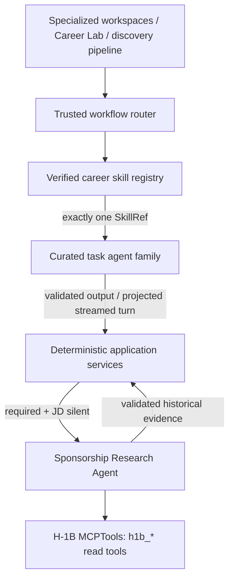

# Career Skills and H-1B Agent Wiring

**Status:** Approved design
**Date:** 2026-08-02
**Scope:** Curated Agno agents, all approved local career skills, Career Lab,
and H-1B sponsorship enrichment
**Related:** `docs/agno-job-hunting-agent-implementation-spec.md`, narrowed by
this design; ADR-0011

## Goal

Wire every approved local career skill to the workflow where it belongs, make
all affected LLM calls explicit Agno agents behind the existing `AgentRunner`
seam, and add one MCP integration: historical H-1B sponsorship research.

The application remains authoritative for routing, validation, persistence,
fact-locks, filters, scoring policy, approvals, and mutations. Agents analyze or
draft; they do not become the system of record.

## Scope Decisions

- Use curated workflow agents, not a single super-agent and not one bespoke
  agent implementation per skill.
- Register all 35 on-disk skills. Thirty-four are user-facing career skills;
  `project-dossier` is internal to profile/project ingestion.
- Give a task agent exactly one verified skill. Never concatenate related skill
  instructions or expose a whole skill family to one run.
- Add a streamed Career Lab web workspace, API, and CLI for the career skills
  that do not belong to an existing specialized workflow.
- Integrate only the H-1B MCP server. Existing job-source connectors remain the
  discovery mechanism.
- Run H-1B research automatically only when the user requires sponsorship and
  a job description's sponsorship signal is `silent`.
- Treat H-1B results as historical employer evidence. They cannot change a
  current job's signal to `offered`, hard-reject a job, or prove present policy.
- Support operator-configured local `stdio` or Streamable HTTP for H-1B, with
  exactly one transport configured and no community URL enabled by default.

## Non-goals

- ATS, Scanner, JobSpy, GitHub, JobGPT, or LinkedIn MCP integration.
- Vendoring or operating third-party MCP server source in this repository.
- Application submission, email sending, uploads, remote-profile changes, or
  other autonomous external mutations.
- The broader canonical-provenance, reversible-deduplication, and multi-source
  storage redesign in the referenced implementation specification.
- Moving deterministic fit scores, filters, fact-locks, or approval policy into
  prompts or skills.

## Current Constraints

- The application already constructs purpose-specific Agno `Agent` instances
  and wraps them in `AgentRunner`, which owns provider key refresh, quotas,
  retries, usage recording, streaming, and async cleanup.
- `services/agents.py` is the shared bundle-building seam for discovery,
  tailoring, and cover letters.
- Coach, Interview, and Scout already share the turn-per-run session and
  streaming substrate.
- The repository contains 35 `skills/*/SKILL.md` directories, but
  `skills-lock.json` currently covers only 22. The other 13 must be reviewed and
  hash-pinned before the registry can expose them.
- The current environment has Agno installed but not the optional `mcp` Python
  dependency, so importing `agno.tools.mcp.MCPTools` fails until that dependency
  is added.

## Architecture



### Stable boundaries

1. Interaction code supplies a workflow action, an explicit skill, or a Career
   Lab message.
2. Specialized workflows select a fixed skill or an allowed family variant.
   Career Lab accepts an explicit skill or uses a tool-free Router Agent whose
   structured output is a closed enum.
3. The registry validates the selected manifest entry, root-confined path, file
   type, content hash, and version.
4. The agent factory returns a reusable `AgentRunner` keyed by agent family,
   skill reference, model id, output schema, and prompt-policy version.
5. The Agno agent receives core application instructions plus
   `Skills(loaders=[LocalSkills(selected_skill_directory)])`. The selected
   directory is the only skill visible to that agent.
6. Application services validate the output and perform any persistence or
   mutation.

Agents are cached and reused by stable configuration. They are not created in a
per-item loop. The H-1B workflow creates one connected toolset and one
Sponsorship Research Agent per enrichment batch, then reuses them for unique
companies on the same async loop.

## Skill Registry

### Manifest contract

Each approved skill entry contains:

- canonical name;
- source repository and reviewed commit or release;
- repository-relative directory and `SKILL.md` path;
- SHA-256 of the approved `SKILL.md` bytes;
- local version;
- agent family;
- allowed workflow uses;
- user-facing versus internal-only classification.

At startup or first registry construction:

1. Resolve the configured skill root.
2. Resolve each directory and file under that root.
3. Reject traversal, absolute manifest paths, non-files, symlink escapes,
   duplicate names, invalid UTF-8, and oversized content.
4. Compare the observed hash with the lock.
5. Build closed enums from successfully verified manifest entries.

An invalid skill fails closed for that capability. It is never silently loaded
from disk, substituted with a related skill, or guessed by path. The application
may remain available, but a workflow requiring the invalid skill returns a
typed capability-unavailable result and setup/readiness reports the defect.

### Skill reference

```python
class SkillRef(BaseModel):
    name: str
    version: str
    sha256: str
    family: AgentFamily
```

`SkillRef` is attached to the runner/run context and persisted on every
influenced analysis, artifact, or assistant turn.

An artifact can be influenced by several sequential steps while each step still
loads one skill. Persist those events as `SkillUse` values containing
`skill_ref`, `stage` (`generated`, `reviewed`, or `revised`), and `used_at`.

## Agent Families and Skill Routing

### Job Analysis Agent

- `job-description-analyzer`
- `job-fit-analyzer`

Job criteria extraction selects the first. Fit and gap explanation selects the
second. Neither agent receives raw MCP access; sponsorship context is supplied
as validated application data.

### Resume Authoring Agent

- `academic-cv-builder`
- `academic-research-cv`
- `creative-portfolio-resume`
- `executive-leadership-resume`
- `executive-resume-writer`
- `resume-bullet-writer`
- `resume-customizer`
- `resume-quantifier`
- `resume-section-builder`
- `resume-tailor`
- `software-engineer-resume`
- `tech-resume-optimizer`

The Tailor workspace defaults to `resume-customizer`. A role-specific or
operation-specific choice replaces that default for the step; it does not layer
a second skill on top. Core fact-lock and provenance instructions remain stable
application policy for every choice.

### Resume Review Agent

- `ats-resume-checker`
- `resume-ats-optimizer`
- `resume-formatter`
- `resume-version-manager`

Deterministic provenance validation remains a gate outside the agent. Existing
reviewer personas remain core prompt policy. A selected review skill influences
only the corresponding review or artifact-management step.

### Cover Letter Agent

- `cover-letter-generator`
- `cover-letter-writer`

Draft, revise, and manual-revision builders become skilled Agno agents while
retaining their structured `CoverLetterContent` output and fact-lock.

### Interview Agent

- `interview-prep-generator`
- `mock-interview-coach`

One-shot preparation selects the first; the existing multi-turn mock interview
selects the second. The persona and formatter are both Agno agents; the selected
procedural skill belongs to the persona, not the schema projector.

### Career Lab Agent

- `application-form-filler`
- `career-changer-translator`
- `career-pivot-planner`
- `cold-email-writer`
- `compensation-negotiator`
- `linkedin-profile-booster`
- `linkedin-profile-optimizer`
- `offer-comparison-analyzer`
- `portfolio-case-study`
- `portfolio-case-study-writer`
- `reference-list-builder`
- `salary-negotiation-prep`

These skills are exposed through Career Lab. Similar variants stay independently
selectable. If a user does not select one, a tool-free Router Agent returns one
of these exact enum values. Invalid, ambiguous, or unusable routing asks the user
to select a skill; it never falls through to another skill.

### Internal Profile Agent

- `project-dossier`

This skill remains internal to project/profile ingestion and is not listed by
Career Lab.

## Affected LLM Calls

All model work in the affected paths is represented by an Agno `Agent` behind
`AgentRunner`:

- Career Lab router, persona, and formatter;
- job-description and fit agents;
- resume writer, reviser, revision, and review agents;
- cover-letter writer, reviser, and revision agents;
- interview persona, prep, debrief, and formatter agents;
- Sponsorship Research Agent.

No affected service imports a concrete model SDK or calls a provider client
directly. Deterministic transformations remain plain Python and are not wrapped
in agents merely for uniformity.

## H-1B Sponsorship Enrichment

### Trigger and order

The discovery funnel becomes:

1. Extract `JobCriteria` from the job description.
2. Apply the existing deterministic filter.
3. Select kept jobs where `SearchConfig.sponsorship_required` is true and
   `sponsorship_signal` is `silent`.
4. Group selected jobs by normalized company identity.
5. Reuse fresh cached evidence; research only missing or expired companies.
6. Add validated historical evidence to fit input.
7. Run existing fit scoring and shortlisting.

`offered` needs no historical check. `denied` remains rejected by the existing
filter. `silent` remains uncertain even when historical filings exist.

### MCP configuration and lifecycle

The Python project adds the supported MCP dependency required by the pinned
Agno version. H-1B configuration is typed and enforces:

- disabled by default;
- transport is `stdio` or `streamable-http`;
- enabled `stdio` requires a command and forbids a URL;
- enabled HTTP requires an absolute allowed URL and forbids a command;
- stable `tool_name_prefix="h1b"`;
- explicit timeout and result-size limits.

One async enrichment operation owns the MCP lifecycle. It creates and connects
one `MCPTools`, pushes its close callback immediately, creates one Sponsorship
Research Agent, processes unique companies within a bounded concurrency limit,
and closes the toolset on the same event loop. Partial startup and per-call
failures cannot leak a connection.

### Tool allowlist

Only these read operations are exposed:

- `get_company_stats`;
- `search_h1b_jobs`;
- `get_available_data`.

The natural-language `ask`, dataset download/load, CSV export, and any unknown
future tools are excluded. Operators prepare local data out of band.

### Evidence model

```python
class H1BSponsorshipEvidence(BaseModel):
    status: Literal["matched", "no_match", "unavailable"]
    normalized_company: str
    display_company: str | None
    fiscal_periods: list[str]
    filing_count: int | None
    certified_count: int | None
    wage_summary: dict[str, float] | None
    source_url: str | None
    data_version: str | None
    retrieved_at: datetime
    expires_at: datetime
    confidence: float
    caveat: str
```

There is intentionally no `current_role_sponsors` field. Model output is
validated and projected into this schema; raw MCP content is not passed onward.

### Persistence and presentation

A workspace-local `h1b_company_evidence` table caches one current record per
normalized company. Its columns are `id`, unique `normalized_company`,
`display_company`, `status`, `evidence_json`, `source_url`, `data_version`,
`retrieved_at`, `expires_at`, and `schema_version`. Job analysis metadata
references the evidence row used.
The job detail and fit explanation may show “historical H-1B filings found” with
period and retrieval date, always alongside the historical-only caveat.

The cache prevents one MCP call per opening. No-match and unavailable are
distinct. An unavailable check never becomes no-match.

## Career Lab

Career Lab reuses the `SessionStore`, streamed run events, formatter retry,
refresh recovery, cancellation behavior, archive lifecycle, and one-active-
session rule already used by Coach, Interview, and Scout.

### Turn input

A turn contains:

- the user message;
- an optional explicit Career Lab skill;
- typed optional references to a job, profile snapshot, resume version, offer,
  or prior Career Lab artifact;
- no arbitrary filesystem path.

Application services resolve referenced data inside the current `UserContext`,
bound its size, label it as untrusted data, and assemble the prompt.

### Turn execution

1. Use the explicit validated skill or run the structured Router Agent.
2. Resolve the verified `SkillRef`.
3. Reuse the matching Career Lab `AgentRunner`.
4. Stream persona prose through the existing stream sink.
5. Project metadata through a formatter agent and validate it.
6. Persist one assistant turn with its `SkillRef` only after validation.

Stopping or failing before validation discards the partial assistant turn and
leaves the durable transcript unchanged.

Career Lab outputs are drafts. Application answers, cold outreach, LinkedIn
text, references, and negotiation materials receive no sending, uploading,
application, or profile-mutation tools.

When a Career Lab job-fit request needs sponsorship evidence, the service calls
the same sponsorship enrichment seam before invoking the skilled Career Agent.
The Career Agent never receives `MCPTools` directly.

### Session records

`CareerLabSession` extends the shared session model with an optional goal and a
list of `CareerLabTurnRecord`. User turns store bounded context references;
assistant turns store the message, exactly one `SkillRef`, optional structured
artifact metadata, and an optional degraded-turn notice. Session JSON lives at
`<workspace>/career-lab/session-<id>.json` under `SessionStore` custody.

## Artifact and Run Metadata

Persist the selected `SkillRef` and effective model/prompt-policy version on:

- job criteria and fit-analysis metadata;
- each `ResumeVersion` created or revised by a skill;
- each `CoverLetter` created or revised by a skill;
- interview session metadata when a skill influences the session;
- each Career Lab assistant turn;
- background run metadata used for audit and support.

Storage uses dedicated metadata fields or typed JSON sidecars rather than
mixing provenance into rendered resume or cover-letter content.

Database changes add `analysis_meta_json` to `Job` and `skill_uses_json` to
`ResumeVersion` and `CoverLetter`. Session-backed Interview and Career Lab data
store the equivalent typed metadata in their validated JSON records. Existing
rows use `None` to mean legacy/unknown, never an empty claim that no skill was
used.

## Error Handling

| Failure | Behavior |
|---|---|
| Invalid skill path, hash, version, or content | Reject that capability; return typed unavailable result; report in readiness |
| Router returns an invalid/ambiguous skill | Run no task agent; request explicit user selection |
| H-1B disabled or invalidly configured | Expose no MCP tools; continue with historical evidence unavailable |
| MCP startup failure | Close anything already opened; record typed provider failure; continue discovery |
| Timeout, disconnect, invalid response, or oversized result | Persist no match claim; mark unavailable; continue other companies/jobs |
| Sponsorship agent output fails validation | Treat as unavailable, never as no-match or positive evidence |
| Career Lab stream is stopped | Discard partial assistant turn; keep transcript byte-identical |
| Formatter fails after retry | Preserve the existing degraded-turn contract without inventing skill metadata |

## Security

- Core agent policy states that skills, MCP responses, jobs, resumes, profiles,
  and user attachments are untrusted data subordinate to system policy.
- Only Sponsorship Research receives `h1b_*` tools.
- Every other task agent receives zero MCP tools and at most one skill loader.
- Tool availability is structural; instructions cannot enable a provider.
- Model output cannot authorize persistence or a remote action.
- User context references are tenant-scoped and resolved by application code.
- Logs and traces exclude credentials, raw MCP payloads, skill bodies, resumes,
  profile bodies, contact details, and full user messages.

## Observability

Record safe structured fields:

- agent family, prompt-policy version, provider, and model;
- skill name, version, and hash;
- run, job, artifact, and session correlation ids;
- H-1B enabled/healthy/cache status, latency, and result/failure counts;
- router outcome and typed failure code.

Provider failure appears as a coverage warning rather than a successful empty
result.

## API, CLI, and Web Surface

The API contract adds:

- `GET /api/career-lab/skills`;
- `POST /api/career-lab/sessions`;
- `POST /api/career-lab/sessions/{session_id}/messages`;
- `POST /api/career-lab/sessions/{session_id}/end`;
- `GET /api/career-lab/sessions`;
- `GET /api/career-lab/sessions/{session_id}`;
- `POST /api/career-lab/sessions/{session_id}/archive`;
- `POST /api/career-lab/sessions/{session_id}/unarchive`;
- `DELETE /api/career-lab/sessions/{session_id}`.

Session creation and messages return `202 RunOut`; the existing run registry and
stream endpoints provide active-run recovery. Job detail adds typed H-1B
capability/evidence fields without exposing raw provider output.

The CLI adds `resume-tailor-harness career-lab` with optional `--skill` and typed job,
resume, and offer references. It follows the Scout command's interactive
session lifecycle and streaming sink. The web adds `/career-lab`, using shared
guided-workspace components with a skill picker, context selectors, responsive
rails, keyboard operation, stop, archive, and refresh recovery.

Any API schema changes regenerate the OpenAPI document and TypeScript clients.

## Configuration

```dotenv
CAREER_SKILL_ROOT=./skills
CAREER_SKILL_MANIFEST=./skills-lock.json

H1B_MCP_ENABLED=false
H1B_MCP_TRANSPORT=stdio
H1B_MCP_COMMAND=
H1B_MCP_URL=
H1B_MCP_TIMEOUT_SECONDS=30
H1B_MCP_MAX_RESULT_CHARS=200000
H1B_CACHE_TTL_DAYS=30
```

The three-tool allowlist and `h1b` prefix are code-owned constants, not
operator-expandable environment values. Enabling the provider with missing or
conflicting transport fields is a typed configuration error. When disabled,
command and URL values are ignored and no MCP import or connection is attempted.

## Verification

### Unit

- Every on-disk skill is represented exactly once; 34 are user-facing and
  `project-dossier` is internal.
- Manifest traversal, symlink escape, duplicate, encoding, size, version, and
  hash failures fail closed.
- Each agent builder receives exactly one `LocalSkills` directory and only the
  selected `SkillRef`.
- Agent caching keys include every behavior-affecting input.
- The Router Agent output is a closed Career Lab enum.
- H-1B trigger matrix covers required/not-required against
  offered/denied/silent.
- Historical evidence never mutates `sponsorship_signal` or hard-filter policy.
- Cache hit, miss, expiry, no-match, and unavailable remain distinct.
- Command/URL exclusivity and disabled-provider behavior validate.

### MCP contract and integration

- Local stdio and Streamable HTTP stub servers expose representative H-1B tool
  schemas and fixture responses.
- Tool snapshot contains the `h1b` prefix and only the three allowlisted tools.
- Partial startup, timeout, disconnect, malformed JSON, invalid schema,
  oversized result, and normal close all release the connection.
- A discovery run calls H-1B once per uncached company, reuses cache, continues
  after a failed company, and supplies only validated evidence to fit.

### Agent and session integration

- Affected production builders return `AgentRunner` around Agno agents; no
  concrete provider call bypasses the model seam.
- Structured outputs remain their expected Pydantic models.
- Career Lab explicit routing, automatic routing, streaming, stop, retry,
  refresh recovery, archive, and tenant isolation are covered.
- `SkillRef` survives run, artifact, and session persistence.
- Existing specialized workflow behavior and fact-lock tests remain green.

### Web and broad verification

- Career Lab skill picker/router, streaming tool/progress parts, responsive
  layout, keyboard use, unavailable skills, and H-1B evidence/caveat render.
- Focused backend and web tests run during implementation.
- Final verification includes backend tests, `ruff check`, web unit tests, web
  lint, web build, generated-contract checks, and the repository's broad verify
  target. A timeout or incomplete command is reported as incomplete, not pass.

## Acceptance Criteria

- All 35 skills are reviewed and hash-pinned; every one maps to exactly one
  family and only the 34 career skills are user-facing.
- Every affected LLM operation is an Agno agent behind `AgentRunner`.
- One task run exposes exactly one selected skill.
- Career Lab makes all 12 general career skills usable through web, API, and
  CLI with durable streamed sessions.
- H-1B is the only MCP integration and is exposed only to Sponsorship Research
  under prefix `h1b` and the three-tool read allowlist.
- Automatic H-1B enrichment runs only for sponsorship-required, JD-silent jobs,
  caches by company, and degrades without blocking discovery.
- Historical evidence is attributed and caveated and cannot assert current
  sponsorship.
- No new external write capability is introduced.
