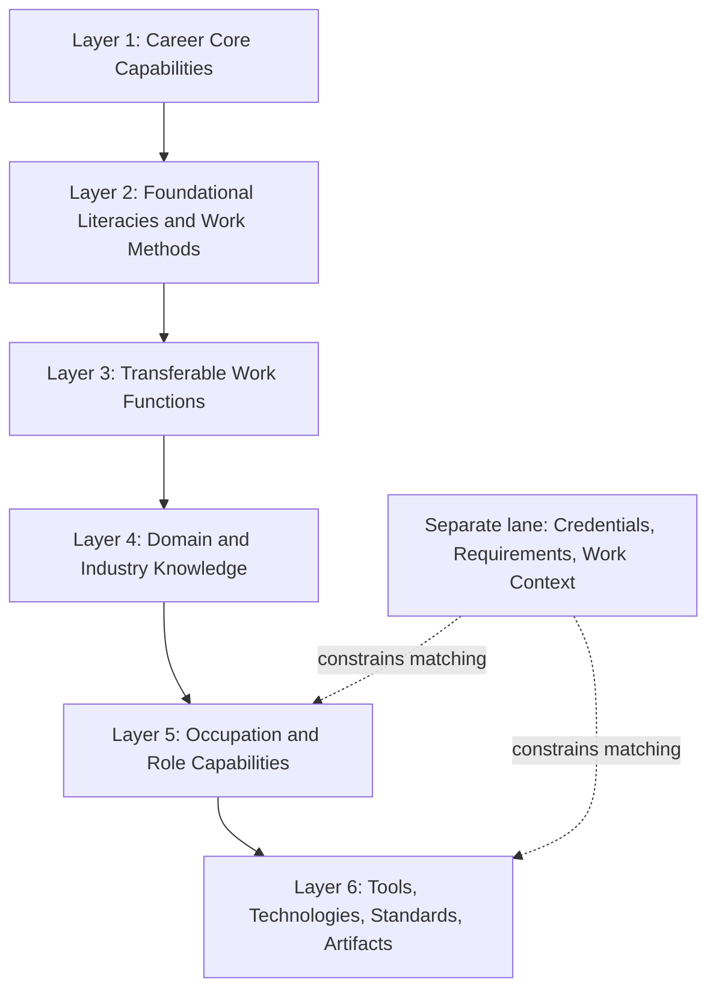
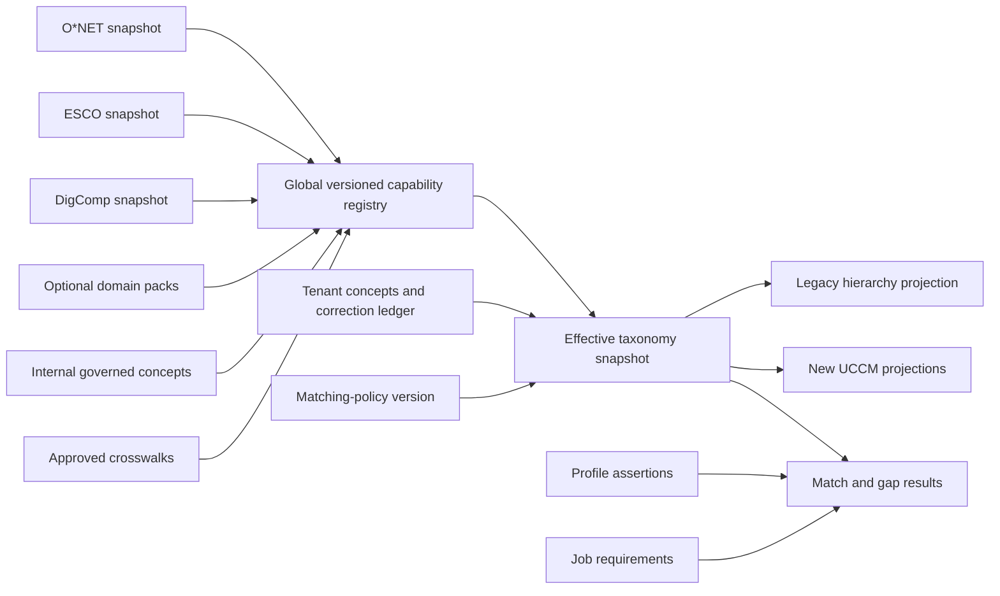
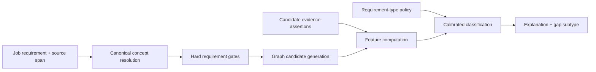

# Universal Career Capability Matrix (UCCM)

## Research report, target architecture, and Codex implementation handoff

**Status:** Recommended target design
**Research date:** 2026-08-18
**Audience:** Product owner, taxonomy/matching engineers, profile-extraction engineers, evaluation owners, and Codex
**Primary baseline:** `skill-taxonomy-current-state-and-research-handoff.md` (repository audit dated 2026-08-18)
**Primary use cases:** personal profile construction, evidence-backed skill assessment, job requirement extraction, job/profile matching, gap diagnosis, resume tailoring, career exploration, and development planning across industries

---

## Executive recommendation

Replace the current technology-oriented category hierarchy with a **Universal Career Capability Matrix (UCCM)** presented to users as a six-layer model, but implemented canonically as a **typed, versioned Career Capability Graph (CCG)**.

The recommended user-facing layers are:

1. **Career Core Capabilities** — broadly applicable behavioral capabilities such as reasoning, communication, collaboration, professional execution, learning, leadership, inclusion, and responsible digital/AI use.
2. **Foundational Literacies and Work Methods** — language, quantitative, data, information, research, project/process, risk, safety, and organizational literacies.
3. **Transferable Work Functions** — reusable kinds of work such as analyzing, designing, planning, operating, advising, teaching, serving, assuring, influencing, and managing.
4. **Domain and Industry Knowledge** — finance, human resources, education, healthcare, law, engineering, creative industries, manufacturing, public service, and other fields.
5. **Occupation and Role Capabilities** — role-specific practices, tasks, methods, and deliverables.
6. **Tools, Technologies, Standards, and Artifacts** — software, equipment, platforms, technical standards, languages, instruments, and work products.

A separate **Requirements and Context lane** must hold credentials, licenses, degrees, work authorization, location, schedule, security clearance, physical demands, and experience-duration requirements. These are important for job matching, but they are not skills and should not be forced into the skill taxonomy.

The canonical model must not be one tree. It must distinguish at least:

- capability or skill;
- knowledge;
- task or work activity;
- tool or technology;
- method or standard;
- work product or artifact;
- competency family;
- occupation or role;
- industry or domain;
- credential or requirement;
- work context; and
- evidence-backed person assertions.

Use **typed relationships** instead of binary same-domain adjacency. Exact synonyms, broader/narrower concepts, versions, product families, prerequisites, task support, knowledge requirements, tool use, occupation relevance, and calibrated transferability are different relationships and must remain different in storage and matching.

Use external standards as **versioned reference backbones and crosswalks**, not as a single imported truth:

- **O\*NET** for U.S. occupations, tasks, work activities, knowledge, skills, work context, and tools;
- **ESCO** for multilingual skills/occupations, skill reusability, essential/optional role links, and cross-border interoperability;
- **NACE** as a widely used U.S. higher-education crosswalk for career-core competencies, without copying restricted content into the product;
- **DigComp 3.0** as an open digital/AI-literacy module;
- **NICE** and other domain frameworks as optional domain packs;
- **SFIA** only under an appropriate license if its content is embedded in a commercial or recruitment product;
- **CASE 1.1** and **CTDL** as interoperability/export targets rather than the internal ontology.

The first engineering slice should **not** attempt a universal taxonomy import. It should first repair the current effective-taxonomy read divergence, propagate one complete taxonomy revision through all derived artifacts, and create regression tests. The graph model should then be introduced behind compatibility adapters and shadow evaluation.

---

## 1. Scope and success criteria

### 1.1 What this redesign must support

The model must work for students and candidates pursuing, among others:

- software, data, engineering, manufacturing, and skilled technical work;
- accounting, finance, banking, risk, and insurance;
- human resources, recruiting, learning and development, and organizational development;
- education, research, student services, and administration;
- management consulting, strategy, operations, and professional services;
- marketing, sales, customer success, and communications;
- design, media, writing, entertainment, and other creative work;
- healthcare, social services, public service, and nonprofit work;
- legal, compliance, policy, and regulatory work;
- hospitality, tourism, logistics, construction, agriculture, and other occupational families.

It must support two directions of reasoning:

1. **Person-centered:** What can this person demonstrably do, in which contexts, at what level, with what evidence, and how recently?
2. **Opportunity-centered:** What does this job actually require, which requirements are strict, and where is the person covered, transferable, partially covered, or missing?

### 1.2 Non-negotiable invariants

The redesign must preserve the strongest current truthfulness rules:

- Taxonomy relationships may guide retrieval, ranking, explanation, and development suggestions; they must not create candidate facts.
- A resume claim must remain grounded in candidate evidence.
- A transferable or related capability must be named by its true candidate-side label, not renamed to the job-description term.
- Credentials, legal requirements, protected attributes, and work-context constraints must not be inferred as ordinary skills.
- Every result must be reproducible from a pinned taxonomy revision, matching-policy revision, candidate evidence revision, and job-extraction revision.

### 1.3 Definition of success

The redesign is successful only if it improves measurable outcomes across a multi-industry gold set:

- higher synonym and concept-typing precision;
- lower false-transfer and false-adjacency rates;
- better explanation of _why_ a person matches or does not match;
- better separation of skill, knowledge, task, tool, credential, and context;
- improved cross-industry profile coverage;
- evidence-claim precision near 100%;
- stable taxonomy revisions and deterministic rollback;
- acceptable cost and latency; and
- no regression in existing fact-lock and resume provenance behavior.

---

## 2. Current-state baseline and the redesign problem

The repository audit establishes the following current contract:

```text
fixed category -> learned domain -> canonical skill <- aliases
```

The current 20 top-level categories are heavily optimized for technology roles. Fifteen are technical or tool-oriented categories; the remaining five combine leadership, collaboration, product/business, process, and domain knowledge. Profile skills also carry a separate `hard` / `soft` / `domain` category, while resume skill-section labels are a third, independently governed axis.

Current matching resolves each job requirement to a canonical token. It marks the requirement:

- `covered` when the candidate matrix contains that canonical;
- `adjacent` when the strongest candidate row belongs to the same learned domain; or
- `gap` otherwise.

This design has four immediate limitations for a universal career product:

1. **Coverage bias.** The top-level vocabulary treats technology as the default shape of work and non-technical careers as a small set of residual categories.
2. **Type collapse.** Knowledge, skills, tools, methods, work activities, and role requirements are represented too similarly.
3. **False adjacency risk.** Same-domain membership is binary and can overstate transferability, especially when a domain grows heterogeneous.
4. **Weak gap diagnosis.** `gap` does not distinguish absent capability, insufficient proficiency, stale evidence, missing credential, different context, or uncertain extraction.

The audit also identifies a correctness issue independent of the new model: match-gap and maintenance paths replay taxonomy corrections through the effective taxonomy, while the tailoring entry point reads `cluster_map.json` directly and applies only profile overrides. The first implementation step must establish one canonical effective-taxonomy read seam and revision contract before changing taxonomy intelligence.

### 2.1 What should remain

The redesign should keep:

- canonical identifiers and aliases;
- deterministic validation around model output;
- user correction precedence;
- evidence-linked profile rows;
- recency and strength signals;
- exact matching as the strongest semantic relationship;
- explicit truthfulness gates; and
- incremental, compatibility-first migration.

### 2.2 What should change

The redesign should replace:

- one closed, technology-heavy category list;
- one-parent classification as the canonical representation;
- `hard` / `soft` / `domain` as the primary semantic model;
- same-domain binary adjacency;
- untyped “skill” tokens that mix tools, tasks, knowledge, credentials, and behaviors; and
- gap results that do not identify the actual deficit.

---

## 3. Research method

### 3.1 Source selection

This review prioritized current, primary sources from government agencies, standards bodies, and framework owners. The landscape includes:

- broad career-readiness frameworks;
- occupational and labor-market taxonomies;
- competency-model architectures;
- digital and domain-specific frameworks;
- proficiency and qualifications frameworks;
- interoperability standards; and
- current skills-first policy research.

### 3.2 Evidence, inference, and recommendation

Throughout this report:

- **Source finding** means a statement directly supported by a cited framework or official source.
- **Design inference** means a conclusion drawn by comparing multiple sources and the current codebase.
- **Recommendation** means the proposed product and engineering decision.

The target UCCM labels and definitions are original product language. They are not reproductions of NACE, SFIA, or another copyrighted framework.

### 3.3 Licensing discipline

A framework can be influential without being safe to ingest. The implementation must preserve source-level licensing metadata and distinguish:

- content license;
- API or software license;
- attribution requirements;
- modification notices;
- commercial-use restrictions;
- redistribution restrictions; and
- territorial or component-specific limitations.

The research identifies suitable open sources, restricted references, and sources requiring legal review. This report is not legal advice.

---

## 4. Research findings

### 4.1 A common skills language needs more than a list

The OECD's 2026 _A Skills-First Labour Market_ treats a common skills language as central to scalable skills-first systems and emphasizes consistent links among skills, occupations, qualifications, and learning outcomes. It also identifies design trade-offs involving granularity, duplication, alignment, machine readability, governance, and interoperability.

**Design inference:** a universal model should not merely replace the current 20 category labels with a longer list. It needs stable identifiers, definitions, typed relations, external mappings, versioning, and governance.

### 4.2 NACE is a useful core-capability crosswalk, not a complete taxonomy

NACE defines eight career-readiness competencies: Career + Self-Development, Communication, Critical Thinking, Equity + Inclusion, Leadership, Professionalism, Teamwork, and Technology. The uploaded December 2025 competency sheets describe each competency through observable sample behaviors rather than occupation-specific tools.

NACE is clearly established in U.S. higher education: a September 2025 NACE quick poll reported that 83.3% of responding colleges were implementing the competencies. This is evidence of adoption among respondents, not proof that NACE is a comprehensive global occupational ontology.

NACE is strongest for:

- common language for early-career development;
- reflection and advising;
- behavior-based competency evidence; and
- institution/employer conversations about broad readiness.

NACE is not designed to provide:

- granular occupation-specific skills across the whole labor market;
- tool, technology, task, and knowledge entities;
- multilingual occupational mappings;
- typed transfer relationships;
- credential requirements; or
- a product-ready open data graph.

Its material is copyrighted. NACE's legal notice limits ordinary site material to private, noncommercial use without permission, and its competency assessment tool is explicitly noncommercial and may not be altered. NACE's current public page also states that the Equity + Inclusion competency is under review and recommends legal consultation before use. Therefore, the product should maintain a **crosswalk** to NACE but use independent labels, definitions, proficiency rubrics, and assessment items.

### 4.3 The DOL competency-model pattern validates general-to-specific layering

The U.S. Department of Labor Competency Model Clearinghouse uses a building-block pattern that moves from foundational personal, academic, and workplace competencies toward industry and occupation-specific competencies. Current public materials show a simplified six-tier presentation; older model-building materials describe a more detailed nine-tier model. Both express the same architectural idea: broad, reusable capabilities form a base, while industry, occupation, and management requirements become more specific.

**Design inference:** preserve the general-to-specific pattern but do not hard-code historical tier numbers. Use stable UCCM layers plus explicit concept types and reusability metadata.

### 4.4 O\*NET provides the strongest U.S. occupation/work anchor

O\*NET's Content Model explicitly separates worker characteristics, worker requirements, experience requirements, occupational requirements, occupation-specific information, and workforce characteristics. Its database includes skills, knowledge, abilities, work activities, detailed work activities, tasks, work context, education, job zones, software skills, and other descriptors.

O\*NET therefore demonstrates a critical modeling principle: **a task, a skill, a knowledge topic, a tool, a work style, and a credential-related requirement are not interchangeable entities.**

O\*NET 30.3 was released in May 2026 and is available in downloadable structured formats. Most database content is licensed under CC BY 4.0, with required attribution and modification notices.

Recommended role in UCCM:

- anchor U.S. occupations and SOC mappings;
- seed generalized and detailed work activities;
- supply occupation-to-skill, knowledge, task, tool, and context relationships;
- support importance/level evidence; and
- provide one source for role profiles, not the only canonical skill vocabulary.

### 4.5 ESCO provides multilingual skill structure and reusability

ESCO v1.2.1, updated December 10, 2025, contains a large multilingual skills pillar and an occupations pillar. The current official page reports 13,939 skill concepts and four top sub-classifications: Knowledge, Language Skills and Knowledge, Skills, and Transversal Skills. Each concept can include preferred and non-preferred terms, description, scope note, reusability level, and relationships.

ESCO distinguishes four reusability levels:

- transversal;
- cross-sectoral;
- sector-specific; and
- occupation-specific.

It also distinguishes **essential** from **optional** knowledge, skills, and competencies for an occupation and supports skill contextualization through broader/narrower relationships.

Recommended role in UCCM:

- multilingual labels and aliases;
- reusability metadata;
- occupation-skill crosswalks outside the U.S.;
- essential/optional requirement priors;
- hierarchical and SKOS-style mappings; and
- comparison with O\*NET rather than destructive ID merging.

EU-owned ESCO content is generally CC BY 4.0 unless otherwise indicated. The ESCO API software is licensed separately under EUPL 1.2, with supporting components under their own licenses.

### 4.6 Australia validates core/tasks/tools—and shows maintenance risks

The former Australian Skills Classification represented occupations through:

- Core Competencies;
- Specialist Tasks; and
- Technology Tools.

Jobs and Skills Australia's developing National Skills Taxonomy builds on this work and aims for an interoperable, shared language across education and employment. Consultation material also records limitations of the prior classification: difficulty keeping tools and specialist tasks current, over-reliance on an occupation lens, and inadequate occupation-specific skill levels.

**Design inference:** the core/tasks/tools split is useful, but the graph needs independent update cadences for stable core concepts, changing role tasks, and fast-changing tools. A universal model must also support both occupation and industry/domain views.

### 4.7 SkillsFuture Singapore demonstrates sector and career-path overlays

SkillsFuture's Skills Frameworks cover 38 sectors and connect sector information, career pathways, job roles, technical skill competencies, critical core skills, and training. The model is useful as evidence that a universal core should support sector-specific overlays and development pathways rather than replace them.

Recommended role in UCCM:

- design reference for sector packs, role progression, and training alignment;
- optional crosswalk when licensing and access terms are confirmed;
- not a global canonical source.

### 4.8 DigComp 3.0 is an appropriate open digital/AI module

DigComp 3.0 is the fifth edition of the European Digital Competence Framework. It retains a stable structure while updating competence wording, proficiency levels, learning outcomes, and AI integration. The Joint Research Centre provides PDF, editable, spreadsheet, linked-data/JSON, glossary, and implementation resources.

Recommended role in UCCM:

- seed the digital/data/AI fluency capability pack;
- provide learning outcomes and proficiency inspiration;
- keep technology-neutral digital competence separate from product-specific tools; and
- use its structured data under applicable EU reuse terms and attribution.

### 4.9 EQF and SFIA show why proficiency and responsibility must be separate

The European Qualifications Framework defines eight qualification levels through knowledge, skills, and responsibility/autonomy. It is a qualifications translation framework, not a micro-skill taxonomy, but it demonstrates that complexity and independent responsibility are distinct dimensions.

SFIA 9 uses seven levels of responsibility and generic attributes such as autonomy, influence, complexity, knowledge, and business skills/behaviors. It is mature for digital work but licensed: product, recruitment-service, redistribution, and commercial uses may require a paid license.

**Design inference:** UCCM should not encode seniority into the skill label. It should store:

- capability proficiency;
- autonomy;
- scope of responsibility;
- complexity;
- influence; and
- evidence confidence

as related but independent dimensions.

### 4.10 NICE demonstrates a maintainable domain-pack pattern

The NICE Workforce Framework for Cybersecurity Components v2.2.0 was released April 28, 2026. It defines work-role categories, work roles, competency areas, and Task, Knowledge, and Skill statements with explicit relationships.

Recommended role in UCCM:

- domain-pack architecture for cybersecurity;
- source of typed task/knowledge/skill relationships;
- example of community and subject-matter-expert maintenance;
- mapped namespace, not flattened into the core taxonomy.

### 4.11 CASE and CTDL are interoperability targets

1EdTech CASE 1.1 defines machine-readable competency frameworks, unique identifiers, hierarchy and alignment associations, rubrics, and REST/JSON exchange. Credential Engine's CTDL provides linked open-data structures connecting skills and competencies to credentials, learning opportunities, jobs, tasks, pathways, and outcomes.

Recommended role in UCCM:

- CASE export/import for learning outcomes and competency frameworks;
- CTDL/CTDL-ASN export for credentials, competencies, jobs, pathways, and linked data;
- internal model remains richer where matching requires evidence, tenancy, and calibrated relationship metadata.

---

## 5. Standards landscape and adoption decision

| Framework/source                   | Primary strength                                                                | Coverage and granularity                                     | Proficiency/relationship features                                                | Reuse position                                                                          | Recommended UCCM role                                                           |
| ---------------------------------- | ------------------------------------------------------------------------------- | ------------------------------------------------------------ | -------------------------------------------------------------------------------- | --------------------------------------------------------------------------------------- | ------------------------------------------------------------------------------- |
| NACE Career Readiness              | Broad early-career behaviors and common U.S. higher-ed language                 | Eight broad competencies with sample behaviors               | Assessment exists, but restricted; not an occupational graph                     | Copyrighted; noncommercial reprint/use constraints; assessment wording restricted       | Crosswalk and validation reference only; use original UCCM language and rubrics |
| DOL Competency Model Clearinghouse | General-to-specific building-block architecture and industry models             | Foundational through industry/occupation layers              | Observable key behaviors; multiple historical tier presentations                 | Official public resource; explicit open-data license was not established in this review | Architectural inspiration; do not bulk-copy until terms are confirmed           |
| O\*NET 30.3                        | U.S. occupation, task, work activity, skill, knowledge, context, and tool data  | Broad U.S. labor-market coverage with structured descriptors | Importance, level, frequency, job zones, occupation links                        | CC BY 4.0 for most database content with attribution/change notice                      | Primary U.S. occupation/work anchor and imported source namespace               |
| ESCO v1.2.1                        | Multilingual skills and occupations; reusability and essential/optional links   | Large EU-oriented vocabulary, 28 languages on current page   | Broader/narrower, preferred/non-preferred terms, reusability, essential/optional | EU content generally CC BY 4.0; API software EUPL 1.2                                   | Multilingual skill/occupation backbone and crosswalk; preserve source IDs       |
| Australian NST / legacy ASC        | Core competencies, specialist tasks, technology tools; interoperability agenda  | National occupation/sector reference; NST still developing   | ASC used core complexity; new model under development                            | ASC retained mainly for research; reuse terms require confirmation                      | Design reference and cautionary maintenance case, not canonical import yet      |
| SkillsFuture Singapore             | Sector frameworks, role pathways, training, technical/core skills               | 38 sectors, national context                                 | Sector-specific proficiency and career pathways                                  | Official access; reuse terms require confirmation                                       | Optional sector and pathway crosswalk                                           |
| DigComp 3.0                        | Digital, data, online safety, AI, and technology-neutral competence             | Five areas, 21 competencies, granular learning outcomes      | Revised proficiency levels and knowledge/skill/attitude outcomes                 | EU reuse terms; structured data available                                               | Open digital/AI foundation pack                                                 |
| EQF                                | Cross-system qualification level translation                                    | Qualifications rather than individual job skills             | Knowledge, skills, responsibility/autonomy across eight levels                   | EU public reference                                                                     | Inspiration for separate level/autonomy dimensions; credential mapping          |
| SFIA 9                             | Mature digital-work skills and levels of responsibility                         | Digital/IT-heavy, global use                                 | Seven responsibility levels and generic attributes                               | All use under license; commercial/product/recruitment use may require paid license      | Licensed crosswalk or benchmark only; do not ingest without appropriate license |
| NICE 2.2.0                         | Cybersecurity roles, competency areas, tasks, knowledge, and skills             | Deep domain coverage                                         | Explicit TKS and role relationships                                              | NIST source; preserve component notices and attribution                                 | Optional cybersecurity domain pack                                              |
| CASE 1.1                           | Exchange of competencies, standards, outcomes, rubrics                          | Interoperability schema, not labor-market content            | Hierarchy, associations, rubrics, GUIDs                                          | Specification usable under 1EdTech terms; certification separate                        | Export/import adapter                                                           |
| CTDL / CTDL-ASN                    | Linked data connecting skills, credentials, learning, jobs, tasks, and pathways | Interoperability vocabulary and registry                     | Rich graph relationships                                                         | Open schema; publisher/registry terms apply                                             | Export and ecosystem integration                                                |
| OECD skills-first research         | Governance and interoperability guidance                                        | Policy architecture, not a taxonomy dataset                  | Emphasizes common language and links across systems                              | Citable research                                                                        | Design validation and governance requirements                                   |

---

## 6. Design principles

### Principle 1 — “Skill” is a product umbrella, not one database type

A job description may contain all of the following:

- “financial reporting” — capability or task family;
- “GAAP” — knowledge/standard;
- “Excel” — tool;
- “CPA required” — credential;
- “five years of experience” — experience requirement;
- “communicates with executives” — contextualized capability/task;
- “detail-oriented” — work style or desired behavior;
- “prepare monthly close package” — task and artifact.

Treating all of them as equivalent skill tokens produces incorrect profiles and matches. The graph must type them separately.

### Principle 2 — Use a graph canon and layered projections

A skill can be:

- relevant to multiple industries;
- used by multiple occupations;
- part of several capability families;
- broader than one concept and narrower than another;
- dependent on knowledge;
- performed through several tools; and
- transferable only in a specific context.

A single-parent tree cannot represent these facts without duplication or loss. The graph is canonical; the six-layer matrix is a user-facing projection.

### Principle 3 — Separate semantic identity from relatedness

The following must never be one generic alias relation:

- exact spelling/abbreviation;
- true synonym;
- equivalent in a stated context;
- version of;
- member of a product family;
- broader/narrower;
- prerequisite;
- commonly co-used;
- transferable to; and
- merely similar in language.

Only exact lexical variants and approved true synonyms resolve to the same canonical concept.

### Principle 4 — Separate specificity from concept type

A concept needs independent metadata for:

- **type:** capability, knowledge, task, tool, method, artifact, credential, and so forth;
- **granularity:** family, cluster, demonstrable capability, atomic skill, technique/action;
- **reusability:** transversal, cross-sector, sector, occupation, employer-specific;
- **domain:** one or more industries/knowledge areas;
- **career layer:** core, foundational, functional, domain, role, enabler; and
- **claim policy:** what evidence is required before it may appear as a candidate claim.

### Principle 5 — Evidence and proficiency are assertions about people, not properties of taxonomy nodes

“Python” or “conflict mediation” does not have one universal proficiency. A person has an evidence-backed proficiency assertion in one or more contexts.

### Principle 6 — Matching must explain the deficit

A candidate may fail a requirement because of:

- no evidence;
- insufficient level;
- different domain context;
- obsolete or stale experience;
- missing subskill;
- strict tool mismatch;
- required credential;
- incomplete extraction; or
- genuinely absent capability.

These are different product actions and must not collapse into `gap`.

### Principle 7 — Stable core, faster-changing overlays

Update cadence should differ:

- core capability families: slow, governed changes;
- foundational methods and functions: moderate changes;
- occupation and domain mappings: regular releases;
- tools and technologies: frequent updates;
- employer-specific concepts: tenant-local;
- market-demand signals: continuously refreshed but not canonical truth.

### Principle 8 — External IDs are mapped, not merged away

Maintain source namespaces and source versions. Use `same_as`, `close_match`, `broader_match`, or custom mapping edges. Do not replace O\*NET, ESCO, DigComp, or NICE IDs with one opaque internal ID without preserving provenance.

### Principle 9 — Corrections are durable, scoped intent

A user correction should state:

- what node or edge is corrected;
- correction type;
- scope: candidate, tenant, or proposed shared mapping;
- reason and evidence;
- actor and timestamp;
- prior value;
- target revision; and
- whether it is safe for aggregation.

### Principle 10 — No autonomous rewrite without evaluation and rollback

Model-generated synonyms, mappings, transfer edges, or domain placements remain proposals until deterministic validation and applicable confidence/review gates pass.

---

## 7. Recommended Universal Career Capability Matrix

### 7.1 Two coordinated representations

**User representation: UCCM**
A multi-layer matrix that lets a person understand broad strengths, reusable functions, domain knowledge, role capabilities, tools, evidence, proficiency, and gaps.

**System representation: Career Capability Graph**
A typed graph of concepts and relationships, with source mappings, versioned snapshots, tenant overlays, and matching policy.



The arrows indicate increasing contextual specificity in the user view. They do **not** imply that every concept has exactly one parent.

### 7.2 Layer definitions

| Layer                                        | Purpose                                                                              | Typical entities                                                             | Examples                                                                                                         |
| -------------------------------------------- | ------------------------------------------------------------------------------------ | ---------------------------------------------------------------------------- | ---------------------------------------------------------------------------------------------------------------- |
| 1. Career Core Capabilities                  | Broad capabilities that support performance and career management across occupations | competency families and observable sub-capabilities                          | reasoned judgment, audience-adapted communication, collaboration, reliable execution, learning agility           |
| 2. Foundational Literacies and Work Methods  | General knowledge and methods used across many functions                             | literacy, method, foundational capability, standard practice                 | quantitative literacy, information evaluation, data literacy, project planning, research methods, risk awareness |
| 3. Transferable Work Functions               | Reusable kinds of work independent of one occupation                                 | generalized work activity, capability cluster, task family                   | analyze, design, plan, advise, operate, teach, sell, facilitate, assure quality, manage                          |
| 4. Domain and Industry Knowledge             | Context needed to perform correctly in a field                                       | knowledge domain, industry domain, regulatory context                        | corporate finance, employment law, pedagogy, healthcare operations, automotive systems, visual communication     |
| 5. Occupation and Role Capabilities          | Practices and deliverables characteristic of a role                                  | capability, task, method, artifact relationship                              | financial modeling, compensation benchmarking, lesson planning, requirements validation, user research           |
| 6. Tools, Technologies, Standards, Artifacts | Enablers and concrete work objects                                                   | tool, software, equipment, language, standard, artifact                      | Excel, Workday, CANoe, Adobe Illustrator, GAAP, lesson plan, policy memo, CAD model                              |
| Requirements and Context                     | Non-skill constraints and formal qualifications                                      | credential, license, education, experience, clearance, physical/work context | CPA, teaching license, RN license, work authorization, shift schedule, five years' experience                    |

### 7.3 Layer 1: original UCCM core capability families

These eight families provide a stable universal projection. They intentionally map to common themes in NACE, ILO/OECD, O\*NET work styles/skills, and other frameworks, but use original product language.

| UCCM family                               | Product definition                                                                                                 | Observable sub-capability examples                                                                                    |
| ----------------------------------------- | ------------------------------------------------------------------------------------------------------------------ | --------------------------------------------------------------------------------------------------------------------- |
| Career Navigation and Continuous Learning | Direct one's development and career using self-awareness, feedback, goals, relationships, and deliberate learning  | reflects on strengths, acts on feedback, plans development, explores opportunities, builds professional relationships |
| Reasoning, Judgment, and Problem Solving  | Frame situations, evaluate evidence and assumptions, generate options, and make defensible decisions               | problem framing, research, analysis, synthesis, bias checks, prioritization, decision rationale                       |
| Communication and Sensemaking             | Receive, structure, and exchange information so that intended audiences can understand and act                     | active listening, writing, presentation, questioning, visualization, persuasion, audience adaptation                  |
| Collaboration and Relationship Management | Work with others toward shared outcomes while managing responsibilities, differences, and conflict                 | coordination, feedback, conflict navigation, trust building, negotiation, cross-functional collaboration              |
| Professional Responsibility and Execution | Deliver reliable, ethical, safe, and high-quality work through planning, accountability, and attention to outcomes | dependability, prioritization, quality control, integrity, risk escalation, resilience, follow-through                |
| Leadership, Influence, and Mobilization   | Set direction and enable people or systems to achieve outcomes, with or without formal authority                   | vision, influence, delegation, coaching, change leadership, project ownership, resource alignment                     |
| Inclusive and Intercultural Practice      | Work effectively and fairly across differences in culture, identity, ability, background, and perspective          | perspective taking, accessible communication, barrier identification, inclusive decisions, cultural adaptation        |
| Digital, Data, and AI Fluency             | Select and use digital technology, data, automation, and AI responsibly to improve work and decisions              | tool selection, data handling, AI judgment, privacy/security, automation, digital adaptation, verification            |

**Roll-up rule:** broad family labels are primarily navigation and assessment categories. A profile should normally claim an observable sub-capability, task, or evidence statement rather than list “leadership” or “critical thinking” without evidence.

### 7.4 NACE-to-UCCM crosswalk

| NACE competency           | UCCM primary crosswalk                    | Notes                                                                                                       |
| ------------------------- | ----------------------------------------- | ----------------------------------------------------------------------------------------------------------- |
| Career + Self-Development | Career Navigation and Continuous Learning | Direct conceptual fit; UCCM uses original wording and separate evidence model                               |
| Communication             | Communication and Sensemaking             | UCCM explicitly includes reception, structuring, audience adaptation, and actionability                     |
| Critical Thinking         | Reasoning, Judgment, and Problem Solving  | UCCM treats problem framing, evidence, decision quality, and bias checks as sub-capabilities                |
| Equity + Inclusion        | Inclusive and Intercultural Practice      | Crosswalk only; current NACE label/status is under review and should not be hard-coded as product authority |
| Leadership                | Leadership, Influence, and Mobilization   | Covers formal and informal leadership; separates proficiency from scope and authority                       |
| Professionalism           | Professional Responsibility and Execution | Reframes as observable delivery, ethics, safety, reliability, and quality                                   |
| Teamwork                  | Collaboration and Relationship Management | Includes conflict, coordination, shared accountability, and relationship quality                            |
| Technology                | Digital, Data, and AI Fluency             | Expands beyond generic technology use while keeping product-specific tools in Layer 6                       |

### 7.5 Layer 3: transferable work-function families

The following are stable _function projections_, not mandatory single parents:

1. **Discover and research** — locate, collect, investigate, observe, interview, experiment.
2. **Analyze and diagnose** — structure, calculate, compare, model, interpret, troubleshoot.
3. **Decide and advise** — evaluate alternatives, recommend, approve, counsel, govern.
4. **Design and create** — conceive, write, compose, engineer, prototype, develop.
5. **Plan and coordinate** — schedule, scope, allocate, organize, integrate, sequence.
6. **Execute and operate** — deliver, produce, process, administer, run, maintain.
7. **Monitor and assure** — test, audit, inspect, validate, control, improve, manage risk.
8. **Communicate and influence** — explain, present, persuade, negotiate, market, sell.
9. **Collaborate and facilitate** — convene, coordinate, mediate, partner, co-create.
10. **Serve, support, and care** — assist, counsel, respond, protect, treat, accommodate.
11. **Teach and develop** — instruct, coach, assess learning, mentor, build capability.
12. **Lead and manage** — set direction, manage performance, make resource decisions, lead change.

A role capability can map to more than one function. For example, “facilitate a performance calibration meeting” maps to collaboration/facilitation, communication/influence, and people-management domain context.

### 7.6 Cross-career examples

| Career target               | Layer 1 core                                         | Layer 2 foundation                                    | Layer 3 function                   | Layer 4 domain                              | Layer 5 role capability                                          | Layer 6 enablers                                    | Requirements lane                                            |
| --------------------------- | ---------------------------------------------------- | ----------------------------------------------------- | ---------------------------------- | ------------------------------------------- | ---------------------------------------------------------------- | --------------------------------------------------- | ------------------------------------------------------------ |
| Financial analyst           | reasoning; communication; execution                  | quantitative and data literacy; research              | analyze; advise; assure            | corporate finance; accounting               | financial modeling; variance analysis; management reporting      | Excel; ERP; Power BI; financial model/workbook      | degree or certification preference; experience duration      |
| HR business partner         | communication; collaboration; inclusion; leadership  | data literacy; policy/risk awareness                  | advise; facilitate; plan; manage   | HR; employment law; organizational behavior | workforce planning; employee relations; performance management   | Workday; survey platform; policy memo               | jurisdictional knowledge; optional HR credential             |
| Teacher                     | communication; inclusion; learning; execution        | literacy; assessment methods; project planning        | teach; design; assess; support     | pedagogy; subject knowledge                 | lesson planning; differentiated instruction; learning assessment | LMS; classroom tools; lesson plan/rubric            | teaching license; background checks                          |
| Management consultant       | reasoning; communication; collaboration; leadership  | research; quantitative/data literacy; project methods | analyze; advise; design; influence | client industry and business strategy       | problem structuring; market analysis; executive recommendation   | Excel; presentation software; interview guide; deck | travel/context expectations; degree/experience preferences   |
| Graphic designer            | communication; execution; digital fluency            | visual literacy; research; project methods            | design; create; communicate        | visual communication; branding              | layout; typography; identity design; design critique             | Illustrator; Photoshop; Figma; portfolio/artwork    | portfolio requirement; sometimes degree preference           |
| Automotive systems engineer | reasoning; collaboration; execution; digital fluency | systems thinking; data literacy; safety/risk          | analyze; design; test; assure      | vehicle systems; ADAS; functional safety    | requirements analysis; CAN diagnostics; validation planning      | MATLAB; Python; CANoe; DBC; test report             | degree; sometimes safety certification or work authorization |
| Registered nurse            | communication; collaboration; execution; inclusion   | scientific literacy; safety; documentation            | assess; care; monitor; educate     | clinical care; patient safety               | patient assessment; medication administration; care planning     | EHR; medical equipment; clinical documentation      | active nursing license; shift/physical requirements          |

---

## 8. Canonical Career Capability Graph

### 8.1 Concept types

Recommended minimum enum:

```text
competency_family
capability
skill
knowledge
work_activity
task
method
standard
tool_technology
artifact
work_style
language
occupation_role
industry_domain
knowledge_domain
credential
requirement
work_context
learning_outcome
```

Guidance:

- `capability` is a demonstrable learned capacity, usually the main person-profile unit.
- `skill` is a relatively atomic learned capability; it may be retained as a subtype for product familiarity.
- `knowledge` represents facts, concepts, theories, rules, or domain understanding.
- `work_activity` is generalized work; `task` is a more contextual action/output.
- `tool_technology` is something used, not proof of the capability performed with it.
- `work_style` is a behavioral tendency and should require direct observation or assessment; it should not be inferred from demographic or weak proxy data.
- `credential` and `requirement` are not candidate skills.

### 8.2 Core node schema

```yaml
ConceptNode:
  id: "internal:capability:financial-modeling"
  type: capability
  preferred_label: "financial modeling"
  normalized_label: "financial modeling"
  definitions:
    - text: "Build and use structured quantitative models to evaluate financial performance, scenarios, or decisions."
      locale: en-US
      source_ref: "internal:definition:2026-08"
  aliases:
    - label: "finance modeling"
      locale: en-US
      alias_type: lexical_variant
      source_ref: "tenant:example"
  career_layers: [role_capability]
  granularity: demonstrable_capability
  reusability: cross_sectoral
  domains: ["internal:domain:finance"]
  status: active
  claim_policy: evidence_required
  source_refs:
    - namespace: internal
      source_id: "seed-2026-08"
      source_version: "1.0.0"
      license_id: "internal-proprietary"
  created_at: "2026-08-18T00:00:00Z"
  updated_at: "2026-08-18T00:00:00Z"
```

### 8.3 Typed edges

Recommended minimum edge types:

| Edge                             | Meaning                                       |                              May collapse identity? | Matching use                                    |
| -------------------------------- | --------------------------------------------- | --------------------------------------------------: | ----------------------------------------------- |
| `lexical_alias_of`               | spelling, abbreviation, or localized label    |                 Yes, after deterministic validation | canonicalization                                |
| `same_as`                        | source concepts judged semantically identical | Yes at resolution layer, while retaining source IDs | exact/equivalent match                          |
| `equivalent_in_context`          | substitutable only under stated context       |                                                  No | conditional equivalent match                    |
| `broader_than` / `narrower_than` | taxonomic scope relationship                  |                                                  No | partial or directional coverage                 |
| `version_of`                     | version lineage                               |                                                  No | version compatibility policy                    |
| `member_of_family`               | product/tool/method family membership         |                                                  No | family compatibility, never automatic exactness |
| `requires_knowledge`             | capability/task depends on knowledge          |                                                  No | gap explanation and learning path               |
| `requires_capability`            | composite or prerequisite relation            |                                                  No | partial coverage and development plan           |
| `uses_tool`                      | capability/task commonly uses tool            |                                                  No | tool requirement analysis                       |
| `produces_artifact`              | capability/task creates work product          |                                                  No | evidence and portfolio matching                 |
| `supports_task`                  | capability enables task                       |                                                  No | role matching                                   |
| `essential_for_role`             | usually required for occupation/role          |                                                  No | requirement prior                               |
| `optional_for_role`              | context-dependent role relevance              |                                                  No | nice-to-have prior                              |
| `applies_in_domain`              | contextual relevance                          |                                                  No | context scoring                                 |
| `transferable_to`                | approved directional transfer with conditions |                                                  No | calibrated transfer match                       |
| `prerequisite_for`               | learning or performance prerequisite          |                                                  No | gap ordering                                    |
| `validated_by`                   | credential/assessment can validate concept    |                                                  No | evidence/credential reasoning                   |
| `aligned_to`                     | cross-framework or learning alignment         |                                                  No | interoperability                                |

### 8.4 Edge metadata

```yaml
ConceptEdge:
  id: "edge:uuid"
  subject_id: "internal:capability:budget-forecasting"
  predicate: transferable_to
  object_id: "internal:capability:financial-forecasting"
  direction: directed
  confidence: 0.93
  status: approved
  conditions:
    domains_any: ["finance", "business-operations"]
    excluded_contexts: []
    min_shared_task_overlap: 0.70
  evidence:
    source_refs: ["internal:expert-review:2026-08"]
    reviewer_ids: ["role:taxonomy-reviewer"]
  tenant_scope: global
  valid_from: "2026-08-18"
  valid_to: null
  revision_created: "ccg:1.0.0"
```

### 8.5 Facets that must not be encoded solely in hierarchy

```text
concept_type
career_layer
granularity
reusability
industry_domain
knowledge_domain
occupation_role
language/locale
jurisdiction
claim_policy
source_namespace
source_version
status
```

### 8.6 Source namespaces and identity

Use stable namespaced IDs:

```text
internal:capability:stakeholder-interviewing
onet:2.B.4.a:active-listening
esco:<official-uuid>
digcomp:3.0:2.1
nice:NF-COM-008
sfia:9:<licensed-id>
tenant:<tenant-id>:concept:<uuid>
```

External records must retain:

- source label and definition;
- source version;
- source URI or file;
- original hierarchy/path;
- license and attribution text;
- import checksum;
- mapping status; and
- deprecation/replacement information.

### 8.7 Graph and projection architecture



---

## 9. Personal profile model

### 9.1 Profile facts versus capability assertions

Keep raw candidate truth in source facts. Build capability assertions as derived, evidence-linked records.

```yaml
CapabilityAssertion:
  assertion_id: "assertion:uuid"
  subject_profile_id: "profile:tenant:user"
  concept_id: "internal:capability:financial-modeling"
  assertion_status: evidenced # evidenced | self_reported | inferred | assessed | disputed
  evidence_fact_ids: ["fact:work:42", "fact:project:17"]
  contexts:
    industries: ["financial-services"]
    domains: ["corporate-finance"]
    occupations: ["financial-analyst"]
    organizations: []
  proficiency:
    level: 3
    confidence: 0.86
    basis: evidence_rubric
  autonomy: independent
  complexity: varied_nonroutine
  responsibility_scope: individual_output
  influence_scope: local_team
  usage:
    last_used: "2026-05"
    duration_months: 30
    frequency: monthly
  outcomes:
    fact_ids: ["fact:impact:9"]
  claimability:
    resume: allowed
    interview: allowed
    recommendation_only: false
  source_revision: "profile-facts:sha256"
  taxonomy_revision: "effective-taxonomy:sha256"
  policy_revision: "assertion-policy:1.0.0"
```

### 9.2 Recommended proficiency scale

Use five behaviorally anchored levels for product simplicity. Do not infer a level from title alone.

| Level | Name                         | Behavioral anchor                                                                                        |
| ----: | ---------------------------- | -------------------------------------------------------------------------------------------------------- |
|     1 | Exposure                     | Recognizes concepts and performs limited parts with close instruction or examples                        |
|     2 | Developing practitioner      | Performs routine work with guidance; knows when to ask for help                                          |
|     3 | Independent practitioner     | Performs varied, non-routine work independently and explains decisions                                   |
|     4 | Advanced / lead practitioner | Handles complex contexts, improves practice, guides others, and integrates across functions              |
|     5 | Expert / strategic authority | Defines standards or strategy, solves novel/high-impact problems, and develops the field or organization |

Store the following separately:

- `autonomy`: supervised, guided, independent, sets direction;
- `complexity`: routine, varied, complex, novel/systemic;
- `responsibility_scope`: self, team, multi-team, organization, ecosystem;
- `influence_scope`: none/local, team, cross-functional, executive/external;
- `evidence_confidence`: confidence in the assertion, not the same as proficiency.

### 9.3 Evidence model

Evidence types should include:

- work experience statement;
- project;
- education or course outcome;
- portfolio artifact;
- assessment;
- credential;
- supervisor/peer observation;
- publication or presentation;
- volunteer/community experience; and
- user correction.

Evidence scoring should consider:

- directness to the capability;
- specificity;
- recency;
- duration and frequency;
- autonomy and complexity;
- outcome/impact;
- corroboration; and
- extraction confidence.

### 9.4 Claimability states

| State                      | Meaning                                       | Resume behavior                                                                                                      |
| -------------------------- | --------------------------------------------- | -------------------------------------------------------------------------------------------------------------------- |
| `literal_evidenced`        | Directly stated and linked to evidence        | May be claimed under its true name                                                                                   |
| `supported_inference`      | Strong inference from literal tasks/artifacts | May guide search and questions; claim only if existing policy permits and evidence names the capability sufficiently |
| `self_reported_unverified` | User supplied without supporting evidence     | Show in private matrix; prompt for evidence before resume use                                                        |
| `assessment_validated`     | Supported by a suitable assessment            | May be used according to assessment validity and policy                                                              |
| `transfer_candidate`       | Related to evidenced capability through graph | Never claim as the target term; use for career exploration and explanation                                           |
| `unknown`                  | Not assessed                                  | Do not treat as absent                                                                                               |
| `disputed`                 | User or reviewer rejected                     | Exclude until resolved                                                                                               |

### 9.5 Profile views

The same assertions should support several projections:

1. **Career core dashboard** — roll-up by the eight core families.
2. **Transferable functions** — reusable work types and evidence.
3. **Domain/role matrix** — depth by target field and occupation.
4. **Tools and technologies** — exact tools, versions, recency, and contexts.
5. **Evidence coverage** — strong, weak, stale, unverified, or missing evidence.
6. **Development view** — priority gaps, prerequisites, learning options, and target roles.

---

## 10. Job requirement model

A job requirement must remain linked to the exact source span and preserve uncertainty.

```yaml
JobRequirement:
  requirement_id: "jobreq:uuid"
  job_id: "job:uuid"
  source_span:
    text: "Advanced Excel skills and experience preparing monthly financial forecasts"
    start: 913
    end: 989
  parsed_items:
    - concept_id: "internal:tool:excel"
      concept_type: tool_technology
      requirement_kind: must_have
      strictness: exact_product
      min_proficiency: 3
    - concept_id: "internal:capability:financial-forecasting"
      concept_type: capability
      requirement_kind: must_have
      strictness: capability
      min_proficiency: 3
      context:
        cadence: monthly
        domain: finance
  importance_weight: 1.0
  evidence_expectation: demonstrated_experience
  recency_requirement: null
  extraction_confidence: 0.92
  taxonomy_revision: "effective-taxonomy:sha256"
  extraction_policy_revision: "jd-extraction:1.0.0"
```

### 10.1 Requirement kinds

```text
must_have
preferred
responsibility
context
credential_required
credential_preferred
experience_required
education_required
availability_or_location
physical_or_environmental
```

### 10.2 Strictness policies

- `exact_product`: named product/tool is a strict requirement unless the employer wording permits alternatives.
- `product_family`: approved family members may qualify.
- `capability`: evidence of the capability matters more than a particular tool.
- `method_or_standard`: exact or formally equivalent method/standard may be required.
- `credential`: no semantic transfer; verify exact credential status and jurisdiction.
- `contextual`: capability must be demonstrated in a specified domain, scale, audience, or environment.

---

## 11. Matching and gap semantics

### 11.1 Replace exact/adjacent/gap with a typed result

Recommended primary result statuses:

| Status                | Definition                                                                          |                                  Counts as covered? | Claim behavior                                                        |
| --------------------- | ----------------------------------------------------------------------------------- | --------------------------------------------------: | --------------------------------------------------------------------- |
| `verified_exact`      | Same canonical concept; evidence, level, context, and policy satisfy requirement    |                                                 Yes | Claim candidate concept under true name                               |
| `verified_equivalent` | Approved exact or contextual equivalence; constraints satisfied                     |                               Yes, with explanation | Claim true candidate concept; may mention equivalence only if factual |
| `covered_broader`     | Candidate has a broader capability and required sub-capability evidence is explicit |                                         Conditional | Claim evidenced sub-capability only                                   |
| `covered_narrower`    | Candidate has a narrower capability that satisfies the broader requirement          |                                         Usually yes | Claim narrower true capability                                        |
| `transferable`        | Approved transfer path with sufficient task/knowledge/context overlap               | No for strict coverage; positive signal for ranking | Never rename as target skill                                          |
| `partial`             | Some required subskills or tasks are evidenced                                      |                                                  No | Explain covered and missing components                                |
| `level_gap`           | Correct concept but evidence is below required proficiency/autonomy/complexity      |                                                  No | Development gap                                                       |
| `context_gap`         | Capability exists, but required domain/scale/audience/context is not evidenced      |                                       No or partial | Explain context difference                                            |
| `recency_gap`         | Capability exists but evidence is too old under policy                              |                                       No or partial | Prompt for recent evidence                                            |
| `evidence_gap`        | Candidate reports or is inferred to have capability, but evidence is insufficient   |                                                  No | Prompt for evidence                                                   |
| `tool_gap`            | Capability may exist but strict named tool/product is not evidenced                 |                                                  No | Keep capability and tool separate                                     |
| `credential_gap`      | Required credential/license is missing or unverified                                |                                                  No | Never infer equivalence                                               |
| `unknown`             | Profile or job extraction is insufficient to decide                                 |                                             Unknown | Ask/collect data rather than treating as absent                       |
| `absent`              | No supported relationship or evidence after evaluation                              |                                                  No | True gap                                                              |

A simplified UI may still show **Covered / Transferable / Partial / Gap / Unknown**, but the stored result must retain the precise subtype.

### 11.2 Matching pipeline



1. Resolve job phrase into one or more typed concepts.
2. Apply hard gates for credentials, strict tools, jurisdiction, and explicit non-substitutable requirements.
3. Retrieve candidate assertions through bounded, allowed graph paths.
4. Compute semantic, task, knowledge, context, level, recency, and evidence features.
5. Apply a policy specific to requirement type.
6. Calibrate confidence and assign a typed status.
7. Produce a human-readable explanation and action.

### 11.3 Feature vector

Recommended features:

```text
canonical_identity
approved_equivalence
relationship_path_types
relationship_path_length
broader_narrower_direction
task_overlap
required_subskill_coverage
knowledge_overlap
tool_family_compatibility
industry_domain_overlap
occupation_context_overlap
audience_or_scale_overlap
proficiency_delta
autonomy_delta
complexity_delta
recency
evidence_directness
evidence_confidence
requirement_importance
requirement_strictness
```

**Hard rule:** same category, same domain, embedding similarity, or lexical similarity alone cannot produce `verified_equivalent` or full coverage.

### 11.4 Transferability policy

A `transferable_to` edge should be:

- directional;
- context-scoped;
- evidence-supported;
- confidence-scored;
- reviewable;
- versioned; and
- incapable of changing the candidate's claim label.

A transfer result should explain the path, for example:

> Transferable evidence: the candidate has built recurring operational forecasts using Excel and historical demand data. This overlaps the target's scenario-modeling tasks and quantitative methods, but there is no direct evidence of corporate financial forecasting.

### 11.5 Suggested scoring architecture

Do not expose one opaque score as truth. Store a structured result and optionally compute product scores:

```text
semantic_coverage_score
proficiency_fit_score
context_fit_score
evidence_quality_score
requirement_satisfaction_score
job_ranking_contribution
```

A starting policy can use rule-based gates plus a calibrated model. Do not hard-code universal weights before gold-set evaluation.

### 11.6 Pseudocode

```python
def match_requirement(requirement, profile, graph, policy):
    resolved = graph.resolve(requirement.concepts)

    hard_failure = policy.check_hard_requirements(requirement, profile, resolved)
    if hard_failure:
        return hard_failure

    candidates = graph.retrieve_candidate_assertions(
        profile=profile,
        targets=resolved,
        allowed_paths=policy.allowed_paths(requirement),
        max_path_length=policy.max_path_length(requirement),
    )

    if not candidates:
        return MatchResult(status="absent", confidence=policy.absence_confidence(...))

    features = [
        build_match_features(requirement, assertion, graph, policy)
        for assertion in candidates
    ]
    result = policy.classify_and_calibrate(requirement, features)
    return attach_explanation_and_provenance(result, requirement, candidates, graph)
```

---

## 12. Gap finding and development planning

### 12.1 Gap taxonomy

A development plan should distinguish:

- **capability acquisition gap** — learn a genuinely new capability;
- **subskill gap** — complete missing components of a composite capability;
- **proficiency gap** — deepen complexity or independence;
- **context gap** — apply capability in a new domain, audience, scale, or regulatory environment;
- **tool gap** — learn a specific tool while preserving the underlying capability distinction;
- **knowledge gap** — acquire prerequisite domain knowledge;
- **credential gap** — obtain or verify formal qualification;
- **recency gap** — refresh and demonstrate current use;
- **evidence gap** — document or validate an existing capability;
- **articulation gap** — evidence exists but is not clearly expressed;
- **unknown gap** — ask a targeted question before recommending training.

### 12.2 Priority model

Rank gaps using:

```text
job requirement importance
strictness
current distance
transferability
prerequisite order
estimated learning effort
candidate interest
career-path reuse
market demand signal
confidence/uncertainty
```

Keep market-demand signals separate from canonical taxonomy. Demand can change rapidly; the concept identity and evidence should remain stable.

### 12.3 Development actions

Actions may include:

- provide missing evidence;
- complete a project or portfolio artifact;
- practice in a new context;
- take a course;
- earn a credential;
- seek supervised experience;
- perform a stretch assignment;
- refresh a tool/version;
- build a prerequisite; or
- revise profile wording without inventing new facts.

---

## 13. Target architecture options

### Option A — Expand the existing hierarchy

**Description:** Replace the 20 fixed categories with broader universal categories and add more learned domains while retaining `category -> domain -> canonical skill`.

**Advantages**

- smallest migration;
- reuses current storage and UI;
- easier short-term implementation.

**Disadvantages**

- still forces one-parent placement;
- cannot cleanly separate skill, knowledge, task, tool, and credential;
- relationship semantics remain weak;
- transferability remains difficult to calibrate;
- external crosswalks become duplicated aliases and categories;
- likely to recreate the current false-adjacency problem at a larger scale.

**Decision:** acceptable only as a temporary UI projection, not the canonical target.

### Option B — Typed capability graph with layered projections **(recommended)**

**Description:** Introduce a typed graph and retain derived tree/matrix projections for compatibility and user comprehension.

**Advantages**

- supports all career families without one technology-centric hierarchy;
- expresses exact, broader, prerequisite, tool, task, role, credential, and transfer relationships separately;
- supports external standards without destructive merging;
- enables precise gap subtypes and explanations;
- preserves a simple layered user experience;
- supports source/version/license provenance.

**Disadvantages**

- higher engineering and evaluation cost;
- requires graph-aware matching and governance;
- needs disciplined limits on generated edges;
- migration must prevent two competing read models.

**Decision:** recommended canonical architecture.

### Option C — Adopt one external taxonomy as the canon

**Description:** Use O\*NET, ESCO, SFIA, or a commercial taxonomy as the primary ID system and add local extensions.

**Advantages**

- faster initial coverage;
- established vocabulary and mappings;
- lower initial taxonomy-authoring cost.

**Disadvantages**

- no single source covers global occupations, career-core behaviors, granular tools, credentials, and all domains equally;
- geographic and occupational biases;
- licensing restrictions for some candidates;
- source update cadence controls product behavior;
- local corrections and evidence policies remain necessary;
- external IDs may not fit the existing product's truth and tenancy model.

**Decision:** reject as the sole canon; use multiple mapped namespaces under Option B.

---

## 14. Canonical lifecycle, storage, and governance

### 14.1 Storage layers

1. **Global source snapshots**
   Immutable, shared, versioned O\*NET/ESCO/DigComp/domain-pack imports. Store in SQLite, Parquet, or another efficient global registry—not duplicated in each tenant directory.

2. **Internal governed graph**
   Product-owned concepts, definitions, relationships, mappings, and policies.

3. **Tenant overlay**
   Tenant-specific aliases, local concepts, rejected concepts, edge corrections, display preferences, and candidate-specific corrections.

4. **Effective snapshot**
   A deterministic read model produced from pinned global sources, internal graph revision, tenant overlay revision, and matching-policy revision.

5. **Derived artifacts**
   Profile matrix, match context, resume attempt, gap report, and UI projections—all carrying the effective revision.

### 14.2 Revision contract

```yaml
TaxonomyRevision:
  revision_id: "sha256:..."
  internal_graph_version: "1.3.0"
  source_snapshots:
    onet: "30.3"
    esco: "1.2.1"
    digcomp: "3.0"
    nice: "2.2.0"
  crosswalk_revision: "2026-08-18.1"
  tenant_overlay_revision: "sha256:..."
  correction_policy_version: "1.0.0"
  matching_policy_version: "1.0.0"
  generated_at: "2026-08-18T20:00:00Z"
```

Every derived artifact should store this revision or a hash that resolves to the full manifest.

### 14.3 Corrections

Recommended correction event schema:

```yaml
CorrectionEvent:
  event_id: "correction:uuid"
  actor_id: "user-or-system"
  scope: tenant # candidate | tenant | proposed_global
  action: reject_edge # add_alias | move_projection | add_edge | reject_edge | merge_local | split_local | retire
  subject_id: "..."
  predicate: transferable_to
  object_id: "..."
  prior_value: { ... }
  new_value: { ... }
  reason_code: false_transfer
  rationale: "Shared domain does not imply the required regulated finance practice."
  evidence_refs: []
  target_revision: "sha256:..."
  created_at: "..."
```

### 14.4 Promotion of learning from corrections

Tenant corrections may become shared learning signals only when:

- raw personal/job text is not exposed;
- the signal is aggregated and de-identified;
- several independent cases support it;
- a reviewer or governed model-validation process approves it;
- source and affected contexts are recorded; and
- no tenant correction silently changes another tenant's effective taxonomy.

### 14.5 Import policy

For each source, store a manifest:

```yaml
SourceManifest:
  source_id: onet
  version: "30.3"
  retrieved_at: "2026-08-18"
  canonical_url: "https://www.onetcenter.org/database.html"
  content_license: "CC BY 4.0 with source-specific exceptions"
  software_license: null
  attribution_template: "..."
  modification_notice_required: true
  files:
    - path: "onet_30_3.json.zip"
      sha256: "..."
  parser_version: "1.0.0"
  import_status: validated
```

### 14.6 Governance roles

- **Source maintainer:** monitors external releases and licensing.
- **Ontology maintainer:** owns internal node/edge definitions and deprecations.
- **Domain reviewer:** approves domain-specific mappings and transfer edges.
- **Evaluation owner:** maintains gold sets, thresholds, and release reports.
- **Privacy/tenancy owner:** reviews correction aggregation and sensitive inference.
- **Product owner:** approves user-facing projections and backward compatibility.

---

## 15. Evaluation design

### 15.1 Gold-set composition

Build a stratified dataset with at least these career families:

1. software/data/IT;
2. engineering/manufacturing;
3. finance/accounting;
4. human resources;
5. education/research;
6. consulting/strategy/operations;
7. creative/design/media;
8. sales/marketing/customer work;
9. healthcare/social services;
10. legal/compliance/public policy;
11. logistics/hospitality/skilled operations; and
12. public/nonprofit administration.

For each family, include:

- entry, mid, senior individual-contributor, and management roles;
- at least two industries where the role transfers;
- ambiguous job descriptions;
- strict credential and tool requirements;
- candidates with direct, transferable, partial, stale, and missing evidence;
- multilingual or alias variation where feasible; and
- negative examples designed to trigger false adjacency.

### 15.2 Annotation units

Annotators should label:

- phrase boundaries;
- concept type;
- canonical concept;
- true synonym/equivalence;
- broader/narrower relation;
- task, knowledge, tool, standard, credential, and context roles;
- requirement importance and strictness;
- candidate evidence linkage;
- proficiency/autonomy/complexity;
- match status;
- gap subtype;
- transferability with direction and conditions; and
- claimability.

### 15.3 Labeling guide principles

- Two terms are synonyms only if substituting them preserves meaning in ordinary relevant contexts.
- Tools are not capabilities; tasks performed with tools may demonstrate capabilities.
- Same industry, category, or embedding neighborhood is not proof of transfer.
- A credential is satisfied only by verified credential evidence under the applicable jurisdiction/policy.
- Unknown is distinct from absent.
- Transferability is directional and context-dependent.
- Candidate evidence must support the claimed granularity and level.

### 15.4 Offline metrics

| Component                   | Metrics                                                                             |
| --------------------------- | ----------------------------------------------------------------------------------- |
| Phrase extraction           | span precision/recall/F1 by concept type                                            |
| Concept typing              | macro/micro F1; confusion matrix among skill/knowledge/task/tool/credential/context |
| Canonicalization            | top-1 and top-k accuracy; synonym precision/recall; unresolved rate                 |
| Relationship classification | per-edge-type precision/recall/F1; path validity                                    |
| Profile assertion           | evidence-link precision/recall; proficiency weighted kappa; confidence calibration  |
| Job requirement extraction  | importance/strictness F1; source-span traceability                                  |
| Matching                    | exact precision/recall; transfer precision; partial/gap subtype F1                  |
| Truthfulness                | unsupported-claim rate; incorrect renaming rate; credential false-positive rate     |
| Ranking                     | NDCG@k, MRR, pairwise preference accuracy                                           |
| Calibration                 | Brier score and expected calibration error                                          |
| Stability                   | concept churn, edge churn, correction/reversal rate, revision reproducibility       |
| Operations                  | latency, token cost, cache hit rate, import/update duration                         |

### 15.5 Recommended release gates

These are **proposed engineering thresholds**, not externally sourced standards:

- exact/synonym precision: **≥ 98%** on adjudicated high-confidence cases;
- strict credential/tool false-positive rate: **≤ 0.5%**;
- evidence-backed resume claim precision: **≥ 99.5%**;
- transferable match precision: **≥ 92% overall** and **≥ 97% for must-have requirements counted positively**;
- false-transfer rate on adversarial same-domain negatives: **≤ 3%**;
- concept-type macro-F1: **≥ 0.93**;
- match-status macro-F1: **≥ 0.88**, with no critical status below **0.80**;
- correction propagation across all consumers: **100%**;
- deterministic reproduction from a stored revision: **100%**;
- no material regression in current exact coverage or provenance tests.

Thresholds should be adjusted after baseline measurement, but must be agreed before enabling new matching semantics in production.

### 15.6 Ablation plan

Evaluate at least:

1. current canonical + same-domain adjacency;
2. new typed concepts, exact only;
3. exact + broader/narrower;
4. exact + task/knowledge overlap;
5. exact + approved transfer edges;
6. with and without external O\*NET/ESCO mappings;
7. with and without proficiency/context features;
8. rule-only versus calibrated classifier;
9. embedding retrieval versus lexical/graph retrieval; and
10. global graph versus global graph + tenant corrections.

### 15.7 Online evaluation

Monitor:

- user acceptance/rejection of extracted concepts;
- correction rate by type;
- explanations expanded or dismissed;
- job-match save/apply behavior, with appropriate privacy review;
- evidence prompts completed;
- learning-plan actions accepted;
- resume coverage and reviewer outcomes;
- stale revision incidents;
- latency/cost; and
- differences across career families and demographic groups where lawful and ethically appropriate.

Do not optimize solely for application clicks. Truthfulness, user understanding, and long-term career utility are primary constraints.

---

## 16. Compatibility-first migration plan

### Phase 0 — Correctness seam before taxonomy redesign

**Goal:** one effective taxonomy read and revision everywhere.

- Add a focused cross-path regression using generated taxonomy plus correction-only alias, skill move, and domain merge.
- Prove match-gap, profile matrix, portfolio planning, and tailoring observe the same effective state.
- Introduce one `EffectiveTaxonomySnapshot` loader owned by `TaxonomyCustody` or a dedicated read-model service.
- Add the complete taxonomy revision to matrix and resume-attempt metadata.
- Make all read paths use the snapshot.
- Add stale-artifact detection and explicit rebuild behavior.

**Rollback:** revert consumers to legacy loader while retaining regression fixtures.

### Phase 1 — Introduce typed graph primitives behind adapters

**Goal:** add structure without changing user-visible behavior.

- Add `ConceptNode`, `ConceptEdge`, `SourceManifest`, `TaxonomyRevision`, and `EffectiveCapabilitySnapshot` models.
- Convert current canonical skills into graph nodes.
- Convert aliases into typed lexical/synonym edges.
- Convert learned domains and fixed categories into legacy projection metadata, not semantic transfer edges.
- Produce a derived legacy `ClusterMap` from the graph.
- Keep current APIs and JSON files compatible.

**Rollback:** feature flag uses the old `ClusterMap` as source of truth.

### Phase 2 — Type existing profile and job terms

**Goal:** distinguish capability, knowledge, task, tool, credential, and context.

- Add deterministic and model-assisted term typing.
- Preserve the original string and source span.
- Keep untyped/ambiguous as `unknown`, not forced classification.
- Add correction UI/API for type errors.
- Evaluate in shadow mode.

### Phase 3 — Add evidence-backed assertions and level dimensions

**Goal:** replace one strength score with a richer assertion while retaining the legacy strength projection.

- Add proficiency, autonomy, complexity, responsibility scope, recency, and confidence.
- Derive legacy matrix strength for existing consumers.
- Add evidence sufficiency and claimability policies.
- Avoid title-only proficiency inference.

### Phase 4 — Add typed job requirements

**Goal:** distinguish must/preferred, strict tools, credentials, contexts, and levels.

- Parse requirement kind, strictness, level, source span, and context.
- Keep current `must_have_skills`, `nice_to_have_skills`, and `tech_stack` as derived compatibility views.
- Add extraction evaluation and source-trace UI.

### Phase 5 — Shadow the new match engine

**Goal:** calculate typed statuses without changing production ranking or writing.

- Implement exact, equivalent, broader/narrower, partial, transfer, and gap-subtype logic.
- Prohibit category/domain-only coverage.
- Compare old and new results on gold and real shadow traffic.
- Log explanations, features, and revision IDs.

### Phase 6 — Import open external sources

**Goal:** add broad labor-market coverage with pinned versions.

- Implement O\*NET 30.3 importer and license/attribution manifest.
- Implement ESCO 1.2.1 importer and mapping layer.
- Implement DigComp 3.0 module.
- Add only reviewed mappings to internal concepts.
- Keep external snapshots immutable.
- Add source update/diff jobs and release reports.

### Phase 7 — Enable new UCCM user projections

**Goal:** expose core, function, domain, role, tool, evidence, and gap views.

- Maintain old category view during transition.
- Add roll-up explanations and confidence.
- Add “unknown versus absent” distinctions.
- Add evidence prompts and development actions.

### Phase 8 — Controlled production switch and deprecation

**Goal:** make the graph/match model authoritative only after gates pass.

- Run staged cohorts and per-career-family monitoring.
- Preserve stored-resume compatibility and legacy projections.
- Version matching policy and attach it to attempts.
- Deprecate binary same-domain adjacency.
- Remove legacy fixed-group classifier only after code and data migration are verified.

---

## 17. First Codex engineering slice

### 17.1 Objective

Establish a single effective-taxonomy read contract and complete revision propagation. This slice fixes a verified architecture boundary and creates the safe foundation for the graph migration.

### 17.2 Scope

1. Build a regression fixture with:
   - generated `ClusterMap`;
   - candidate matrix;
   - correction-only alias;
   - correction-only skill move; and
   - correction-only domain merge.
2. Execute both match-gap and tailoring paths.
3. Confirm and document current divergence.
4. Add one effective snapshot loader.
5. Route all relevant consumers through it.
6. Add complete revision metadata to derived artifacts.
7. Add freshness checks and deterministic rebuild behavior.
8. Preserve current matching semantics in this slice.

### 17.3 Likely code seams from the repository audit

Codex must inspect the current repository before editing, but the audit identifies these seams:

- `src/resume_tailor_harness/taxonomy/custody.py`
- `src/resume_tailor_harness/taxonomy/clusters.py`
- `src/resume_tailor_harness/taxonomy/corrections.py`
- `src/resume_tailor_harness/taxonomy/state.py`
- `src/resume_tailor_harness/profile/matrix.py`
- `src/resume_tailor_harness/services/profile_build.py`
- `src/resume_tailor_harness/services/match_gap.py`
- `src/resume_tailor_harness/services/tailoring.py`
- `src/resume_tailor_harness/tailor/service.py`
- `src/resume_tailor_harness/tailor/evidence_portfolio.py`
- `src/resume_tailor_harness/tailor/coverage.py`
- profile matrix and resume-attempt models/persistence discovered in the repository.

### 17.4 Proposed interface

```python
@dataclass(frozen=True)
class EffectiveTaxonomySnapshot:
    cluster_map: ClusterMap
    generated_revision: str
    corrections_revision: str
    lifecycle_revision: str
    effective_revision: str

class TaxonomyReadService(Protocol):
    def load_effective_snapshot(self, workspace: Path) -> EffectiveTaxonomySnapshot:
        ...
```

If `TaxonomyCustody.snapshot()` already returns all required data, prefer adapting and standardizing that method rather than adding a parallel abstraction.

### 17.5 Acceptance tests

Add or extend tests to prove:

1. An alias added only in `taxonomy_corrections.json` is observed by match-gap and tailoring.
2. A skill moved only in the correction ledger changes the domain seen by both paths.
3. A domain merge only in the correction ledger changes adjacent matching identically in both paths.
4. Matrix freshness fails when any generated-map, correction-ledger, or lifecycle-state component changes.
5. A stored resume attempt records the complete effective taxonomy revision.
6. Re-running with the same inputs produces the same revision.
7. A correction replay is idempotent.
8. Existing provenance and fact-lock tests still pass.
9. Existing exact/adjacent/gap behavior is unchanged except for previously stale correction visibility.
10. Provider outages or invalid classification responses do not mutate the correction ledger or revision incorrectly.

Suggested test files:

```text
tests/test_taxonomy_effective_read_contract.py
tests/test_taxonomy_custody.py
tests/test_profile_matrix.py
tests/test_services_tailoring.py
tests/test_services_match_gap.py
```

### 17.6 Out of scope for the first slice

- no O\*NET/ESCO import;
- no typed graph storage;
- no proficiency model;
- no new UI categories;
- no replacement of same-domain adjacency;
- no LLM prompt redesign beyond what is required for the read seam;
- no deletion of legacy code.

### 17.7 Definition of done

- one documented effective-taxonomy loader is used by all matching/tailoring consumers;
- complete revision metadata is persisted and asserted by tests;
- the cross-path correction regression passes;
- existing focused and full test suites pass;
- migration notes and rollback instructions are documented.

---

## 18. Subsequent Codex work packages

### Work package A — Graph schema and legacy adapter

Deliver:

- Pydantic/dataclass models for node, edge, source manifest, correction event, and revision;
- graph validation rules;
- converter from current `ClusterMap` to graph;
- derived graph-to-`ClusterMap` projection;
- serialization and deterministic hashing;
- unit/property tests for cycles, aliases, source IDs, and correction replay.

### Work package B — Term typing

Deliver:

- phrase-type schema;
- deterministic rules for credentials, tools, years, degrees, languages, and context;
- model-assisted classifier for ambiguous phrases;
- evidence/source-span preservation;
- gold-set harness and confusion reports.

### Work package C — Profile assertions

Deliver:

- assertion model;
- evidence aggregation and recency;
- five-level proficiency rubric;
- separate autonomy/complexity/scope dimensions;
- legacy strength adapter;
- claimability policy and tests.

### Work package D — Job requirements

Deliver:

- typed requirement extraction;
- strictness and importance;
- credential/context lane;
- backward-compatible must/nice/tech projections;
- source-span UI/API support.

### Work package E — Match engine v2

Deliver:

- typed result statuses;
- bounded graph traversal;
- hard requirement gates;
- feature builder;
- rule baseline and calibrated model interface;
- explanations and provenance;
- shadow comparison dashboard.

### Work package F — External source pipeline

Deliver:

- source manifests and attribution renderer;
- O\*NET importer;
- ESCO importer;
- DigComp importer;
- diff/update jobs;
- mapping-review workflow;
- license tests preventing unapproved restricted-source export.

### Work package G — UCCM UI/API projections

Deliver:

- core capability roll-up;
- work-function view;
- domain/role view;
- tools view;
- requirement/context lane;
- precise gap explanations;
- evidence and development prompts;
- legacy view toggle during migration.

---

## 19. API and persistence recommendations

### 19.1 Compatibility API

Keep current response fields until consumers migrate, but add:

```json
{
  "taxonomy_revision": "sha256:...",
  "matching_policy_revision": "1.0.0",
  "legacy_match": "adjacent",
  "match_v2": {
    "status": "transferable",
    "confidence": 0.91,
    "candidate_concept_id": "internal:capability:operational-forecasting",
    "target_concept_id": "internal:capability:financial-forecasting",
    "relationship_path": ["transferable_to"],
    "gaps": ["domain_context"],
    "claim_policy": "candidate_name_only",
    "explanation": "..."
  }
}
```

### 19.2 Persistence choice

For the initial graph adapter, deterministic JSON is acceptable. For full O\*NET/ESCO imports, use a shared queryable store rather than tenant JSON:

- SQLite for local/single-node deployments;
- PostgreSQL with normalized node/edge tables for multi-user production;
- Parquet/Arrow for import/diff analytics;
- optional graph database only if traversal/query needs justify operational complexity.

Do not introduce a graph database merely because the ontology is a graph. Most required traversals are bounded and can be implemented efficiently in relational storage with indexed edge tables.

### 19.3 Suggested relational tables

```text
concepts
concept_labels
concept_definitions
concept_edges
concept_facets
source_manifests
source_records
crosswalk_reviews
tenant_concepts
tenant_correction_events
profile_assertions
assertion_evidence
job_requirements
match_results
taxonomy_revisions
```

---

## 20. Risk register

| Risk                                      | Consequence                                                   | Mitigation                                                                                                                    |
| ----------------------------------------- | ------------------------------------------------------------- | ----------------------------------------------------------------------------------------------------------------------------- |
| False synonym                             | Candidate is incorrectly credited with a requirement          | High-precision synonym gate; aliases separate from related concepts; review and rollback                                      |
| False transfer                            | Misleading job fit and resume emphasis                        | Typed directional edges; task/knowledge/context evidence; strict thresholds; adversarial gold set                             |
| External source bias                      | Historical or geographic bias propagates into recommendations | Multiple sources; source visibility; local context; fairness review; do not treat mappings as truth                           |
| Job-posting bias                          | Inflated or exclusionary requirements become normalized       | Keep demand signals separate; identify credentials/context; compare to occupation frameworks                                  |
| NACE/SFIA licensing misuse                | Legal and commercial risk                                     | Crosswalk-only use unless permission/license; source manifests; export restrictions                                           |
| Source-version drift                      | Reproducibility and stale mappings                            | Pinned immutable snapshots; diff reports; explicit upgrade process                                                            |
| Two read models                           | Match-gap, profile, and tailoring disagree                    | Single effective snapshot seam; revision in every derived artifact                                                            |
| Tenant contamination                      | One user's correction affects others                          | Scoped correction ledger; no automatic global promotion; de-identification and review                                         |
| Over-inference of soft skills/work styles | Unsupported or biased claims                                  | Observable behavior evidence; assessment/direct observation; protected-attribute safeguards                                   |
| Proficiency inflation                     | Seniority/title becomes false expertise                       | Evidence-based rubrics; separate level/autonomy/scope; title is contextual evidence only                                      |
| Graph explosion                           | Cost, latency, and unmaintainable relationships               | Typed allowlist; bounded paths; edge confidence/status; prune unused generated edges                                          |
| LLM instability                           | Taxonomy churn                                                | Deterministic validation, stable IDs, proposal workflow, versioned releases                                                   |
| UI complexity                             | Users cannot understand the matrix                            | Layered projections; progressive disclosure; explanations; preserve simple summary                                            |
| Cross-industry undercoverage              | Model remains technology-centric                              | Stratified gold set and source imports; per-family quality reporting                                                          |
| Credential misclassification              | Illegal or unsafe eligibility claims                          | Separate requirement lane; exact verification; jurisdiction-specific policy                                                   |
| E&I/legal-policy volatility               | External label becomes unstable across jurisdictions          | Original inclusive/intercultural capability language; configurable display; legal review; no dependency on one external label |

---

## 21. Architecture decision records

### ADR-001 — Canonical representation

**Decision:** typed capability graph with derived layered projections.
**Rejected:** larger single hierarchy as final architecture.

### ADR-002 — External standards

**Decision:** preserve source namespaces and crosswalks; no single external source is the internal canon.
**Reason:** coverage, geography, licensing, and semantic differences.

### ADR-003 — Career-core framework

**Decision:** use eight original UCCM core families, crosswalked to NACE and other frameworks.
**Reason:** broad usability without copying or binding the product to restricted/volatile framework wording.

### ADR-004 — Candidate truth

**Decision:** taxonomy and transfer edges never create candidate facts.
**Reason:** preserve current provenance and truthfulness contract.

### ADR-005 — Matching

**Decision:** retire same-domain adjacency as semantic coverage. Use typed relationships, evidence, level, and context.
**Reason:** reduce false transfer and provide actionable gap types.

### ADR-006 — Proficiency

**Decision:** five capability levels plus separate autonomy, complexity, scope, influence, and confidence.
**Reason:** avoid mixing skill mastery with title or organizational seniority.

### ADR-007 — Requirements

**Decision:** credentials, degrees, experience duration, work authorization, location, schedule, and physical context remain outside the skill taxonomy.
**Reason:** they require different verification and matching policies.

### ADR-008 — Migration

**Decision:** correct one effective read seam first; then add graph adapters and shadow matching.
**Reason:** avoid building richer intelligence on an inconsistent correctness boundary.

---

## 22. Copy/paste Codex implementation prompt

```text
You are implementing the first compatibility-first slice of the Universal Career Capability Matrix redesign in an existing resume/career application.

Read these two documents first:
1. skill-taxonomy-current-state-and-research-handoff.md
2. universal-career-capability-matrix-research-and-codex-handoff.md

Do not implement the full capability graph in this slice.

OBJECTIVE
Create one canonical effective-taxonomy read contract and propagate a complete taxonomy revision through profile matrix, match-gap, evidence planning, tailoring, and stored resume attempts.

CURRENT VERIFIED ISSUE
- Match-gap and taxonomy maintenance replay taxonomy_corrections.json through the effective taxonomy.
- The tailoring entry point currently reads profile/cluster_map.json directly and applies profile overrides, so correction-only aliases, moves, or merges may not be visible.
- The candidate truth/provenance gates must not change.
- Existing matching semantics remain exact / same-domain adjacent / gap for this slice.

REQUIRED INVESTIGATION
1. Inspect the repository and confirm the current read paths.
2. Add a regression fixture with a generated ClusterMap and candidate matrix.
3. Apply, only through taxonomy_corrections.json:
   - one alias;
   - one skill-to-domain move; and
   - one domain merge.
4. Run match-gap and tailoring's build_skill_match_context path.
5. Record the failing behavior before the fix.

IMPLEMENTATION REQUIREMENTS
- Prefer using or extending TaxonomyCustody's coherent snapshot rather than adding a second competing service.
- Expose one immutable EffectiveTaxonomySnapshot containing the effective ClusterMap and a complete revision over generated map, correction ledger, and lifecycle state.
- Route services/profile_build.py, services/match_gap.py, services/tailoring.py, and relevant downstream portfolio/tailoring calls through that snapshot or a single adapter.
- Persist the complete taxonomy revision in matrix metadata and stored resume-attempt metadata.
- Make freshness checks fail when any component of the effective taxonomy revision changes.
- Keep user correction precedence and idempotent replay.
- Keep current fact-lock, provenance, skill-naming, numeric-evidence, and adjacent-name rules unchanged.
- Do not materialize corrections back into cluster_map.json as the primary fix; consumers must read the effective state.
- Do not add O*NET, ESCO, new categories, proficiency, or graph matching in this slice.

LIKELY FILES
- src/resume_tailor_harness/taxonomy/custody.py
- src/resume_tailor_harness/taxonomy/clusters.py
- src/resume_tailor_harness/taxonomy/corrections.py
- src/resume_tailor_harness/taxonomy/state.py
- src/resume_tailor_harness/profile/matrix.py
- src/resume_tailor_harness/services/profile_build.py
- src/resume_tailor_harness/services/match_gap.py
- src/resume_tailor_harness/services/tailoring.py
- src/resume_tailor_harness/tailor/service.py
- relevant persistence/model files discovered during inspection

TESTS
Add or update tests proving:
- correction-only alias is identical in match-gap and tailoring;
- correction-only move is identical in match-gap and tailoring;
- correction-only merge is identical in match-gap and tailoring;
- matrix freshness changes for generated map, correction ledger, or lifecycle state changes;
- resume attempts retain complete taxonomy revision;
- correction replay and revision generation are deterministic and idempotent;
- existing exact/adjacent/gap, provenance, and fact-lock tests still pass.

DELIVERABLES
1. Code and tests.
2. A brief migration note describing the new read contract and rollback.
3. A before/after test showing the verified divergence is closed.
4. A list of remaining seams for the later typed capability graph, without implementing them.

QUALITY GATE
Do not claim completion until the focused tests and the repository's relevant full test suite pass. Include exact commands and outputs in the final implementation report.
```

---

## 23. Follow-on Codex prompt for graph schema design

Use this only after the first slice is merged and the effective read contract is stable.

```text
Design and implement a feature-flagged typed Career Capability Graph adapter without changing production matching behavior.

Use the UCCM research document as the design authority. First write an implementation plan and identify existing repository patterns.

Minimum models:
- ConceptNode
- ConceptEdge
- SourceManifest
- CorrectionEvent
- TaxonomyRevision
- EffectiveCapabilitySnapshot

Minimum concept types:
competency_family, capability, skill, knowledge, work_activity, task, method, standard, tool_technology, artifact, work_style, language, occupation_role, industry_domain, knowledge_domain, credential, requirement, work_context, learning_outcome.

Minimum edges:
lexical_alias_of, same_as, equivalent_in_context, broader_than, narrower_than, version_of, member_of_family, requires_knowledge, requires_capability, uses_tool, produces_artifact, supports_task, essential_for_role, optional_for_role, applies_in_domain, transferable_to, prerequisite_for, validated_by, aligned_to.

Requirements:
- Convert current ClusterMap content to graph nodes/edges.
- Preserve source and tenant provenance.
- Generate a deterministic legacy ClusterMap projection so current APIs and tests remain compatible.
- Learned domain/category membership must remain a display/legacy projection and must not automatically create transferable_to edges.
- Stable IDs, deterministic serialization, validation, and revision hashing are required.
- Add property and regression tests for alias flattening, cycles, invalid edges, source mappings, correction replay, deterministic projection, and rollback.
- No external taxonomy import and no production Match v2 in this work package.
```

---

## 24. Source notes and bibliography

### Repository and uploaded sources

- `skill-taxonomy-current-state-and-research-handoff.md`, especially sections 2–7 and 11. The audit records the current three-level taxonomy, exact/same-domain/gap matching, truthfulness gates, read-path divergence, and first regression proposal.
- NACE December 2025 competency sheets supplied with this request:
  - `nace-career-readiness-competencies-career-and-self-development-december-2025.pdf`, p. 1.
  - `nace-career-readiness-competencies-communication-december-2025.pdf`, p. 1.
  - `nace-career-readiness-competencies-critical-thinking-december-2025.pdf`, p. 1.
  - `nace-career-readiness-competencies-equity-and-inclusion-december-2025.pdf`, p. 1.
  - `nace-career-readiness-competencies-leadership-december-2025.pdf`, p. 1.
  - `nace-career-readiness-competencies-professionalism-december-2025.pdf`, p. 1.
  - `nace-career-readiness-competencies-teamwork-december-2025.pdf`, p. 1.
  - `nace-career-readiness-competencies-technology-december-2025.pdf`, p. 1.

### Primary web sources

1. OECD. _A Skills-First Labour Market_ (2026).
   <https://www.oecd.org/en/publications/a-skills-first-labour-market_2e1b85f0-en.html>
2. OECD. “Building a common skills language.”
   <https://www.oecd.org/en/publications/a-skills-first-labour-market_2e1b85f0-en/full-report/building-a-common-skills-language_8148eb1f.html>
3. NACE. “What Is Career Readiness?”
   <https://www.naceweb.org/career-readiness/competencies/career-readiness-defined>
4. NACE. “More Than 83% of Respondents Implementing Career Readiness Competencies” (2025).
   <https://naceweb.org/career-readiness/competencies/nace-quick-poll-more-than-83-percent-of-respondents-implementing-career-readiness-competencies>
5. NACE. Copyright and Legal Notice.
   <https://www.naceweb.org/about-us/copyright/>
6. NACE. Competency Assessment Tool use guidelines.
   <https://www.naceweb.org/career-readiness/competencies/the-nace-competency-assessment-tool/>
7. U.S. Department of Labor / CareerOneStop. Competency Model Clearinghouse and Building Blocks Model.
   <https://www.careeronestop.org/CompetencyModel/>
8. O\*NET Resource Center. Content Model.
   <https://www.onetcenter.org/content.html>
9. O\*NET Resource Center. Database 30.3.
   <https://www.onetcenter.org/database.html>
10. O\*NET Resource Center. Database content license.
    <https://www.onetcenter.org/license_db.html>
11. O\*NET Resource Center. Database releases.
    <https://www.onetcenter.org/db_releases.html>
12. ESCO. Skills & Competences, v1.2.1.
    <https://esco.ec.europa.eu/en/classification/skill_main>
13. ESCO. Two-pillar structure.
    <https://esco.ec.europa.eu/en/about-esco/escopedia/escopedia/two-pillar-structure-esco>
14. ESCO. Skill reusability level.
    <https://esco.ec.europa.eu/en/about-esco/escopedia/escopedia/skill-reusability-level>
15. ESCO. Skill contextualisation.
    <https://esco.ec.europa.eu/en/about-esco/escopedia/escopedia/skill-contextualisation>
16. ESCO. Copyright notice.
    <https://esco.ec.europa.eu/en/copyright-notice-esco-skills-competences>
17. ESCO. API and licensing.
    <https://esco.ec.europa.eu/en/use-esco/use-esco-services-api>
18. Jobs and Skills Australia. National Skills Taxonomy.
    <https://www.jobsandskills.gov.au/data/national-skills-taxonomy>
19. Jobs and Skills Australia. National Skills Taxonomy consultation summary.
    <https://www.jobsandskills.gov.au/sites/default/files/2024-11/nst_consultation_summary.pdf>
20. SkillsFuture Singapore. Skills Frameworks.
    <https://jobsandskills.skillsfuture.gov.sg/frameworks/skills-frameworks>
21. European Commission Joint Research Centre. DigComp 3.0.
    <https://joint-research-centre.ec.europa.eu/projects-and-activities/education-and-training/digital-transformation-education/digital-competence-framework-digcomp/digcomp-30_en>
22. European Commission Joint Research Centre. DigComp 3.0 resources and structured data.
    <https://joint-research-centre.ec.europa.eu/projects-and-activities/education-and-training/digital-transformation-education/digital-competence-framework-digcomp/digcomp-30-resources_en>
23. Europass. Description of the eight EQF levels.
    <https://europass.europa.eu/en/description-eight-eqf-levels>
24. SFIA Foundation. Using and licensing SFIA.
    <https://sfia-online.org/en/about-sfia/licensing-sfia/using-and-licensing-sfia>
25. SFIA Foundation. Choosing a licence.
    <https://sfia-online.org/en/about-sfia/licensing-sfia/choosing-a-licence>
26. NIST. NICE Framework Components v2.2.0 release.
    <https://www.nist.gov/news-events/news/2026/04/nice-releases-nice-framework-components-v220>
27. 1EdTech. Competencies and Academic Standards Exchange (CASE) 1.1.
    <https://www.1edtech.org/standards/case>
28. Credential Engine. Open skills and CTDL.
    <https://credentialengine.org/resources/open-skills-and-rich-skill-descriptors-ctdl-enables-connections-and-collaboration/>
29. Credential Engine. CTDL linked open data.
    <https://credentialengine.org/2024/03/12/ctdl-linked-open-data-explained/>

---

## 25. Final recommendation in one sentence

Build a **typed, evidence-aware, versioned career capability graph** with a **simple six-layer matrix projection**, use NACE for career-core crosswalks, O\*NET/ESCO for occupation and skill coverage, open domain modules where appropriate, and replace same-domain adjacency with explainable, calibrated relationship and gap semantics—after first establishing one effective-taxonomy read and revision contract.
